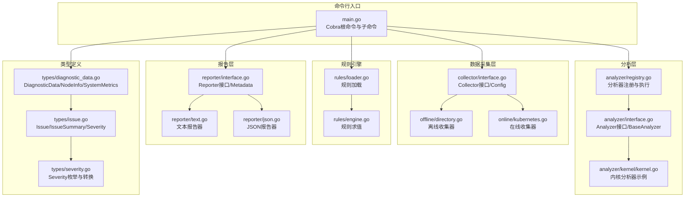
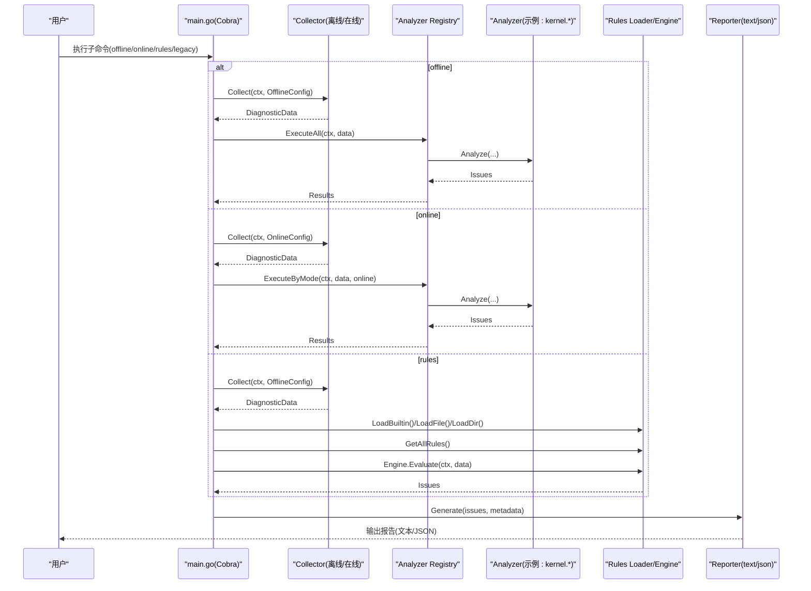
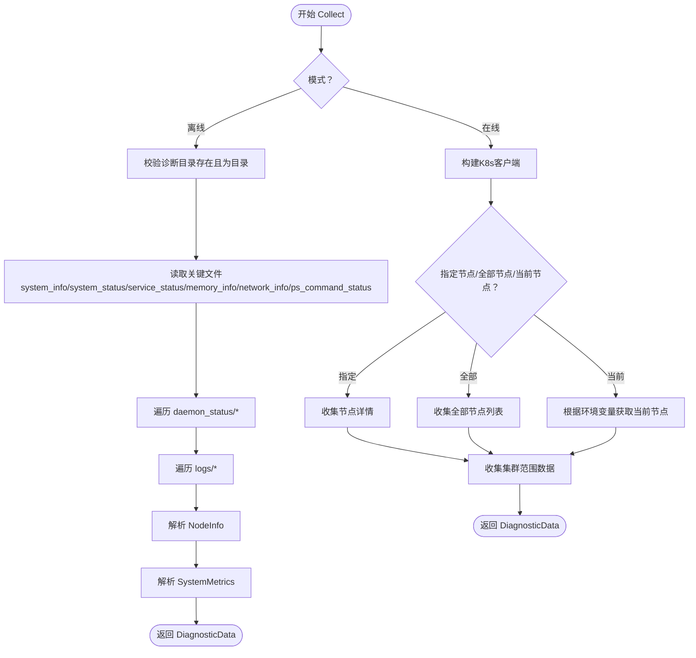
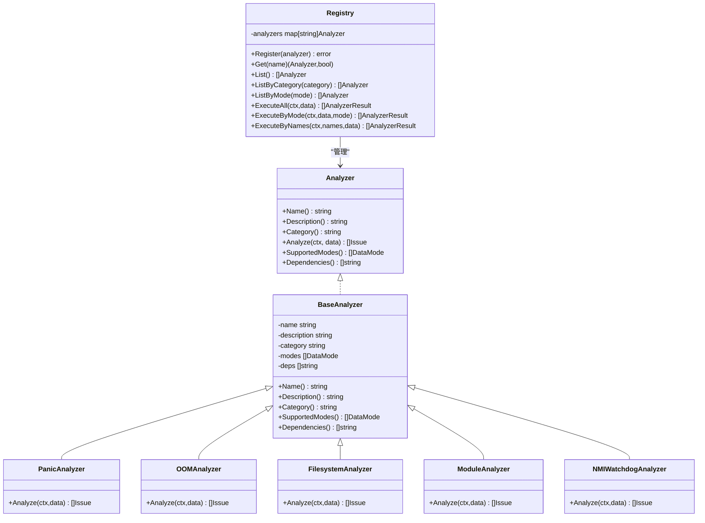
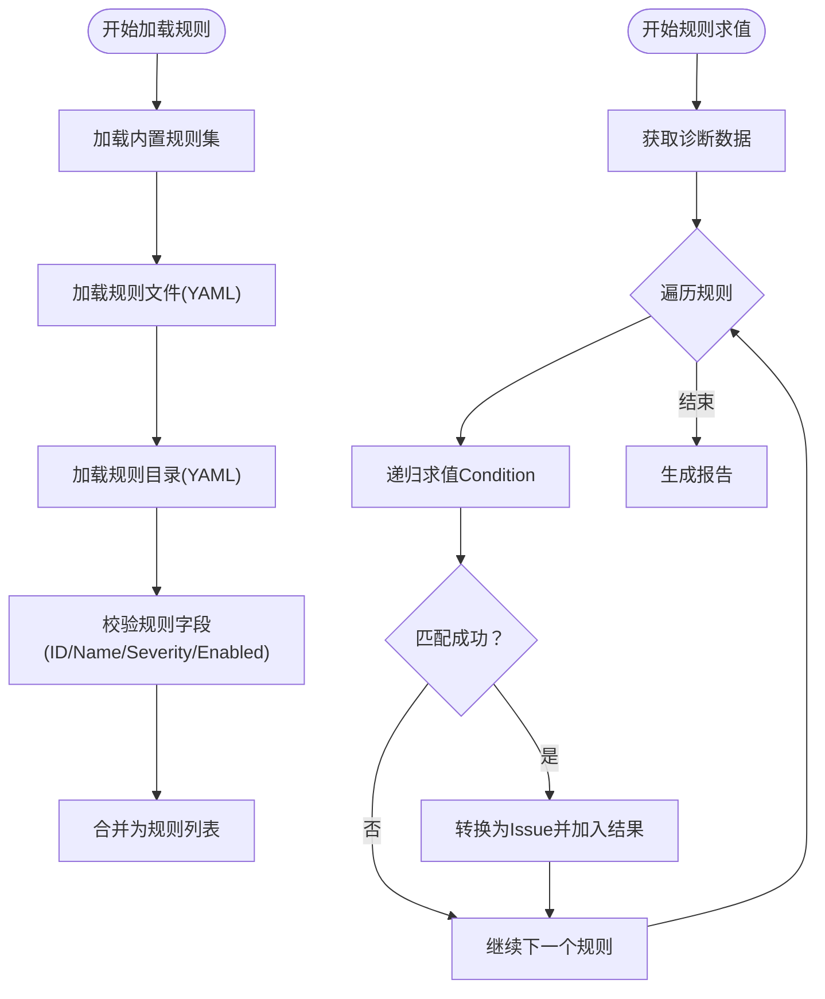
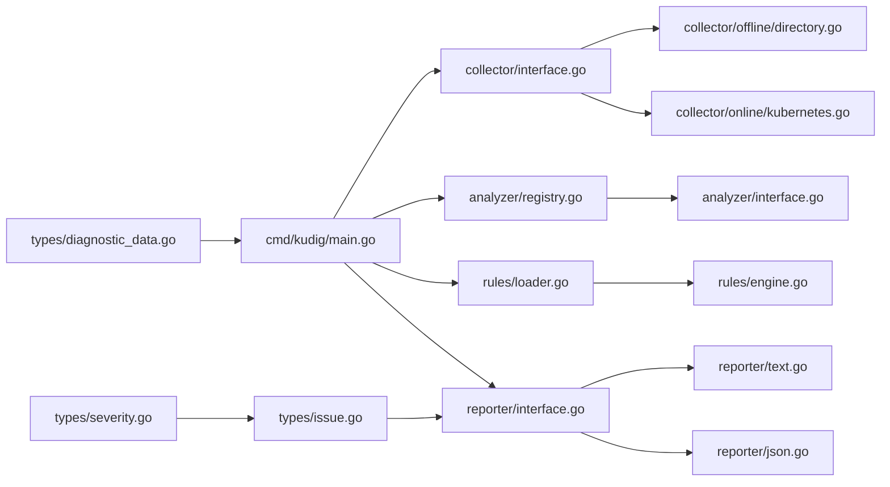

# v2.0 Go命令行参考

<cite>
**本文引用的文件**
- [README.md](file://README.md)
- [main.go](file://v2-go/cmd/kudig/main.go)
- [registry.go](file://v2-go/pkg/analyzer/registry.go)
- [interface.go（分析器接口）](file://v2-go/pkg/analyzer/interface.go)
- [directory.go（离线收集器）](file://v2-go/pkg/collector/offline/directory.go)
- [kubernetes.go（在线收集器）](file://v2-go/pkg/collector/online/kubernetes.go)
- [interface.go（收集器接口）](file://v2-go/pkg/collector/interface.go)
- [engine.go（规则引擎）](file://v2-go/pkg/rules/engine.go)
- [loader.go（规则加载器）](file://v2-go/pkg/rules/loader.go)
- [diagnostic_data.go（诊断数据类型）](file://v2-go/pkg/types/diagnostic_data.go)
- [issue.go（问题类型）](file://v2-go/pkg/types/issue.go)
- [severity.go（严重级别）](file://v2-go/pkg/types/severity.go)
- [interface.go（报告接口）](file://v2-go/pkg/reporter/interface.go)
- [json.go（JSON报告器）](file://v2-go/pkg/reporter/json.go)
- [text.go（文本报告器）](file://v2-go/pkg/reporter/text.go)
- [kernel.go（内核分析器）](file://v2-go/pkg/analyzer/kernel/kernel.go)
</cite>

## 目录
1. [简介](#简介)
2. [项目结构](#项目结构)
3. [核心组件](#核心组件)
4. [架构总览](#架构总览)
5. [详细组件分析](#详细组件分析)
6. [依赖关系分析](#依赖关系分析)
7. [性能考量](#性能考量)
8. [故障排查指南](#故障排查指南)
9. [结论](#结论)
10. [附录](#附录)

## 简介
本参考面向 v2.0 Go 版本的 kudig 命令行工具，提供从命令入口、数据采集、分析执行、规则引擎到报告输出的全链路使用说明。该版本支持离线分析（基于 diagnose_k8s.sh 生成的数据目录）、在线实时诊断（通过 Kubernetes API）、以及基于 YAML 的自定义规则评估。

## 项目结构
v2-go 目录包含命令入口、核心分析包（analyzer、collector、reporter、rules、types），以及 Helm Chart 和构建脚本等辅助内容。命令行入口位于 cmd/kudig/main.go，围绕 Cobra 提供 offline、online、rules、legacy、list-analyzers 等子命令。

**图表来源**
- [main.go](file://v2-go/cmd/kudig/main.go#L59-L178)
- [interface.go（收集器接口）](file://v2-go/pkg/collector/interface.go#L10-L114)
- [directory.go（离线收集器）](file://v2-go/pkg/collector/offline/directory.go#L1-L138)
- [kubernetes.go（在线收集器）](file://v2-go/pkg/collector/online/kubernetes.go#L1-L139)
- [registry.go（分析器注册）](file://v2-go/pkg/analyzer/registry.go#L1-L112)
- [interface.go（分析器接口）](file://v2-go/pkg/analyzer/interface.go#L1-L112)
- [kernel.go（内核分析器）](file://v2-go/pkg/analyzer/kernel/kernel.go#L1-L120)
- [loader.go（规则加载器）](file://v2-go/pkg/rules/loader.go#L1-L120)
- [engine.go（规则引擎）](file://v2-go/pkg/rules/engine.go#L1-L80)
- [interface.go（报告接口）](file://v2-go/pkg/reporter/interface.go#L1-L81)
- [text.go（文本报告器）](file://v2-go/pkg/reporter/text.go#L1-L60)
- [json.go（JSON报告器）](file://v2-go/pkg/reporter/json.go#L1-L40)
- [diagnostic_data.go（诊断数据类型）](file://v2-go/pkg/types/diagnostic_data.go#L1-L90)
- [issue.go（问题类型）](file://v2-go/pkg/types/issue.go#L1-L65)
- [severity.go（严重级别）](file://v2-go/pkg/types/severity.go#L1-L48)

**章节来源**
- [README.md](file://README.md#L1-L120)
- [main.go](file://v2-go/cmd/kudig/main.go#L59-L178)

## 核心组件
- 命令行入口与子命令
  - 根命令：提供全局标志（如输出格式、详细输出、输出文件）。
  - 子命令：
    - offline：离线分析诊断目录，支持 text/json 输出。
    - online：在线诊断，支持 kubeconfig/context/node/namespace/all-nodes 等参数。
    - rules：基于 YAML 规则评估诊断数据，支持列出规则、指定文件或目录。
    - legacy：兼容旧版 Bash 脚本输出。
    - list-analyzers：列出已注册分析器。
- 数据采集层
  - Collector 接口与 Config 定义，支持离线与在线两种模式。
  - 离线收集器：解析 diagnose_k8s.sh 生成的目录结构，提取关键文件与指标。
  - 在线收集器：通过 Kubernetes 客户端获取节点、事件、系统 Pod、DaemonSet 等信息。
- 分析器与注册表
  - Analyzer 接口与 BaseAnalyzer 基类，统一名称、描述、分类、支持模式、依赖声明。
  - Registry 统一注册、查询、按类别/模式筛选、拓扑排序执行、聚合结果。
- 规则引擎
  - Loader 加载内置与自定义 YAML 规则，支持按 ID/分类检索。
  - Engine 递归求值条件（文件包含/正则匹配/指标阈值/逻辑组合），生成 Issue。
- 报告层
  - Reporter 接口与工厂，内置 text/json 两种格式，支持去重、按严重级别排序。
- 类型与严重级别
  - DiagnosticData 封装模式、时间戳、节点信息、系统指标、原始文件与日志流。
  - Issue/IssueSummary/Severity 定义问题模型与统计、严重级别枚举与序列化。

**章节来源**
- [main.go](file://v2-go/cmd/kudig/main.go#L150-L339)
- [interface.go（收集器接口）](file://v2-go/pkg/collector/interface.go#L10-L114)
- [directory.go（离线收集器）](file://v2-go/pkg/collector/offline/directory.go#L57-L138)
- [kubernetes.go（在线收集器）](file://v2-go/pkg/collector/online/kubernetes.go#L101-L139)
- [interface.go（分析器接口）](file://v2-go/pkg/analyzer/interface.go#L1-L112)
- [registry.go（分析器注册）](file://v2-go/pkg/analyzer/registry.go#L95-L164)
- [loader.go（规则加载器）](file://v2-go/pkg/rules/loader.go#L1-L120)
- [engine.go（规则引擎）](file://v2-go/pkg/rules/engine.go#L24-L80)
- [interface.go（报告接口）](file://v2-go/pkg/reporter/interface.go#L1-L81)
- [text.go（文本报告器）](file://v2-go/pkg/reporter/text.go#L1-L60)
- [json.go（JSON报告器）](file://v2-go/pkg/reporter/json.go#L1-L40)
- [diagnostic_data.go（诊断数据类型）](file://v2-go/pkg/types/diagnostic_data.go#L1-L90)
- [issue.go（问题类型）](file://v2-go/pkg/types/issue.go#L1-L65)
- [severity.go（严重级别）](file://v2-go/pkg/types/severity.go#L1-L48)

## 架构总览
下图展示 v2.0 命令行在不同模式下的调用流程与组件交互：

**图表来源**
- [main.go](file://v2-go/cmd/kudig/main.go#L180-L339)
- [directory.go（离线收集器）](file://v2-go/pkg/collector/offline/directory.go#L57-L138)
- [kubernetes.go（在线收集器）](file://v2-go/pkg/collector/online/kubernetes.go#L101-L139)
- [registry.go（分析器注册）](file://v2-go/pkg/analyzer/registry.go#L95-L164)
- [kernel.go（内核分析器）](file://v2-go/pkg/analyzer/kernel/kernel.go#L30-L120)
- [loader.go（规则加载器）](file://v2-go/pkg/rules/loader.go#L23-L80)
- [engine.go（规则引擎）](file://v2-go/pkg/rules/engine.go#L24-L80)
- [interface.go（报告接口）](file://v2-go/pkg/reporter/interface.go#L1-L81)
- [text.go（文本报告器）](file://v2-go/pkg/reporter/text.go#L37-L105)
- [json.go（JSON报告器）](file://v2-go/pkg/reporter/json.go#L26-L40)

## 详细组件分析

### 命令行入口与子命令
- 根命令与标志
  - 全局标志：--verbose、--output/-o、--format/-f。
  - 在线模式标志：--kubeconfig、--context、--node/-n、--namespace、--all-nodes。
  - 规则模式标志：--file、--dir、--list。
- 子命令行为
  - offline：校验上下文信号、获取离线收集器、收集数据、执行全部分析器、去重排序、生成报告、设置退出码。
  - online：构建客户端、收集节点/集群信息、按在线模式执行分析器、生成报告、设置退出码。
  - rules：加载内置/自定义规则、评估规则、生成报告、设置退出码。
  - legacy：调用 Bash 脚本兼容模式，转换输出为统一 Issue 结构。
  - list-analyzers：列举注册的分析器及其支持模式。

**章节来源**
- [main.go](file://v2-go/cmd/kudig/main.go#L150-L339)
- [main.go](file://v2-go/cmd/kudig/main.go#L340-L610)

### 数据采集层
- Collector 接口
  - Collect(ctx, config) 返回 DiagnosticData。
  - Mode()/Name()/Validate() 提供能力标识与前置校验。
- Config
  - 离线：DiagnosePath、TimeoutSeconds。
  - 在线：Kubeconfig、Context、NodeName、Namespace、AllNodes、TimeoutSeconds。
- 离线收集器
  - 校验目录存在性与可访问性。
  - 读取关键文件与目录（system_info、system_status、service_status、memory_info、network_info、ps_command_status、daemon_status/*、logs/*）。
  - 解析 NodeInfo 与 SystemMetrics（CPU核数、负载、内存、交换、磁盘使用、conntrack）。
- 在线收集器
  - 优先使用 in-cluster 配置，否则回退到默认 kubeconfig。
  - 获取指定节点或全部节点信息，收集节点状态、事件、Pod 列表、系统组件状态、命名空间事件、系统 Pod 与 DaemonSet 状态。

**图表来源**
- [directory.go（离线收集器）](file://v2-go/pkg/collector/offline/directory.go#L36-L138)
- [directory.go（离线收集器）](file://v2-go/pkg/collector/offline/directory.go#L140-L316)
- [kubernetes.go（在线收集器）](file://v2-go/pkg/collector/online/kubernetes.go#L42-L139)
- [kubernetes.go（在线收集器）](file://v2-go/pkg/collector/online/kubernetes.go#L141-L262)

**章节来源**
- [interface.go（收集器接口）](file://v2-go/pkg/collector/interface.go#L10-L114)
- [directory.go（离线收集器）](file://v2-go/pkg/collector/offline/directory.go#L36-L316)
- [kubernetes.go（在线收集器）](file://v2-go/pkg/collector/online/kubernetes.go#L42-L438)

### 分析器与注册表
- Analyzer 接口
  - Name()/Description()/Category()/Analyze()/SupportedModes()/Dependencies()。
- BaseAnalyzer
  - 提供通用字段与方法，便于快速实现具体分析器。
- Registry
  - 注册/查询/列表/按类别/按模式筛选。
  - 执行策略：按依赖拓扑排序，支持按模式/类别/名称执行，聚合结果。
  - 支持取消上下文，避免长时间阻塞。

**图表来源**
- [interface.go（分析器接口）](file://v2-go/pkg/analyzer/interface.go#L1-L112)
- [registry.go（分析器注册）](file://v2-go/pkg/analyzer/registry.go#L1-L112)
- [kernel.go（内核分析器）](file://v2-go/pkg/analyzer/kernel/kernel.go#L1-L120)

**章节来源**
- [interface.go（分析器接口）](file://v2-go/pkg/analyzer/interface.go#L1-L112)
- [registry.go（分析器注册）](file://v2-go/pkg/analyzer/registry.go#L95-L229)
- [kernel.go（内核分析器）](file://v2-go/pkg/analyzer/kernel/kernel.go#L1-L276)

### 规则引擎
- Loader
  - LoadFile/LoadDir/LoadBuiltin：加载单个/目录/内置规则集。
  - 校验规则完整性（ID、名称、严重级别、启用状态），默认启用。
  - GetAllRules/GetRulesByCategory/GetRuleByID：规则检索。
- Engine
  - Evaluate/EvaluateByCategory：对诊断数据求值，生成 Issue。
  - 条件类型：file_contains、regex_match、metric_threshold、and、or。
  - 指标阈值支持：load_avg_1min/5min/15min、mem_used_percent、swap_used_percent、disk_used_percent、conntrack_percent，并进行归一化处理。

**图表来源**
- [loader.go（规则加载器）](file://v2-go/pkg/rules/loader.go#L1-L120)
- [loader.go（规则加载器）](file://v2-go/pkg/rules/loader.go#L249-L286)
- [engine.go（规则引擎）](file://v2-go/pkg/rules/engine.go#L24-L80)
- [engine.go（规则引擎）](file://v2-go/pkg/rules/engine.go#L77-L160)
- [engine.go（规则引擎）](file://v2-go/pkg/rules/engine.go#L160-L249)

**章节来源**
- [loader.go（规则加载器）](file://v2-go/pkg/rules/loader.go#L1-L286)
- [engine.go（规则引擎）](file://v2-go/pkg/rules/engine.go#L1-L297)

### 报告层
- Reporter 接口与工厂
  - Format()/Generate() 统一生成器接口。
  - DefaultFactory 管理已注册的报告器。
- 文本报告器
  - 按严重级别分组输出，支持 ANSI 颜色。
  - 去重与排序：按 ENName 去重，严重级别降序。
- JSON 报告器
  - 生成统一 Report 结构，包含元数据、摘要与异常列表。

**章节来源**
- [interface.go（报告接口）](file://v2-go/pkg/reporter/interface.go#L1-L125)
- [text.go（文本报告器）](file://v2-go/pkg/reporter/text.go#L1-L166)
- [json.go（JSON报告器）](file://v2-go/pkg/reporter/json.go#L1-L40)

### 类型与严重级别
- DiagnosticData
  - Mode/Timestamp/DiagnosePath/NodeInfo/SystemMetrics/RawFiles/LogStreams/K8sClient/Namespace/NodeName。
- NodeInfo/SystemMetrics
  - 包含主机名、内核版本、OS镜像、容器运行时、Kubelet版本、CPU核数、负载、内存、交换、磁盘使用、conntrack 等。
- Issue/IssueSummary/Severity
  - 问题模型、统计与严重级别枚举（严重/警告/提示），支持序列化与解析。

**章节来源**
- [diagnostic_data.go（诊断数据类型）](file://v2-go/pkg/types/diagnostic_data.go#L1-L163)
- [issue.go（问题类型）](file://v2-go/pkg/types/issue.go#L1-L121)
- [severity.go（严重级别）](file://v2-go/pkg/types/severity.go#L1-L90)

## 依赖关系分析
- 命令行入口依赖收集器工厂、分析器注册表、规则加载器与报告工厂。
- 收集器实现分别依赖离线/在线两种数据源。
- 分析器注册表依赖 Analyzer 接口与 BaseAnalyzer。
- 规则引擎依赖 Loader 与 DiagnosticData。
- 报告层依赖 Issue 与 ReportMetadata。

**图表来源**
- [main.go](file://v2-go/cmd/kudig/main.go#L150-L339)
- [interface.go（收集器接口）](file://v2-go/pkg/collector/interface.go#L10-L114)
- [directory.go（离线收集器）](file://v2-go/pkg/collector/offline/directory.go#L1-L138)
- [kubernetes.go（在线收集器）](file://v2-go/pkg/collector/online/kubernetes.go#L1-L139)
- [registry.go（分析器注册）](file://v2-go/pkg/analyzer/registry.go#L1-L112)
- [interface.go（分析器接口）](file://v2-go/pkg/analyzer/interface.go#L1-L112)
- [loader.go（规则加载器）](file://v2-go/pkg/rules/loader.go#L1-L120)
- [engine.go（规则引擎）](file://v2-go/pkg/rules/engine.go#L1-L80)
- [interface.go（报告接口）](file://v2-go/pkg/reporter/interface.go#L1-L81)
- [text.go（文本报告器）](file://v2-go/pkg/reporter/text.go#L1-L60)
- [json.go（JSON报告器）](file://v2-go/pkg/reporter/json.go#L1-L40)
- [diagnostic_data.go（诊断数据类型）](file://v2-go/pkg/types/diagnostic_data.go#L1-L90)
- [issue.go（问题类型）](file://v2-go/pkg/types/issue.go#L1-L65)
- [severity.go（严重级别）](file://v2-go/pkg/types/severity.go#L1-L48)

**章节来源**
- [main.go](file://v2-go/cmd/kudig/main.go#L150-L339)
- [registry.go（分析器注册）](file://v2-go/pkg/analyzer/registry.go#L95-L164)

## 性能考量
- 并发与取消
  - 分析器执行前建立带取消的上下文，支持 SIGINT/SIGTERM 中断。
  - Registry 执行时对每个分析器独立计时，便于性能分析。
- I/O 与解析
  - 离线收集器按需读取关键文件，避免全量扫描。
  - 在线收集器按需获取节点/事件/Pod 列表，避免冗余请求。
- 报告生成
  - 文本报告器支持颜色输出，JSON 报告器可选择缩进格式。
- 规则求值
  - 条件求值采用递归与短路逻辑，减少无效计算。

[本节为通用指导，无需特定文件来源]

## 故障排查指南
- 常见退出码
  - 0：无问题。
  - 1：存在警告或提示。
  - 2：存在严重问题。
- 离线模式
  - 确认诊断目录存在且包含必要文件（system_info、system_status、service_status、memory_info、network_info、ps_command_status 等）。
  - 若解析失败，检查对应文件内容格式。
- 在线模式
  - 确认 kubeconfig 或 in-cluster 配置有效，具备访问权限。
  - 指定节点/命名空间时注意过滤条件。
- 规则模式
  - 自定义规则文件需符合 YAML 格式与字段要求。
  - 使用 --list 查看可用规则 ID 与分类。
- 报告输出
  - 使用 --output/-o 指定输出文件路径。
  - 使用 --format 指定输出格式（text/json）。

**章节来源**
- [main.go](file://v2-go/cmd/kudig/main.go#L268-L339)
- [main.go](file://v2-go/cmd/kudig/main.go#L474-L507)
- [main.go](file://v2-go/cmd/kudig/main.go#L600-L608)
- [severity.go（严重级别）](file://v2-go/pkg/types/severity.go#L78-L90)

## 结论
v2.0 Go 版本以模块化架构实现了命令行诊断工具，支持离线与在线双模式、可扩展的分析器体系、灵活的 YAML 规则引擎与标准化报告输出。通过清晰的接口与工厂模式，用户可在不同场景下高效完成 Kubernetes 节点诊断任务。

[本节为总结性内容，无需特定文件来源]

## 附录
- 快速开始
  - 构建：在 v2-go 目录执行构建脚本或编译命令。
  - 离线分析：使用 offline 子命令指向 diagnose_k8s.sh 生成的目录。
  - 在线诊断：使用 online 子命令连接集群，可指定 kubeconfig/context/node/namespace/all-nodes。
  - 自定义规则：使用 rules 子命令加载 YAML 规则并评估诊断数据。
  - 兼容模式：使用 legacy 子命令复用旧版 Bash 输出。
  - 列出分析器：使用 list-analyzers 子命令查看可用分析器。

**章节来源**
- [README.md](file://README.md#L1-L120)
- [main.go](file://v2-go/cmd/kudig/main.go#L59-L178)