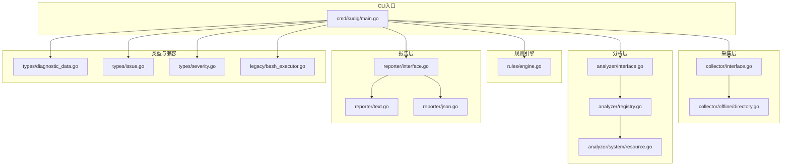
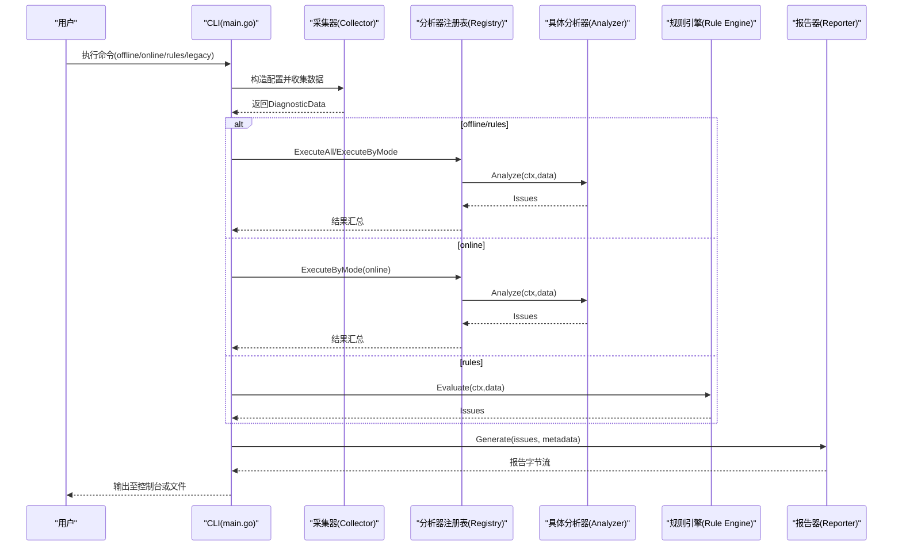
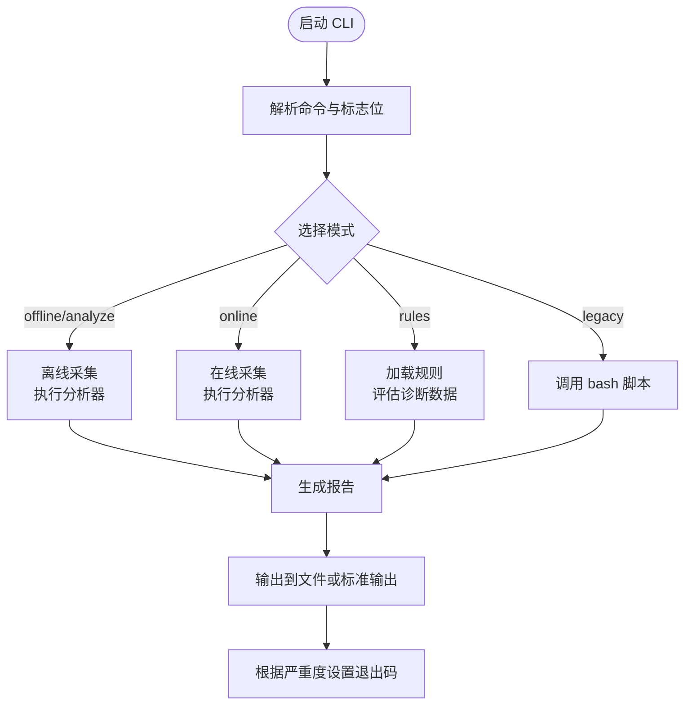
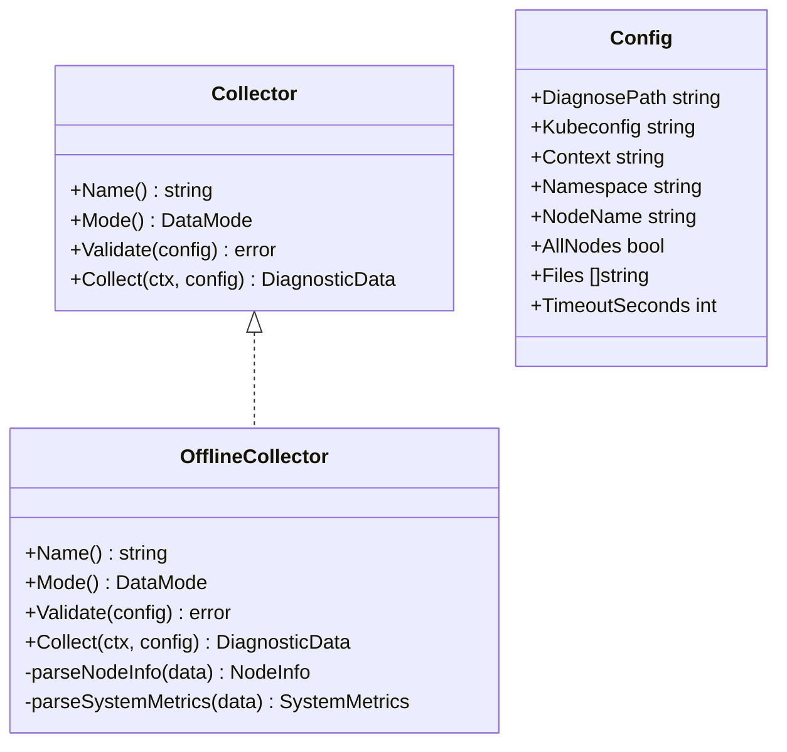
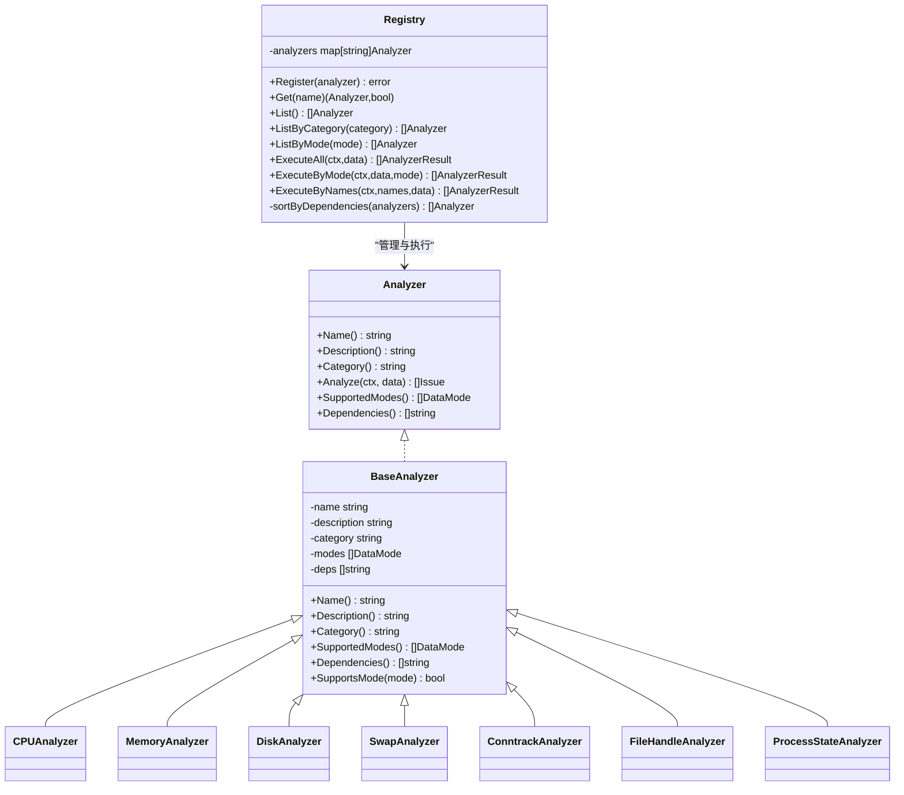
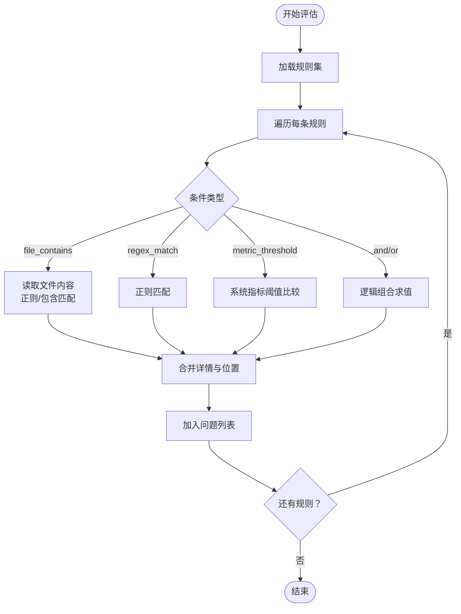
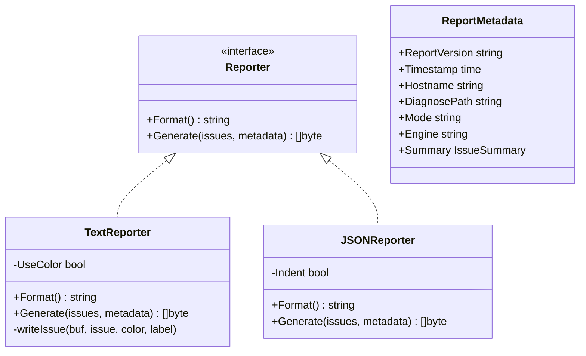
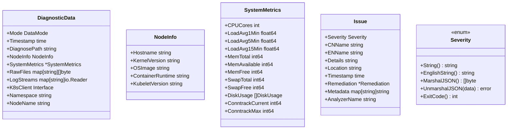
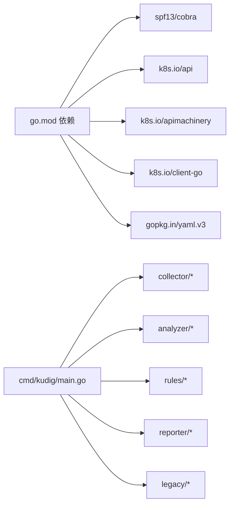

# v2.0 Go开发指南

<cite>
**本文引用的文件**
- [v2-go/cmd/kudig/main.go](file://v2-go/cmd/kudig/main.go)
- [v2-go/pkg/analyzer/interface.go](file://v2-go/pkg/analyzer/interface.go)
- [v2-go/pkg/analyzer/registry.go](file://v2-go/pkg/analyzer/registry.go)
- [v2-go/pkg/analyzer/system/resource.go](file://v2-go/pkg/analyzer/system/resource.go)
- [v2-go/pkg/collector/interface.go](file://v2-go/pkg/collector/interface.go)
- [v2-go/pkg/collector/offline/directory.go](file://v2-go/pkg/collector/offline/directory.go)
- [v2-go/pkg/reporter/interface.go](file://v2-go/pkg/reporter/interface.go)
- [v2-go/pkg/reporter/json.go](file://v2-go/pkg/reporter/json.go)
- [v2-go/pkg/reporter/text.go](file://v2-go/pkg/reporter/text.go)
- [v2-go/pkg/rules/engine.go](file://v2-go/pkg/rules/engine.go)
- [v2-go/pkg/times/types/diagnostic_data.go](file://v2-go/pkg/types/diagnostic_data.go)
- [v2-go/pkg/types/types/issue.go](file://v2-go/pkg/types/issue.go)
- [v2-go/pkg/types/types/severity.go](file://v2-go/pkg/types/severity.go)
- [v2-go/pkg/legacy/bash_executor.go](file://v2-go/pkg/legacy/bash_executor.go)
- [v2-go/README.md](file://v2-go/README.md)
- [v2-go/go.mod](file://v2-go/go.mod)
</cite>

## 目录
1. [简介](#简介)
2. [项目结构](#项目结构)
3. [核心组件](#核心组件)
4. [架构总览](#架构总览)
5. [详细组件分析](#详细组件分析)
6. [依赖关系分析](#依赖关系分析)
7. [性能考量](#性能考量)
8. [故障排查指南](#故障排查指南)
9. [结论](#结论)
10. [附录](#附录)

## 简介
本指南面向希望基于 v2.0 Go 版本进行二次开发与集成的工程师，系统阐述 kudig 的模块划分、数据流、扩展点与最佳实践。v2.0 以 Go 重写，提供离线与在线两种诊断模式、35+ 内置分析器、YAML 规则引擎、文本/JSON 报告输出，并兼容 v1.0 的诊断数据格式。

## 项目结构
v2-go 目录采用按“能力域”分层的组织方式：
- cmd/kudig：CLI 入口，定义子命令与参数解析
- pkg/analyzer：分析器框架与各领域分析器（system/process/network/kernel/kubernetes/runtime）
- pkg/collector：数据采集层（offline/online）
- pkg/reporter：报告生成层（text/json）
- pkg/rules：规则引擎（条件判断、阈值、文件匹配、指标阈值）
- pkg/types：核心数据模型（诊断数据、问题、严重度）
- pkg/legacy：v1.0 兼容层（调用 bash 脚本）
- charts：Helm Chart（部署）
- Dockerfile/Makefile：构建与打包

图表来源
- [v2-go/cmd/kudig/main.go](file://v2-go/cmd/kudig/main.go#L1-L610)
- [v2-go/pkg/collector/interface.go](file://v2-go/pkg/collector/interface.go#L1-L114)
- [v2-go/pkg/collector/offline/directory.go](file://v2-go/pkg/collector/offline/directory.go#L1-L321)
- [v2-go/pkg/analyzer/interface.go](file://v2-go/pkg/analyzer/interface.go#L1-L112)
- [v2-go/pkg/analyzer/registry.go](file://v2-go/pkg/analyzer/registry.go#L1-L229)
- [v2-go/pkg/analyzer/system/resource.go](file://v2-go/pkg/analyzer/system/resource.go#L1-L404)
- [v2-go/pkg/rules/engine.go](file://v2-go/pkg/rules/engine.go#L1-L297)
- [v2-go/pkg/reporter/interface.go](file://v2-go/pkg/reporter/interface.go#L1-L125)
- [v2-go/pkg/reporter/text.go](file://v2-go/pkg/reporter/text.go#L1-L166)
- [v2-go/pkg/reporter/json.go](file://v2-go/pkg/reporter/json.go#L1-L40)
- [v2-go/pkg/types/diagnostic_data.go](file://v2-go/pkg/types/diagnostic_data.go#L1-L163)
- [v2-go/pkg/types/issue.go](file://v2-go/pkg/types/issue.go#L1-L121)
- [v2-go/pkg/types/severity.go](file://v2-go/pkg/types/severity.go#L1-L90)
- [v2-go/pkg/legacy/bash_executor.go](file://v2-go/pkg/legacy/bash_executor.go#L1-L200)

章节来源
- [v2-go/README.md](file://v2-go/README.md#L1-L202)

## 核心组件
- CLI 控制流与命令
  - 主入口负责注册子命令（offline/online/legacy/analyze/list-analyzers/rules），解析全局与各模式标志位，执行对应流程并输出报告。
- 采集层
  - 定义统一的 Collector 接口与工厂；离线采集器从诊断目录读取关键文件与日志，解析节点信息与系统指标。
- 分析层
  - Analyzer 接口与 Registry 管理器，支持按模式过滤、依赖拓扑排序、并发安全注册与执行。
- 规则引擎
  - 支持文件内容/正则匹配、系统指标阈值比较、逻辑组合（AND/OR）与上下文取消。
- 报告层
  - 文本与 JSON 输出，支持去重、按严重度排序、元数据注入与兼容字段。
- 类型与严重度
  - 统一的数据结构（诊断数据、节点信息、系统指标、问题、修复建议）与严重度枚举及序列化。

章节来源
- [v2-go/cmd/kudig/main.go](file://v2-go/cmd/kudig/main.go#L52-L610)
- [v2-go/pkg/collector/interface.go](file://v2-go/pkg/collector/interface.go#L1-L114)
- [v2-go/pkg/collector/offline/directory.go](file://v2-go/pkg/collector/offline/directory.go#L1-L321)
- [v2-go/pkg/analyzer/interface.go](file://v2-go/pkg/analyzer/interface.go#L1-L112)
- [v2-go/pkg/analyzer/registry.go](file://v2-go/pkg/analyzer/registry.go#L1-L229)
- [v2-go/pkg/rules/engine.go](file://v2-go/pkg/rules/engine.go#L1-L297)
- [v2-go/pkg/reporter/interface.go](file://v2-go/pkg/reporter/interface.go#L1-L125)
- [v2-go/pkg/reporter/text.go](file://v2-go/pkg/reporter/text.go#L1-L166)
- [v2-go/pkg/reporter/json.go](file://v2-go/pkg/reporter/json.go#L1-L40)
- [v2-go/pkg/types/diagnostic_data.go](file://v2-go/pkg/types/diagnostic_data.go#L1-L163)
- [v2-go/pkg/types/issue.go](file://v2-go/pkg/types/issue.go#L1-L121)
- [v2-go/pkg/types/severity.go](file://v2-go/pkg/types/severity.go#L1-L90)

## 架构总览
下图展示 CLI 如何串联采集、分析、规则与报告模块，以及数据在各层之间的流转。

图表来源
- [v2-go/cmd/kudig/main.go](file://v2-go/cmd/kudig/main.go#L180-L610)
- [v2-go/pkg/analyzer/registry.go](file://v2-go/pkg/analyzer/registry.go#L95-L164)
- [v2-go/pkg/rules/engine.go](file://v2-go/pkg/rules/engine.go#L24-L49)
- [v2-go/pkg/reporter/interface.go](file://v2-go/pkg/reporter/interface.go#L1-L125)

## 详细组件分析

### CLI 与命令流程
- 子命令与标志位
  - offline/analyze：离线分析诊断目录，支持输出格式与文件。
  - online：在线模式，支持 kubeconfig/context/node/namespace/all-nodes。
  - rules：加载内置与自定义规则，支持列出规则与对离线数据评估。
  - legacy：调用 v1.0 bash 脚本，兼容旧数据格式。
  - list-analyzers：列举已注册分析器及其支持模式。
- 信号与超时
  - 通过 context.WithCancel 处理 SIGINT/SIGTERM；rules/legacy/online 默认带取消机制。
- 退出码策略
  - 依据最高严重度返回 0/1/2，便于 CI/自动化集成。

图表来源
- [v2-go/cmd/kudig/main.go](file://v2-go/cmd/kudig/main.go#L150-L610)

章节来源
- [v2-go/cmd/kudig/main.go](file://v2-go/cmd/kudig/main.go#L52-L610)

### 采集层：离线采集器
- 功能要点
  - 校验诊断目录合法性；读取 system_info/system_status/service_status/memory_info/network_info/ps_command_status 等关键文件。
  - 解析节点信息（主机名、内核、OS、kubelet 版本）与系统指标（CPU 核心数、负载、内存、交换、磁盘使用、conntrack）。
  - 支持 daemon_status 与 logs 子目录的递归读取。
- 设计模式
  - Collector 接口抽象，工厂注册，便于扩展在线采集器。

图表来源
- [v2-go/pkg/collector/interface.go](file://v2-go/pkg/collector/interface.go#L1-L114)
- [v2-go/pkg/collector/offline/directory.go](file://v2-go/pkg/collector/offline/directory.go#L1-L321)

章节来源
- [v2-go/pkg/collector/interface.go](file://v2-go/pkg/collector/interface.go#L1-L114)
- [v2-go/pkg/collector/offline/directory.go](file://v2-go/pkg/collector/offline/directory.go#L1-L321)

### 分析层：分析器框架与系统资源分析器
- Analyzer 接口
  - 名称、描述、分类、支持模式、依赖声明、分析方法。
  - BaseAnalyzer 提供通用实现与模式支持判定。
- Registry 管理
  - 注册、查询、按类别/模式过滤、依赖拓扑排序、并发安全执行。
- 系统资源分析器示例
  - CPU/内存/磁盘/交换/连接跟踪/文件句柄/进程状态等，按阈值生成问题并附修复建议。

图表来源
- [v2-go/pkg/analyzer/interface.go](file://v2-go/pkg/analyzer/interface.go#L1-L112)
- [v2-go/pkg/analyzer/registry.go](file://v2-go/pkg/analyzer/registry.go#L1-L229)
- [v2-go/pkg/analyzer/system/resource.go](file://v2-go/pkg/analyzer/system/resource.go#L1-L404)

章节来源
- [v2-go/pkg/analyzer/interface.go](file://v2-go/pkg/analyzer/interface.go#L1-L112)
- [v2-go/pkg/analyzer/registry.go](file://v2-go/pkg/analyzer/registry.go#L1-L229)
- [v2-go/pkg/analyzer/system/resource.go](file://v2-go/pkg/analyzer/system/resource.go#L1-L404)

### 规则引擎：条件与阈值评估
- 支持条件类型
  - 文件包含/正则匹配、指标阈值比较（负载/内存/交换/磁盘/conntrack）、逻辑组合（AND/OR）。
- 上下文与错误处理
  - 每条规则独立评估，遇到错误记录并继续；支持 ctx.Done() 提前终止。
- 输出映射
  - 将匹配结果转换为 Issue 并附位置信息与详情。

图表来源
- [v2-go/pkg/rules/engine.go](file://v2-go/pkg/rules/engine.go#L24-L297)

章节来源
- [v2-go/pkg/rules/engine.go](file://v2-go/pkg/rules/engine.go#L1-L297)

### 报告层：文本与 JSON 输出
- 文本报告
  - 分严重度分组输出，支持 ANSI 彩色；提供去重与按严重度排序。
- JSON 报告
  - 生成兼容结构，包含元数据、摘要与异常列表；支持缩进输出。
- 元数据
  - 报告版本、时间戳、主机名、诊断路径、模式、引擎等。

图表来源
- [v2-go/pkg/reporter/interface.go](file://v2-go/pkg/reporter/interface.go#L1-L125)
- [v2-go/pkg/reporter/text.go](file://v2-go/pkg/reporter/text.go#L1-L166)
- [v2-go/pkg/reporter/json.go](file://v2-go/pkg/reporter/json.go#L1-L40)

章节来源
- [v2-go/pkg/reporter/interface.go](file://v2-go/pkg/reporter/interface.go#L1-L125)
- [v2-go/pkg/reporter/text.go](file://v2-go/pkg/reporter/text.go#L1-L166)
- [v2-go/pkg/reporter/json.go](file://v2-go/pkg/reporter/json.go#L1-L40)

### 类型与严重度
- DiagnosticData：封装诊断模式、时间戳、节点信息、系统指标、原始文件与日志流、K8s 客户端与聚焦命名空间/节点。
- Issue/Remediation：问题实体与修复建议；支持元数据与分析器标识。
- Severity：严重度枚举与序列化，提供退出码映射。

图表来源
- [v2-go/pkg/types/diagnostic_data.go](file://v2-go/pkg/types/diagnostic_data.go#L1-L163)
- [v2-go/pkg/types/issue.go](file://v2-go/pkg/types/issue.go#L1-L121)
- [v2-go/pkg/types/severity.go](file://v2-go/pkg/types/severity.go#L1-L90)

章节来源
- [v2-go/pkg/types/diagnostic_data.go](file://v2-go/pkg/types/diagnostic_data.go#L1-L163)
- [v2-go/pkg/types/issue.go](file://v2-go/pkg/types/issue.go#L1-L121)
- [v2-go/pkg/types/severity.go](file://v2-go/pkg/types/severity.go#L1-L90)

### 兼容层：v1.0 bash 脚本
- 通过 legacy 包封装 bash 执行与报告转换，保持与旧版 JSON 字段兼容，便于迁移。

章节来源
- [v2-go/pkg/legacy/bash_executor.go](file://v2-go/pkg/legacy/bash_executor.go#L1-L200)

## 依赖关系分析
- 外部依赖
  - Cobra（命令行）、Kubernetes 客户端库（client-go、api、apimachinery）、YAML（yaml.v3）。
- 内部耦合
  - CLI 依赖采集、分析、规则与报告模块；分析器通过注册表集中管理；报告器通过工厂注册。
- 循环依赖
  - 未见直接循环；分析器依赖类型与报告器，但不反向依赖 CLI。

图表来源
- [v2-go/go.mod](file://v2-go/go.mod#L1-L63)
- [v2-go/cmd/kudig/main.go](file://v2-go/cmd/kudig/main.go#L1-L610)

章节来源
- [v2-go/go.mod](file://v2-go/go.mod#L1-L63)

## 性能考量
- 上下文与取消
  - 在线/规则/legacy 均使用 context.WithCancel/WithTimeout，避免长时间阻塞；建议在分析器内部对耗时操作支持 ctx.Done() 提前退出。
- 并发与顺序
  - Registry 对分析器按依赖拓扑排序执行，减少不必要的并发；可在分析器内部并行处理非共享资源。
- I/O 与解析
  - 离线采集器一次性读取关键文件；建议对大文件采用流式处理或分块读取，避免内存峰值。
- 报告生成
  - 文本报告按严重度分组输出，JSON 报告支持缩进；建议在 CI 场景使用 JSON 并关闭缩进以减小体积。

## 故障排查指南
- 常见问题定位
  - 离线模式：确认诊断目录存在且包含关键文件；检查 system_info/system_status 等是否被正确解析。
  - 在线模式：验证 kubeconfig/context/node/namespace 参数；确保具有访问权限与网络连通性。
  - 规则模式：确认规则文件/目录有效；检查 file_contains/regex_match/metric_threshold 条件是否匹配。
- 退出码
  - 0：无问题；1：存在警告/提示；2：存在严重问题；便于自动化脚本快速判断。
- 日志与调试
  - 使用 -v 详细模式查看采集与分析过程；必要时将输出重定向到文件以便复盘。

章节来源
- [v2-go/cmd/kudig/main.go](file://v2-go/cmd/kudig/main.go#L180-L610)
- [v2-go/pkg/reporter/text.go](file://v2-go/pkg/reporter/text.go#L1-L166)

## 结论
v2.0 Go 版本以清晰的分层架构、完善的扩展点与强大的规则引擎，提供了稳定高效的 Kubernetes 节点诊断能力。开发者可通过实现新的 Analyzer/Collector/Reporter 或编写 YAML 规则快速适配新场景；同时保留了对 v1.0 的兼容通道，便于平滑迁移。

## 附录
- 快速上手
  - 构建与测试：参考 README 的构建与测试命令。
  - 使用示例：离线/在线/规则/兼容模式均有示例命令。
- 开发建议
  - 新增分析器：实现 Analyzer 接口并通过 init() 注册；在 registry 中声明支持模式与依赖。
  - 新增报告器：实现 Reporter 接口并通过工厂注册；注意元数据与兼容字段。
  - 新增采集器：实现 Collector 接口并通过工厂注册；确保 Validate 与 Collect 的健壮性。

章节来源
- [v2-go/README.md](file://v2-go/README.md#L65-L202)