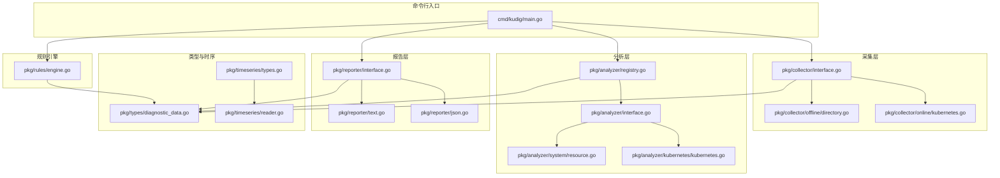
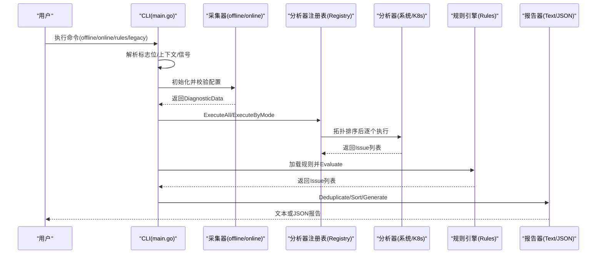
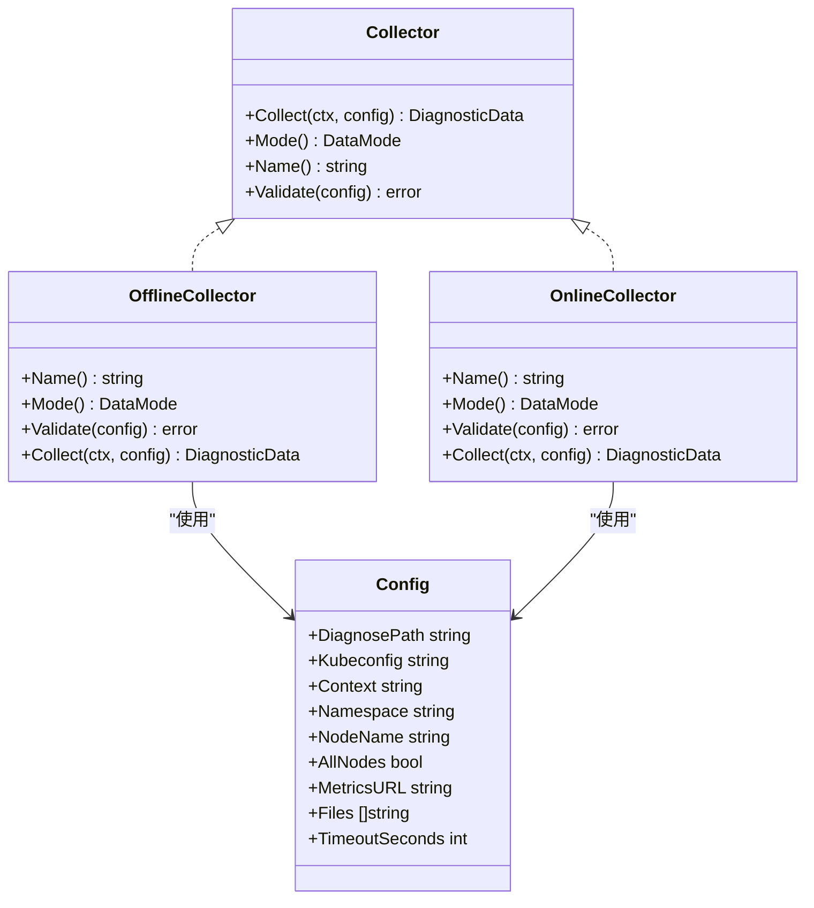
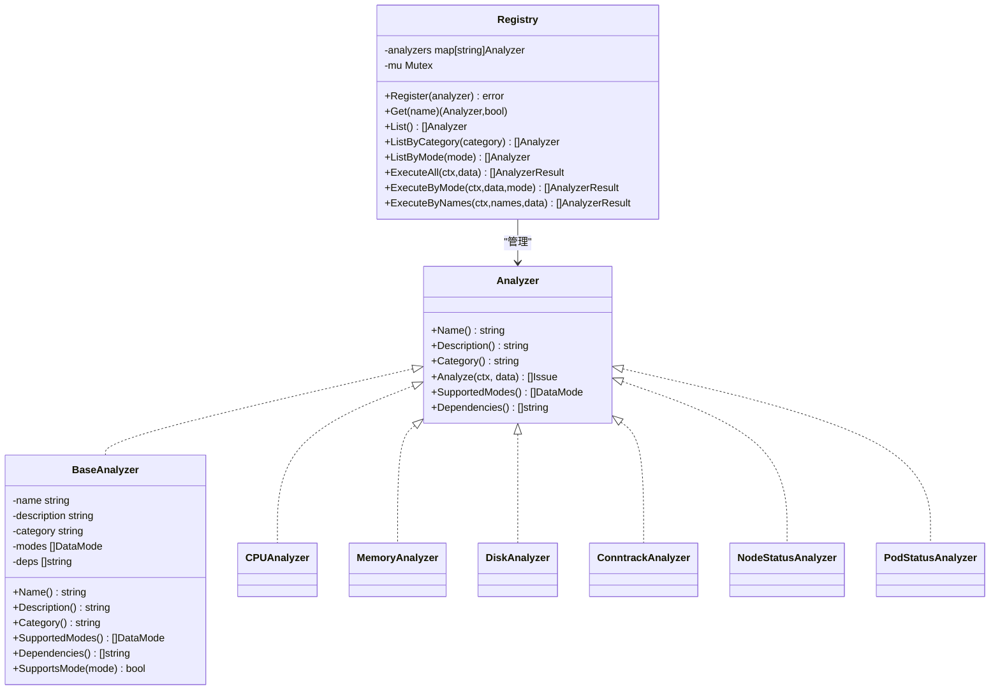
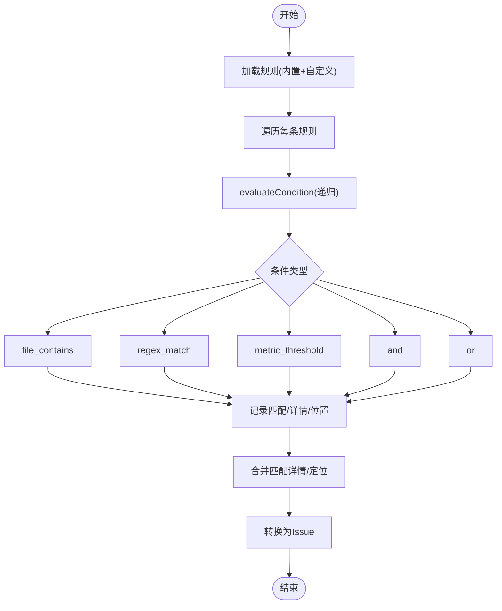
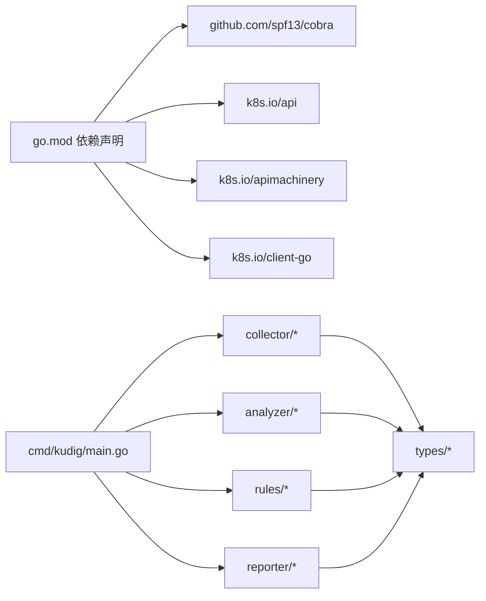

# v2.0 Go架构设计

<cite>
**本文引用的文件**
- [v2-go/cmd/kudig/main.go](file://v2-go/cmd/kudig/main.go)
- [v2-go/pkg/analyzer/interface.go](file://v2-go/pkg/analyzer/interface.go)
- [v2-go/pkg/analyzer/registry.go](file://v2-go/pkg/analyzer/registry.go)
- [v2-go/pkg/analyzer/system/resource.go](file://v2-go/pkg/analyzer/system/resource.go)
- [v2-go/pkg/analyzer/kubernetes/kubernetes.go](file://v2-go/pkg/analyzer/kubernetes/kubernetes.go)
- [v2-go/pkg/collector/interface.go](file://v2-go/pkg/collector/interface.go)
- [v2-go/pkg/collector/offline/directory.go](file://v2-go/pkg/collector/offline/directory.go)
- [v2-go/pkg/collector/online/kubernetes.go](file://v2-go/pkg/collector/online/kubernetes.go)
- [v2-go/pkg/reporter/interface.go](file://v2-go/pkg/reporter/interface.go)
- [v2-go/pkg/reporter/text.go](file://v2-go/pkg/reporter/text.go)
- [v2-go/pkg/reporter/json.go](file://v2-go/pkg/reporter/json.go)
- [v2-go/pkg/rules/engine.go](file://v2-go/pkg/rules/engine.go)
- [v2-go/pkg/timeseries/types.go](file://v2-go/pkg/timeseries/types.go)
- [v2-go/pkg/timeseries/reader.go](file://v2-go/pkg/timeseries/reader.go)
- [v2-go/pkg/types/diagnostic_data.go](file://v2-go/pkg/types/diagnostic_data.go)
- [v2-go/go.mod](file://v2-go/go.mod)
- [v2-go/README.md](file://v2-go/README.md)
</cite>

## 目录
1. [简介](#简介)
2. [项目结构](#项目结构)
3. [核心组件](#核心组件)
4. [架构总览](#架构总览)
5. [详细组件分析](#详细组件分析)
6. [依赖关系分析](#依赖关系分析)
7. [性能考量](#性能考量)
8. [故障排查指南](#故障排查指南)
9. [结论](#结论)
10. [附录](#附录)

## 简介
本文件面向 v2.0 Go 版本的 kudig 项目，系统性梳理其架构设计与实现要点，覆盖命令行入口、数据采集层、分析引擎、规则引擎、报告生成层以及类型模型，并以可视化方式呈现模块间交互与数据流，帮助开发者快速理解与扩展。

## 项目结构
v2-go 采用分层清晰的包组织方式：
- cmd/kudig：CLI 入口，基于 cobra 构建子命令与参数解析
- pkg/analyzer：分析器框架与各领域分析器（系统、进程、网络、内核、Kubernetes、运行时）
- pkg/collector：数据采集层（离线目录读取、在线 K8s API）
- pkg/reporter：报告生成层（文本、JSON）
- pkg/rules：YAML 规则加载与执行引擎
- pkg/types：核心数据结构（诊断数据、节点信息、系统指标、问题与严重度等）
- pkg/timeseries：时序数据类型与读取接口（用于未来扩展）
- charts、Dockerfile、Makefile：部署与构建支撑

图表来源
- [v2-go/cmd/kudig/main.go](file://v2-go/cmd/kudig/main.go#L1-L610)
- [v2-go/pkg/collector/interface.go](file://v2-go/pkg/collector/interface.go#L1-L114)
- [v2-go/pkg/collector/offline/directory.go](file://v2-go/pkg/collector/offline/directory.go#L1-L321)
- [v2-go/pkg/collector/online/kubernetes.go](file://v2-go/pkg/collector/online/kubernetes.go#L1-L439)
- [v2-go/pkg/analyzer/interface.go](file://v2-go/pkg/analyzer/interface.go#L1-L112)
- [v2-go/pkg/analyzer/registry.go](file://v2-go/pkg/analyzer/registry.go#L1-L229)
- [v2-go/pkg/analyzer/system/resource.go](file://v2-go/pkg/analyzer/system/resource.go#L1-L404)
- [v2-go/pkg/analyzer/kubernetes/kubernetes.go](file://v2-go/pkg/analyzer/kubernetes/kubernetes.go#L1-L728)
- [v2-go/pkg/rules/engine.go](file://v2-go/pkg/rules/engine.go#L1-L297)
- [v2-go/pkg/reporter/interface.go](file://v2-go/pkg/reporter/interface.go#L1-L125)
- [v2-go/pkg/reporter/text.go](file://v2-go/pkg/reporter/text.go#L1-L166)
- [v2-go/pkg/reporter/json.go](file://v2-go/pkg/reporter/json.go#L1-L40)
- [v2-go/pkg/types/diagnostic_data.go](file://v2-go/pkg/types/diagnostic_data.go#L1-L163)
- [v2-go/pkg/timeseries/types.go](file://v2-go/pkg/timeseries/types.go#L1-L200)
- [v2-go/pkg/timeseries/reader.go](file://v2-go/pkg/timeseries/reader.go#L1-L200)

章节来源
- [v2-go/README.md](file://v2-go/README.md#L1-L202)

## 核心组件
- 命令行入口与控制流
  - 通过 cobra 注册 offline、online、rules、legacy、list-analyzers 等子命令，解析全局与各模式专用标志位，统一管理上下文取消与信号处理，按模式调用采集器、分析器、规则引擎与报告器。
- 数据采集层
  - 接口定义 Config、Collector、Mode；离线采集器从诊断目录读取关键文件与日志，解析节点信息与系统指标；在线采集器基于 kubeconfig 或 in-cluster 配置访问 K8s API，抓取节点、事件、Pod 状态等。
- 分析器框架
  - Analyzer 接口定义名称、类别、描述、支持模式、依赖与分析方法；Registry 统一注册、依赖拓扑排序、并发安全执行、结果聚合；内置系统、Kubernetes 等多类分析器。
- 规则引擎
  - Loader 加载内置与自定义规则；Engine 对诊断数据执行条件判断（文件匹配、正则、指标阈值、逻辑组合），产出 Issue。
- 报告层
  - Reporter 接口抽象不同输出格式；TextReporter 与 JSONReporter 分别生成人类可读与机器可解析报告；提供去重、排序、摘要计算等通用能力。
- 类型与时序
  - DiagnosticData、NodeInfo、SystemMetrics、Issue、Severity 等核心类型；timeseries 提供时序数据抽象与读取接口，便于后续扩展。

章节来源
- [v2-go/cmd/kudig/main.go](file://v2-go/cmd/kudig/main.go#L1-L610)
- [v2-go/pkg/collector/interface.go](file://v2-go/pkg/collector/interface.go#L1-L114)
- [v2-go/pkg/analyzer/interface.go](file://v2-go/pkg/analyzer/interface.go#L1-L112)
- [v2-go/pkg/analyzer/registry.go](file://v2-go/pkg/analyzer/registry.go#L1-L229)
- [v2-go/pkg/rules/engine.go](file://v2-go/pkg/rules/engine.go#L1-L297)
- [v2-go/pkg/reporter/interface.go](file://v2-go/pkg/reporter/interface.go#L1-L125)
- [v2-go/pkg/reporter/text.go](file://v2-go/pkg/reporter/text.go#L1-L166)
- [v2-go/pkg/reporter/json.go](file://v2-go/pkg/reporter/json.go#L1-L40)
- [v2-go/pkg/types/diagnostic_data.go](file://v2-go/pkg/types/diagnostic_data.go#L1-L163)
- [v2-go/pkg/timeseries/types.go](file://v2-go/pkg/timeseries/types.go#L1-L200)
- [v2-go/pkg/timeseries/reader.go](file://v2-go/pkg/timeseries/reader.go#L1-L200)

## 架构总览
下图展示 v2.0 的端到端流程：CLI 解析参数 → 选择采集模式 → 采集诊断数据 → 执行分析器/规则引擎 → 生成报告 → 输出结果。

图表来源
- [v2-go/cmd/kudig/main.go](file://v2-go/cmd/kudig/main.go#L180-L610)
- [v2-go/pkg/collector/interface.go](file://v2-go/pkg/collector/interface.go#L1-L114)
- [v2-go/pkg/analyzer/registry.go](file://v2-go/pkg/analyzer/registry.go#L95-L164)
- [v2-go/pkg/rules/engine.go](file://v2-go/pkg/rules/engine.go#L24-L49)
- [v2-go/pkg/reporter/text.go](file://v2-go/pkg/reporter/text.go#L38-L105)
- [v2-go/pkg/reporter/json.go](file://v2-go/pkg/reporter/json.go#L26-L34)

## 详细组件分析

### 命令行与控制流（CLI）
- 功能要点
  - 子命令：offline、online、rules、legacy、list-analyzers
  - 全局标志：verbose、output、format
  - 在线模式标志：kubeconfig、context、node、namespace、all-nodes
  - 规则模式标志：file、dir、list
  - 信号处理：SIGINT/SIGTERM 取消上下文
  - 退出码：根据最高严重度与问题数量返回 0/1/2
- 关键流程
  - offline：离线采集 → 执行全部分析器 → 去重排序 → 生成报告 → 输出
  - online：在线采集 → 按模式执行分析器 → 去重排序 → 生成报告 → 输出
  - rules：加载规则 → 离线采集 → 规则引擎评估 → 去重排序 → 生成报告 → 输出
  - legacy：调用兼容层生成报告

章节来源
- [v2-go/cmd/kudig/main.go](file://v2-go/cmd/kudig/main.go#L52-L610)

### 数据采集层（Collector）
- Collector 接口
  - Collect、Mode、Name、Validate
  - Config 结构体包含诊断路径、kubeconfig、context、namespace、node、allNodes、metricsURL、files、超时等字段
- 离线采集器
  - 校验目录存在且为目录
  - 读取 system_info、system_status、service_status、memory_info、network_info、ps_command_status 等关键文件
  - 递归读取 daemon_status 与 logs 子目录
  - 解析 NodeInfo 与 SystemMetrics（CPU、负载、内存、Swap、磁盘、Conntrack）
- 在线采集器
  - 优先 in-cluster 配置，其次 kubeconfig，默认 context
  - 支持指定节点或全量节点扫描
  - 抓取 Node、Events、Pods、System Pods、DaemonSets 等信息并写入 RawFiles

图表来源
- [v2-go/pkg/collector/interface.go](file://v2-go/pkg/collector/interface.go#L1-L114)
- [v2-go/pkg/collector/offline/directory.go](file://v2-go/pkg/collector/offline/directory.go#L1-L321)
- [v2-go/pkg/collector/online/kubernetes.go](file://v2-go/pkg/collector/online/kubernetes.go#L1-L439)

章节来源
- [v2-go/pkg/collector/interface.go](file://v2-go/pkg/collector/interface.go#L1-L114)
- [v2-go/pkg/collector/offline/directory.go](file://v2-go/pkg/collector/offline/directory.go#L1-L321)
- [v2-go/pkg/collector/online/kubernetes.go](file://v2-go/pkg/collector/online/kubernetes.go#L1-L439)

### 分析器框架与注册表（Analyzer）
- Analyzer 接口
  - Name、Description、Category、Analyze、SupportedModes、Dependencies
- BaseAnalyzer
  - 提供通用字段与 SupportsMode 辅助
- Registry
  - 注册、查询、按类别/模式过滤、依赖拓扑排序、并发安全执行、结果聚合
- 典型分析器
  - 系统：CPU、内存、磁盘、Swap、Conntrack、文件句柄、进程状态
  - Kubernetes：PLEG、CNI、证书、API Server、节点状态、镜像拉取、Pod 状态、事件

图表来源
- [v2-go/pkg/analyzer/interface.go](file://v2-go/pkg/analyzer/interface.go#L1-L112)
- [v2-go/pkg/analyzer/registry.go](file://v2-go/pkg/analyzer/registry.go#L1-L229)
- [v2-go/pkg/analyzer/system/resource.go](file://v2-go/pkg/analyzer/system/resource.go#L1-L404)
- [v2-go/pkg/analyzer/kubernetes/kubernetes.go](file://v2-go/pkg/analyzer/kubernetes/kubernetes.go#L1-L728)

章节来源
- [v2-go/pkg/analyzer/interface.go](file://v2-go/pkg/analyzer/interface.go#L1-L112)
- [v2-go/pkg/analyzer/registry.go](file://v2-go/pkg/analyzer/registry.go#L1-L229)
- [v2-go/pkg/analyzer/system/resource.go](file://v2-go/pkg/analyzer/system/resource.go#L1-L404)
- [v2-go/pkg/analyzer/kubernetes/kubernetes.go](file://v2-go/pkg/analyzer/kubernetes/kubernetes.go#L1-L728)

### 规则引擎（Rules）
- Loader
  - 加载内置规则，支持从文件或目录加载自定义规则
- Engine
  - Evaluate/EvaluateByCategory 遍历规则，条件类型包括：
    - file_contains：文件内容包含/正则匹配，支持计数与否定
    - regex_match：正则匹配
    - metric_threshold：系统指标阈值比较（负载、内存、Swap、磁盘、Conntrack 等）
    - and/or：逻辑组合
  - 将匹配结果转换为 Issue 并返回

图表来源
- [v2-go/pkg/rules/engine.go](file://v2-go/pkg/rules/engine.go#L24-L297)

章节来源
- [v2-go/pkg/rules/engine.go](file://v2-go/pkg/rules/engine.go#L1-L297)

### 报告生成层（Reporter）
- Reporter 接口
  - Generate(issues, metadata) 与 Format()
- ReportMetadata
  - 包含报告版本、时间戳、主机名、诊断目录、模式、引擎、摘要等
- TextReporter
  - 彩色输出、按严重度分组、统计摘要、去重与排序
- JSONReporter
  - 生成标准 Report 结构，支持缩进

章节来源
- [v2-go/pkg/reporter/interface.go](file://v2-go/pkg/reporter/interface.go#L1-L125)
- [v2-go/pkg/reporter/text.go](file://v2-go/pkg/reporter/text.go#L1-L166)
- [v2-go/pkg/reporter/json.go](file://v2-go/pkg/reporter/json.go#L1-L40)

### 类型与数据模型（Types）
- DiagnosticData
  - Mode、Timestamp、DiagnosePath、NodeInfo、SystemMetrics、RawFiles、LogStreams、K8sClient、Namespace、NodeName
- NodeInfo
  - Hostname、KernelVersion、OSImage、ContainerRuntime、KubeletVersion
- SystemMetrics
  - CPU 核心数、负载、内存、Swap、磁盘使用、Conntrack
- Issue/Severity
  - 问题实体与严重度枚举，支持摘要统计与去重排序

章节来源
- [v2-go/pkg/types/diagnostic_data.go](file://v2-go/pkg/types/diagnostic_data.go#L1-L163)

## 依赖关系分析
- 外部依赖
  - Cobra：命令行框架
  - Kubernetes 客户端库：在线模式访问 API
  - YAML 解析：规则与配置
- 内部耦合
  - CLI 依赖采集层、分析层、规则引擎与报告层
  - 分析层与规则引擎均消费 DiagnosticData
  - 报告层依赖 Issue 与 ReportMetadata

图表来源
- [v2-go/go.mod](file://v2-go/go.mod#L1-L63)
- [v2-go/cmd/kudig/main.go](file://v2-go/cmd/kudig/main.go#L1-L610)

章节来源
- [v2-go/go.mod](file://v2-go/go.mod#L1-L63)

## 性能考量
- 并发与取消
  - 分析器执行前检查 ctx.Done()，支持 SIGINT/SIGTERM 快速取消
- 依赖拓扑
  - 通过拓扑排序确保依赖先行，避免重复计算
- I/O 优化
  - 离线采集按需读取关键文件，避免全量扫描
  - 在线采集按需抓取节点、事件、Pod 列表，设置合理超时
- 报告生成
  - 去重与排序在内存中完成，复杂度与问题数量线性相关

## 故障排查指南
- 常见问题定位
  - 离线模式：确认诊断目录存在且包含关键文件；检查 RawFiles 是否正确填充
  - 在线模式：验证 kubeconfig/context；检查节点权限与 RBAC；确认 API 可达
  - 规则模式：确认规则文件/目录有效；检查 file_contains/regex_match 的文件路径与正则
- 退出码
  - 0：无问题；1：存在警告/提示；2：存在严重问题
- 日志与调试
  - 启用 verbose 获取更详细过程信息
  - 使用 --output 将报告写入文件以便复盘

章节来源
- [v2-go/cmd/kudig/main.go](file://v2-go/cmd/kudig/main.go#L180-L610)
- [v2-go/pkg/reporter/text.go](file://v2-go/pkg/reporter/text.go#L38-L105)

## 结论
v2.0 Go 版本通过清晰的分层架构、可扩展的分析器与规则引擎、完善的报告体系，实现了对 Kubernetes 节点的离线与在线诊断能力。其模块化设计便于新增分析器与规则，同时具备良好的可维护性与可扩展性。

## 附录
- 构建与运行
  - 依赖安装、构建、测试、多平台构建、Docker 构建等可通过 Makefile 完成
- 版本与许可
  - 项目采用 Apache License 2.0

章节来源
- [v2-go/README.md](file://v2-go/README.md#L65-L202)