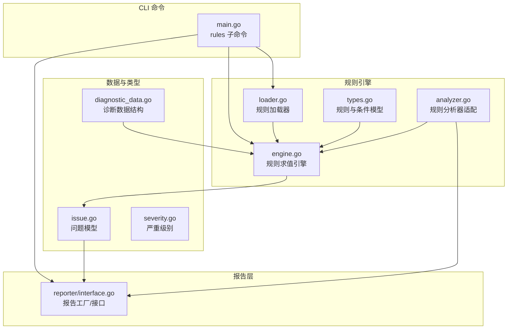
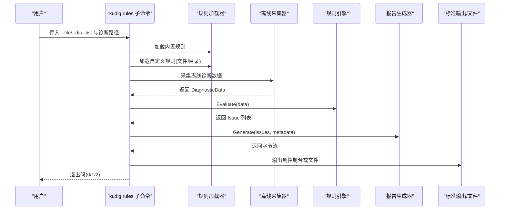
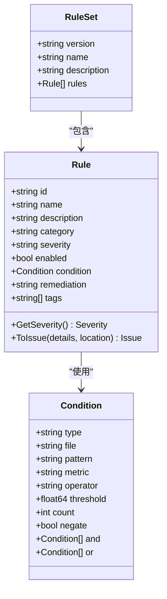
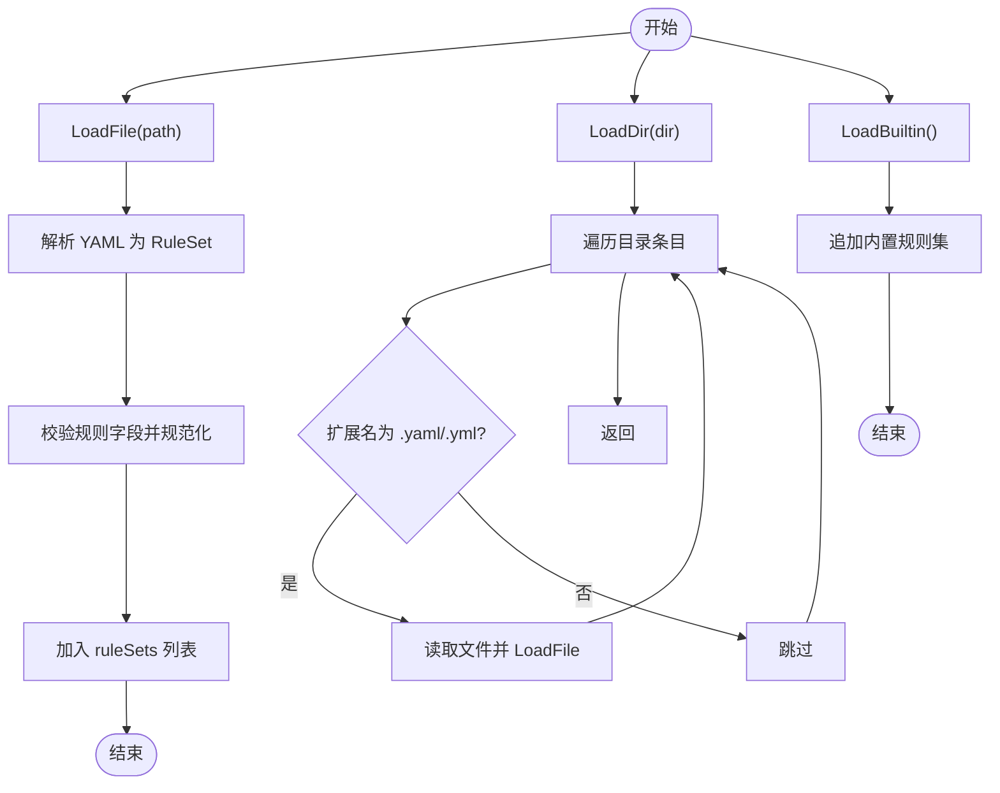
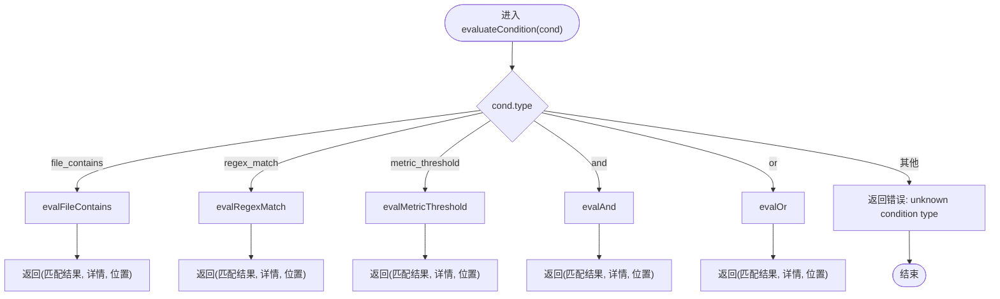
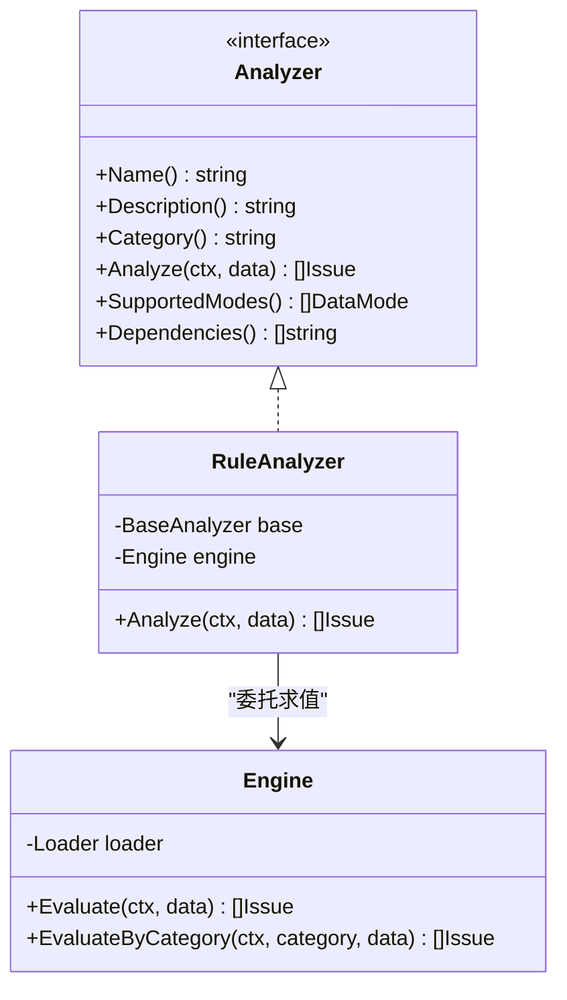
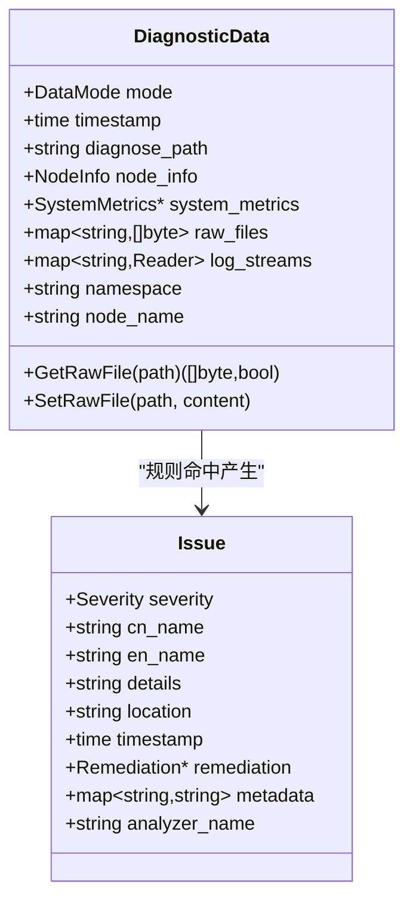
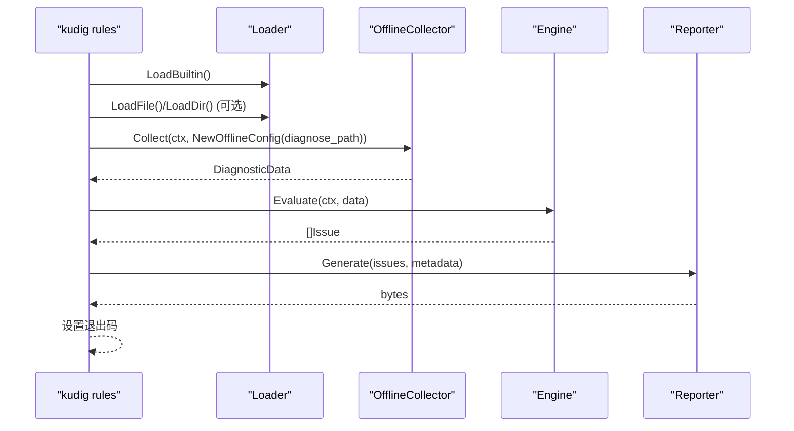
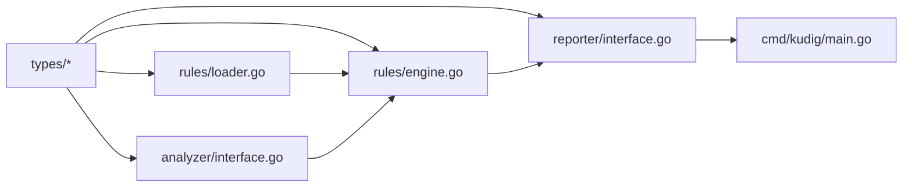

# v2.0 Go自定义规则

<cite>
**本文引用的文件列表**
- [v2-go/cmd/kudig/main.go](file://v2-go/cmd/kudig/main.go)
- [v2-go/pkg/rules/engine.go](file://v2-go/pkg/rules/engine.go)
- [v2-go/pkg/rules/loader.go](file://v2-go/pkg/rules/loader.go)
- [v2-go/pkg/rules/types.go](file://v2-go/pkg/rules/types.go)
- [v2-go/pkg/rules/analyzer.go](file://v2-go/pkg/rules/analyzer.go)
- [v2-go/rules/custom.yaml](file://v2-go/rules/custom.yaml)
- [v2-go/pkg/types/diagnostic_data.go](file://v2-go/pkg/types/diagnostic_data.go)
- [v2-go/pkg/types/issue.go](file://v2-go/pkg/types/issue.go)
- [v2-go/pkg/types/severity.go](file://v2-go/pkg/types/severity.go)
- [v2-go/pkg/analyzer/interface.go](file://v2-go/pkg/analyzer/interface.go)
- [v2-go/pkg/reporter/interface.go](file://v2-go/pkg/reporter/interface.go)
- [v2-go/README.md](file://v2-go/README.md)
</cite>

## 目录
1. [简介](#简介)
2. [项目结构](#项目结构)
3. [核心组件](#核心组件)
4. [架构总览](#架构总览)
5. [详细组件分析](#详细组件分析)
6. [依赖关系分析](#依赖关系分析)
7. [性能与扩展性考虑](#性能与扩展性考虑)
8. [故障排查指南](#故障排查指南)
9. [结论](#结论)
10. [附录](#附录)

## 简介
本章节面向 v2.0 Go 版本的“自定义规则”能力，聚焦于如何通过 YAML 规则集对离线诊断数据进行条件判断与问题发现，并与内置分析器、报告生成、退出码策略协同工作。读者无需深入 Go 语法即可理解规则的编写方式、加载流程、执行逻辑与输出格式。

## 项目结构
v2.0 的规则子系统位于 v2-go/pkg/rules，配合 CLI 命令入口、类型定义、报告层与分析器接口共同构成完整的规则执行链路。

图表来源
- [v2-go/cmd/kudig/main.go](file://v2-go/cmd/kudig/main.go#L485-L609)
- [v2-go/pkg/rules/loader.go](file://v2-go/pkg/rules/loader.go#L1-L286)
- [v2-go/pkg/rules/engine.go](file://v2-go/pkg/rules/engine.go#L1-L297)
- [v2-go/pkg/rules/types.go](file://v2-go/pkg/rules/types.go#L1-L112)
- [v2-go/pkg/rules/analyzer.go](file://v2-go/pkg/rules/analyzer.go#L1-L58)
- [v2-go/pkg/types/diagnostic_data.go](file://v2-go/pkg/types/diagnostic_data.go#L1-L163)
- [v2-go/pkg/types/issue.go](file://v2-go/pkg/types/issue.go#L1-L121)
- [v2-go/pkg/types/severity.go](file://v2-go/pkg/types/severity.go#L1-L90)
- [v2-go/pkg/reporter/interface.go](file://v2-go/pkg/reporter/interface.go#L1-L125)

章节来源
- [v2-go/README.md](file://v2-go/README.md#L1-L202)
- [v2-go/cmd/kudig/main.go](file://v2-go/cmd/kudig/main.go#L485-L609)

## 核心组件
- 规则加载器：从单个 YAML 文件或目录批量加载规则集，校验并规范化规则字段。
- 规则引擎：递归评估规则条件（文件包含、正则匹配、指标阈值、复合 AND/OR），命中后转换为问题项。
- 规则模型：定义 Rule、Condition、RuleSet 结构及严重级别映射。
- 规则分析器：将规则引擎封装为分析器，可作为分析流水线的一部分运行。
- 诊断数据：承载离线采集的原始文件内容、系统指标等，供规则读取。
- 问题与严重级别：统一的问题表示与严重等级，用于排序、去重与退出码策略。
- 报告层：根据问题集合生成文本或 JSON 报告，携带元数据与摘要统计。

章节来源
- [v2-go/pkg/rules/loader.go](file://v2-go/pkg/rules/loader.go#L1-L286)
- [v2-go/pkg/rules/engine.go](file://v2-go/pkg/rules/engine.go#L1-L297)
- [v2-go/pkg/rules/types.go](file://v2-go/pkg/rules/types.go#L1-L112)
- [v2-go/pkg/rules/analyzer.go](file://v2-go/pkg/rules/analyzer.go#L1-L58)
- [v2-go/pkg/types/diagnostic_data.go](file://v2-go/pkg/types/diagnostic_data.go#L1-L163)
- [v2-go/pkg/types/issue.go](file://v2-go/pkg/types/issue.go#L1-L121)
- [v2-go/pkg/types/severity.go](file://v2-go/pkg/types/severity.go#L1-L90)
- [v2-go/pkg/reporter/interface.go](file://v2-go/pkg/reporter/interface.go#L1-L125)

## 架构总览
规则模式的调用序列如下：CLI 解析参数 -> 加载内置与自定义规则 -> 离线采集诊断数据 -> 引擎逐条评估 -> 生成问题 -> 报告输出 -> 依据严重度设置退出码。

图表来源
- [v2-go/cmd/kudig/main.go](file://v2-go/cmd/kudig/main.go#L485-L609)
- [v2-go/pkg/rules/loader.go](file://v2-go/pkg/rules/loader.go#L1-L286)
- [v2-go/pkg/rules/engine.go](file://v2-go/pkg/rules/engine.go#L1-L297)
- [v2-go/pkg/reporter/interface.go](file://v2-go/pkg/reporter/interface.go#L1-L125)

## 详细组件分析

### 规则模型与条件类型
规则由 RuleSet 包含多个 Rule；每个 Rule 含条件 Condition，支持以下类型：
- file_contains：在指定相对路径文件中查找模式（支持正则，失败时回退为简单包含；可设定最小出现次数）
- regex_match：对文件内容进行正则匹配
- metric_threshold：基于系统指标阈值比较（支持 gt/gte/lt/lte/eq/ne）
- and/or：复合条件，短路组合

图表来源
- [v2-go/pkg/rules/types.go](file://v2-go/pkg/rules/types.go#L1-L112)

章节来源
- [v2-go/pkg/rules/types.go](file://v2-go/pkg/rules/types.go#L1-L112)

### 规则加载器
- LoadFile：读取单个 YAML，解析为 RuleSet，校验每条规则的 id/name/severity/enabled 字段并规范化。
- LoadDir：遍历目录下所有 .yaml/.yml 文件，逐一加载。
- LoadBuiltin：内置默认规则集，覆盖系统、内核、Kubernetes、网络等常见场景。
- GetAllRules/GetRulesByCategory/GetRuleByID：按启用状态与分类筛选规则。

图表来源
- [v2-go/pkg/rules/loader.go](file://v2-go/pkg/rules/loader.go#L1-L286)

章节来源
- [v2-go/pkg/rules/loader.go](file://v2-go/pkg/rules/loader.go#L1-L286)

### 规则引擎与条件求值
- Evaluate/EvaluateByCategory：遍历规则，逐条求值；支持上下文取消。
- evaluateCondition：根据类型分派到具体求值函数。
- evalFileContains：优先尝试正则匹配，失败回退字符串包含；支持最小出现次数；支持否定。
- evalRegexMatch：编译正则并匹配，记录匹配片段截断后的详情。
- evalMetricThreshold：从 SystemMetrics 读取指标，支持 CPU 归一化、内存百分比、磁盘最大使用率、连接跟踪使用率等；支持比较运算符与否定。
- evalAnd/evalOr：短路逻辑，聚合细节与定位信息。

图表来源
- [v2-go/pkg/rules/engine.go](file://v2-go/pkg/rules/engine.go#L1-L297)

章节来源
- [v2-go/pkg/rules/engine.go](file://v2-go/pkg/rules/engine.go#L1-L297)

### 规则分析器适配
- RuleAnalyzer：包装 Engine，实现 Analyzer 接口，支持离线/在线两种模式。
- DefaultRuleAnalyzer/FromDir/FromFile：便捷创建带内置或自定义规则的分析器实例。

图表来源
- [v2-go/pkg/analyzer/interface.go](file://v2-go/pkg/analyzer/interface.go#L1-L112)
- [v2-go/pkg/rules/analyzer.go](file://v2-go/pkg/rules/analyzer.go#L1-L58)

章节来源
- [v2-go/pkg/rules/analyzer.go](file://v2-go/pkg/rules/analyzer.go#L1-L58)
- [v2-go/pkg/analyzer/interface.go](file://v2-go/pkg/analyzer/interface.go#L1-L112)

### 诊断数据与问题模型
- DiagnosticData：承载 Mode、Timestamp、NodeInfo、SystemMetrics、RawFiles、LogStreams 等；提供 GetRawFile/SetRawFile 访问离线文件内容。
- Issue：统一问题表示，含严重级别、中英文名称、详情、定位、修复建议、元数据等；支持计算摘要与最高严重级别。

图表来源
- [v2-go/pkg/types/diagnostic_data.go](file://v2-go/pkg/types/diagnostic_data.go#L1-L163)
- [v2-go/pkg/types/issue.go](file://v2-go/pkg/types/issue.go#L1-L121)

章节来源
- [v2-go/pkg/types/diagnostic_data.go](file://v2-go/pkg/types/diagnostic_data.go#L1-L163)
- [v2-go/pkg/types/issue.go](file://v2-go/pkg/types/issue.go#L1-L121)

### CLI 规则模式执行流程
- 参数解析：支持 --file、--dir、--list；必须提供诊断路径。
- 加载规则：先内置，再自定义文件/目录；--list 仅列出规则清单。
- 采集数据：离线模式使用 OfflineCollector。
- 执行引擎：Engine.Evaluate(data)。
- 报告生成：Reporter.Generate(issues, metadata)，支持 text/json。
- 退出码：依据最高严重度决定 0/1/2。

图表来源
- [v2-go/cmd/kudig/main.go](file://v2-go/cmd/kudig/main.go#L485-L609)
- [v2-go/pkg/rules/loader.go](file://v2-go/pkg/rules/loader.go#L1-L286)
- [v2-go/pkg/rules/engine.go](file://v2-go/pkg/rules/engine.go#L1-L297)
- [v2-go/pkg/reporter/interface.go](file://v2-go/pkg/reporter/interface.go#L1-L125)

章节来源
- [v2-go/cmd/kudig/main.go](file://v2-go/cmd/kudig/main.go#L485-L609)

## 依赖关系分析
- 规则引擎依赖诊断数据结构以读取文件内容与系统指标。
- 规则模型依赖严重级别枚举以映射字符串到数值。
- 规则分析器实现 Analyzer 接口，可融入现有分析器注册与执行体系。
- 报告层依赖问题集合与元数据生成最终输出。

图表来源
- [v2-go/pkg/types/diagnostic_data.go](file://v2-go/pkg/types/diagnostic_data.go#L1-L163)
- [v2-go/pkg/types/issue.go](file://v2-go/pkg/types/issue.go#L1-L121)
- [v2-go/pkg/types/severity.go](file://v2-go/pkg/types/severity.go#L1-L90)
- [v2-go/pkg/rules/engine.go](file://v2-go/pkg/rules/engine.go#L1-L297)
- [v2-go/pkg/rules/loader.go](file://v2-go/pkg/rules/loader.go#L1-L286)
- [v2-go/pkg/analyzer/interface.go](file://v2-go/pkg/analyzer/interface.go#L1-L112)
- [v2-go/pkg/reporter/interface.go](file://v2-go/pkg/reporter/interface.go#L1-L125)
- [v2-go/cmd/kudig/main.go](file://v2-go/cmd/kudig/main.go#L485-L609)

章节来源
- [v2-go/pkg/rules/engine.go](file://v2-go/pkg/rules/engine.go#L1-L297)
- [v2-go/pkg/rules/loader.go](file://v2-go/pkg/rules/loader.go#L1-L286)
- [v2-go/pkg/analyzer/interface.go](file://v2-go/pkg/analyzer/interface.go#L1-L112)
- [v2-go/pkg/reporter/interface.go](file://v2-go/pkg/reporter/interface.go#L1-L125)
- [v2-go/cmd/kudig/main.go](file://v2-go/cmd/kudig/main.go#L485-L609)

## 性能与扩展性考虑
- 条件求值短路：AND/OR 采用短路逻辑，减少不必要的计算。
- 正则回退：当正则编译失败时回退到简单包含，提高稳定性。
- 指标归一化：CPU 负载阈值按 CPU 核数归一化，避免误报。
- 并发与取消：规则遍历支持 ctx 取消，便于长耗时场景中断。
- 可扩展性：新增条件类型只需在 evaluateCondition 分支中添加新求值函数；新增规则集通过 LoadDir/LoadFile 即可接入。

[本节为通用指导，不直接分析具体文件]

## 故障排查指南
- 规则文件解析失败：检查 YAML 语法与字段完整性（id 必填；severity 默认 info；enabled 默认 true）。
- 文件路径不存在：离线模式下，Condition.file 必须与诊断目录内的相对路径一致。
- 正则错误：regex_match 编译失败会返回错误；建议先用 file_contains 验证模式，再切换为正则。
- 指标缺失：metric_threshold 依赖 SystemMetrics；若为空则判定为未命中。
- 复合条件误判：AND/OR 组合时注意 negation 与 count 的交互，必要时拆分为更细粒度规则。
- 输出格式：确保 --format 有效（text/json），否则会返回未知格式错误。

章节来源
- [v2-go/pkg/rules/loader.go](file://v2-go/pkg/rules/loader.go#L1-L286)
- [v2-go/pkg/rules/engine.go](file://v2-go/pkg/rules/engine.go#L1-L297)
- [v2-go/cmd/kudig/main.go](file://v2-go/cmd/kudig/main.go#L485-L609)

## 结论
v2.0 的规则子系统提供了灵活、可扩展的 YAML 规则引擎，能够快速将业务与环境特定的检查逻辑转化为可复用的诊断规则。通过与离线数据采集、问题模型与报告层的无缝集成，用户可以以较低成本构建定制化的诊断能力，并获得一致的输出与退出码策略。

[本节为总结性内容，不直接分析具体文件]

## 附录

### 自定义规则示例与说明
- 示例规则集位于 rules/custom.yaml，包含系统、Kubernetes、网络等类别的规则，支持阈值型与文本匹配型条件，以及 AND/OR 复合条件。
- 常见用法：
  - 使用内置规则：直接运行 rules 子命令。
  - 使用自定义规则文件：--file 指向 YAML 文件。
  - 使用规则目录：--dir 指向包含多个规则文件的目录。
  - 列出规则：--list 查看可用规则清单。

章节来源
- [v2-go/rules/custom.yaml](file://v2-go/rules/custom.yaml#L1-L135)
- [v2-go/cmd/kudig/main.go](file://v2-go/cmd/kudig/main.go#L485-L609)