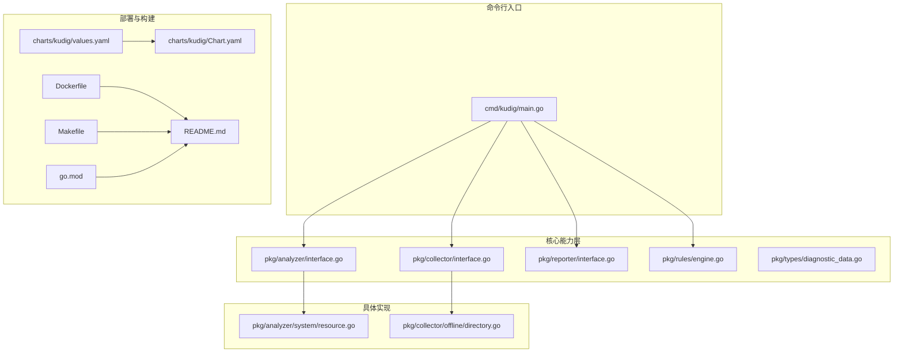
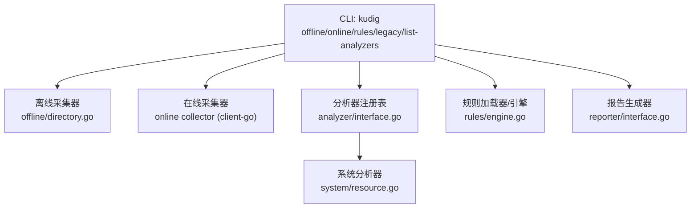
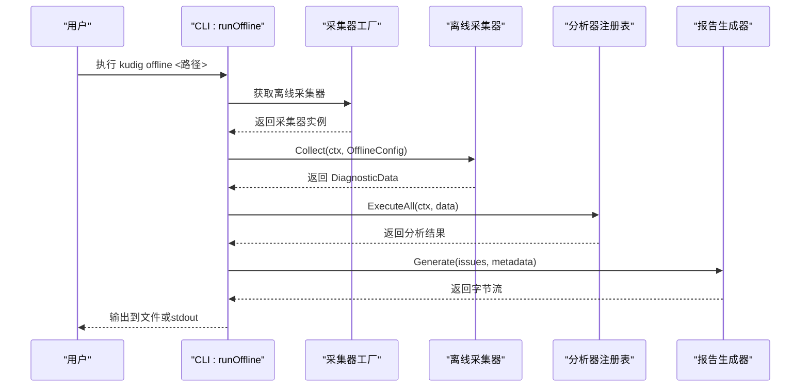
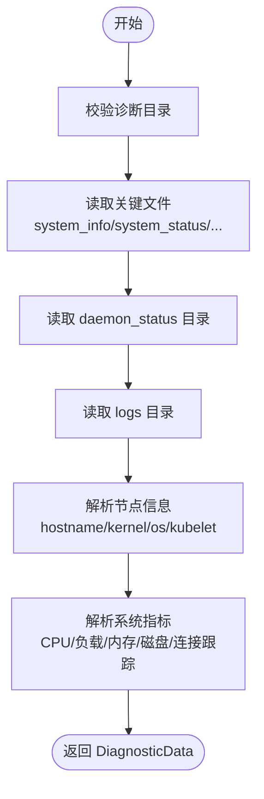
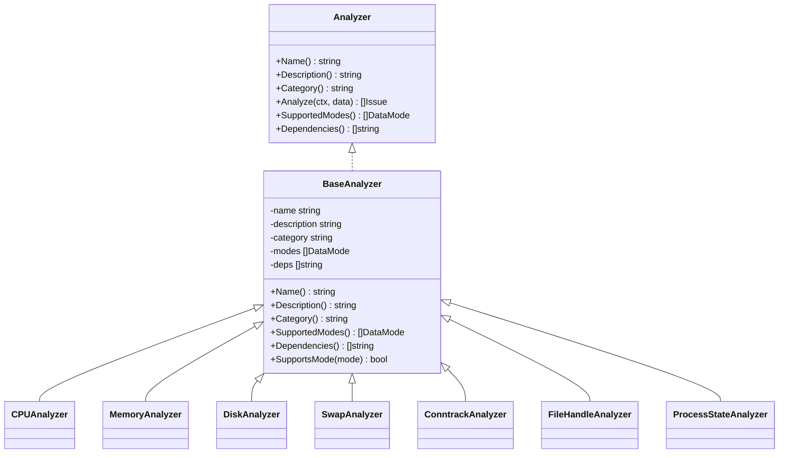
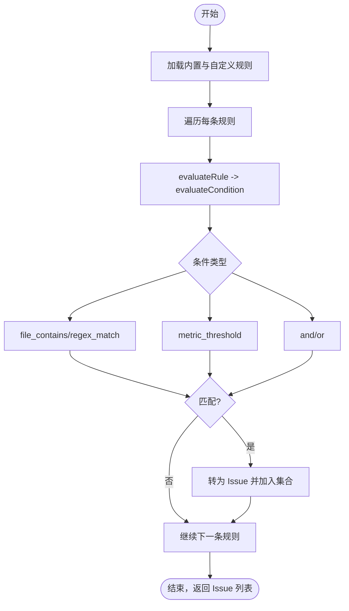
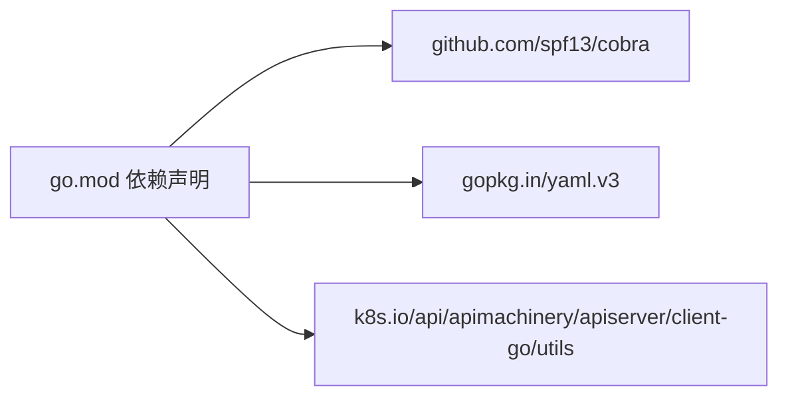

# v2.0 Go部署指南

<cite>
**本文引用的文件**
- [v2-go/cmd/kudig/main.go](file://v2-go/cmd/kudig/main.go)
- [v2-go/README.md](file://v2-go/README.md)
- [v2-go/go.mod](file://v2-go/go.mod)
- [v2-go/Dockerfile](file://v2-go/Dockerfile)
- [v2-go/Makefile](file://v2-go/Makefile)
- [v2-go/charts/kudig/Chart.yaml](file://v2-go/charts/kudig/Chart.yaml)
- [v2-go/charts/kudig/values.yaml](file://v2-go/charts/kudig/values.yaml)
- [v2-go/pkg/analyzer/interface.go](file://v2-go/pkg/analyzer/interface.go)
- [v2-go/pkg/analyzer/system/resource.go](file://v2-go/pkg/analyzer/system/resource.go)
- [v2-go/pkg/collector/interface.go](file://v2-go/pkg/collector/interface.go)
- [v2-go/pkg/collector/offline/directory.go](file://v2-go/pkg/collector/offline/directory.go)
- [v2-go/pkg/reporter/interface.go](file://v2-go/pkg/reporter/interface.go)
- [v2-go/pkg/rules/engine.go](file://v2-go/pkg/rules/engine.go)
- [v2-go/pkg/types/diagnostic_data.go](file://v2-go/pkg/types/diagnostic_data.go)
- [v2-go/rules/custom.yaml](file://v2-go/rules/custom.yaml)
</cite>

## 目录
1. [简介](#简介)
2. [项目结构](#项目结构)
3. [核心组件](#核心组件)
4. [架构总览](#架构总览)
5. [详细组件分析](#详细组件分析)
6. [依赖分析](#依赖分析)
7. [性能考量](#性能考量)
8. [故障排查指南](#故障排查指南)
9. [结论](#结论)
10. [附录](#附录)

## 简介
本指南面向希望在生产环境中部署与运维 kudig v2.0（Go 版本）的工程团队，覆盖从源码构建、容器镜像制作、Kubernetes 原生部署到日常运维与排障的全流程。v2.0 提供离线与在线两种诊断模式，内置 35+ 分析器，支持 YAML 规则引擎，并提供 Helm Chart 与 Dockerfile，便于快速落地。

## 项目结构
v2-go 目录采用按“能力域”分层的模块化组织方式，CLI 入口位于 cmd/kudig，核心能力分布在 pkg 下的 analyzer（分析器）、collector（采集器）、reporter（报告）、rules（规则引擎）、types（公共类型）等子包；部署相关包含 charts（Helm Chart）、Dockerfile、Makefile 等。

图表来源
- [v2-go/cmd/kudig/main.go](file://v2-go/cmd/kudig/main.go#L1-L120)
- [v2-go/pkg/analyzer/interface.go](file://v2-go/pkg/analyzer/interface.go#L1-L112)
- [v2-go/pkg/collector/interface.go](file://v2-go/pkg/collector/interface.go#L1-L114)
- [v2-go/pkg/reporter/interface.go](file://v2-go/pkg/reporter/interface.go#L1-L125)
- [v2-go/pkg/rules/engine.go](file://v2-go/pkg/rules/engine.go#L1-L120)
- [v2-go/pkg/types/diagnostic_data.go](file://v2-go/pkg/types/diagnostic_data.go#L1-L163)
- [v2-go/pkg/analyzer/system/resource.go](file://v2-go/pkg/analyzer/system/resource.go#L1-L120)
- [v2-go/pkg/collector/offline/directory.go](file://v2-go/pkg/collector/offline/directory.go#L1-L120)
- [v2-go/charts/kudig/Chart.yaml](file://v2-go/charts/kudig/Chart.yaml#L1-L18)
- [v2-go/charts/kudig/values.yaml](file://v2-go/charts/kudig/values.yaml#L1-L98)
- [v2-go/Dockerfile](file://v2-go/Dockerfile#L1-L47)
- [v2-go/Makefile](file://v2-go/Makefile#L1-L131)
- [v2-go/go.mod](file://v2-go/go.mod#L1-L63)
- [v2-go/README.md](file://v2-go/README.md#L1-L202)

章节来源
- [v2-go/README.md](file://v2-go/README.md#L1-L202)

## 核心组件
- CLI 与命令体系：基于 cobra 的命令树，支持 offline、online、legacy、rules、list-analyzers 等子命令，统一的全局标志（输出格式、文件、详细级别）与各模式专用标志（kubeconfig/context/node/namespace/all-nodes、规则文件/目录/列表）。
- 数据采集层：抽象接口定义 Config 与 Collector，离线实现从诊断目录读取关键文件并解析为 DiagnosticData。
- 分析引擎：Analyzer 接口与 BaseAnalyzer 基类，系统分析器示例（CPU/内存/磁盘/Swap/连接跟踪/文件句柄/进程状态）。
- 报告层：Reporter 接口与工厂，支持 text/json 输出，统一元数据结构。
- 规则引擎：基于 YAML 的条件表达式（文件包含/正则/指标阈值/逻辑组合），对离线数据执行评估。
- 类型与数据模型：DataMode、DiagnosticData、NodeInfo、SystemMetrics、DiskUsage 等。

章节来源
- [v2-go/cmd/kudig/main.go](file://v2-go/cmd/kudig/main.go#L52-L178)
- [v2-go/pkg/collector/interface.go](file://v2-go/pkg/collector/interface.go#L1-L114)
- [v2-go/pkg/collector/offline/directory.go](file://v2-go/pkg/collector/offline/directory.go#L1-L138)
- [v2-go/pkg/analyzer/interface.go](file://v2-go/pkg/analyzer/interface.go#L1-L112)
- [v2-go/pkg/analyzer/system/resource.go](file://v2-go/pkg/analyzer/system/resource.go#L1-L120)
- [v2-go/pkg/reporter/interface.go](file://v2-go/pkg/reporter/interface.go#L1-L125)
- [v2-go/pkg/rules/engine.go](file://v2-go/pkg/rules/engine.go#L1-L120)
- [v2-go/pkg/types/diagnostic_data.go](file://v2-go/pkg/types/diagnostic_data.go#L1-L163)

## 架构总览
下图展示 CLI 如何协调采集、分析、报告与规则引擎，以及与 Kubernetes API 的交互关系。

图表来源
- [v2-go/cmd/kudig/main.go](file://v2-go/cmd/kudig/main.go#L180-L483)
- [v2-go/pkg/collector/offline/directory.go](file://v2-go/pkg/collector/offline/directory.go#L1-L138)
- [v2-go/pkg/analyzer/interface.go](file://v2-go/pkg/analyzer/interface.go#L1-L112)
- [v2-go/pkg/analyzer/system/resource.go](file://v2-go/pkg/analyzer/system/resource.go#L1-L120)
- [v2-go/pkg/rules/engine.go](file://v2-go/pkg/rules/engine.go#L1-L120)
- [v2-go/pkg/reporter/interface.go](file://v2-go/pkg/reporter/interface.go#L1-L125)

## 详细组件分析

### CLI 与命令流程
- offline 流程：信号处理、打印头部信息、选择离线采集器、收集数据、执行全部分析器、去重排序、生成报告、写入文件或标准输出、根据严重度返回退出码。
- online 流程：与 offline 类似，但使用在线采集器，支持 kubeconfig/context/node/namespace/all-nodes 参数。
- rules 流程：加载内置与自定义规则（文件/目录），可列出规则；对离线数据执行规则评估，生成报告。
- legacy 流程：调用兼容层，将 bash 报告转换为 Issue 并输出 text/json。

图表来源
- [v2-go/cmd/kudig/main.go](file://v2-go/cmd/kudig/main.go#L180-L277)
- [v2-go/pkg/collector/interface.go](file://v2-go/pkg/collector/interface.go#L1-L114)
- [v2-go/pkg/collector/offline/directory.go](file://v2-go/pkg/collector/offline/directory.go#L1-L138)
- [v2-go/pkg/reporter/interface.go](file://v2-go/pkg/reporter/interface.go#L1-L125)

章节来源
- [v2-go/cmd/kudig/main.go](file://v2-go/cmd/kudig/main.go#L180-L483)

### 数据采集与解析
- 离线采集器职责：校验诊断目录、读取关键文件（system_info、system_status、service_status、memory_info、network_info、ps_command_status 等）、递归读取 daemon_status 与 logs 子目录、解析节点信息与系统指标。
- 解析逻辑：从 system_info 提取主机名、内核版本、OS、kubelet 版本；从 system_status 提取负载、磁盘 df 输出；从 memory_info 提取内存与 swap；从 network_info 提取 conntrack 统计；从 logs 子目录读取日志内容。

图表来源
- [v2-go/pkg/collector/offline/directory.go](file://v2-go/pkg/collector/offline/directory.go#L57-L138)
- [v2-go/pkg/collector/offline/directory.go](file://v2-go/pkg/collector/offline/directory.go#L140-L316)

章节来源
- [v2-go/pkg/collector/offline/directory.go](file://v2-go/pkg/collector/offline/directory.go#L1-L321)

### 分析器框架与系统分析器
- Analyzer 接口：名称、描述、分类、支持模式、依赖、分析方法。
- BaseAnalyzer：封装通用字段与方法，支持模式判断。
- 系统分析器示例：CPU/内存/磁盘/Swap/连接跟踪/文件句柄/进程状态，依据阈值与模式匹配生成 Issue。
- 注册机制：init 中将各分析器注册至默认注册表，供执行器统一调度。

图表来源
- [v2-go/pkg/analyzer/interface.go](file://v2-go/pkg/analyzer/interface.go#L1-L112)
- [v2-go/pkg/analyzer/system/resource.go](file://v2-go/pkg/analyzer/system/resource.go#L1-L120)

章节来源
- [v2-go/pkg/analyzer/interface.go](file://v2-go/pkg/analyzer/interface.go#L1-L112)
- [v2-go/pkg/analyzer/system/resource.go](file://v2-go/pkg/analyzer/system/resource.go#L1-L404)

### 规则引擎与自定义规则
- 引擎能力：遍历规则，递归评估条件（文件包含/正则/指标阈值/逻辑与/或），将匹配结果转为 Issue。
- 条件类型：file_contains、regex_match、metric_threshold、and、or。
- 自定义规则样例：包含 CPU/内存/Kubelet/OOM/Pod驱逐/连接跟踪/服务停止/磁盘与 inode 压力等场景，支持 count、negate、阈值比较与复合逻辑。

图表来源
- [v2-go/pkg/rules/engine.go](file://v2-go/pkg/rules/engine.go#L1-L297)
- [v2-go/rules/custom.yaml](file://v2-go/rules/custom.yaml#L1-L135)

章节来源
- [v2-go/pkg/rules/engine.go](file://v2-go/pkg/rules/engine.go#L1-L297)
- [v2-go/rules/custom.yaml](file://v2-go/rules/custom.yaml#L1-L135)

### 报告生成与元数据
- Reporter 接口：Generate(issues, metadata) 与 Format()。
- 元数据：报告版本、时间戳、主机名、诊断目录、模式、引擎、摘要统计。
- 输出：支持 text/json，默认 text；可写入文件或标准输出。

章节来源
- [v2-go/pkg/reporter/interface.go](file://v2-go/pkg/reporter/interface.go#L1-L125)

## 依赖分析
- 外部依赖：cobra（命令行）、yaml.v3（规则与配置）、k8s.io/*（在线模式访问 API）。
- 构建与打包：Makefile 提供构建、测试、清理、安装、交叉编译、Docker 构建等目标；Dockerfile 采用多阶段构建，Alpine 运行时，内置健康检查与默认入口。
- Helm Chart：Chart.yaml 描述应用元信息；values.yaml 控制 DaemonSet/Deployment、RBAC、安全上下文、HostPath 挂载、规则目录、调度周期、指标导出等。

图表来源
- [v2-go/go.mod](file://v2-go/go.mod#L1-L63)

章节来源
- [v2-go/go.mod](file://v2-go/go.mod#L1-L63)
- [v2-go/Dockerfile](file://v2-go/Dockerfile#L1-L47)
- [v2-go/Makefile](file://v2-go/Makefile#L1-L131)
- [v2-go/charts/kudig/Chart.yaml](file://v2-go/charts/kudig/Chart.yaml#L1-L18)
- [v2-go/charts/kudig/values.yaml](file://v2-go/charts/kudig/values.yaml#L1-L98)

## 性能考量
- 离线模式：I/O 主导，建议将诊断目录置于高性能存储；避免在大规模日志上做正则扫描，必要时预筛选。
- 在线模式：API 调用带宽与延迟敏感，合理设置超时与 context 取消；按需聚焦命名空间与节点，减少请求范围。
- 规则引擎：复杂正则与多次文件扫描会放大成本，建议合并条件、限制 count、使用阈值替代全量匹配。
- 报告生成：JSON 序列化在大数据量下有开销，可优先使用 text 格式或定向输出关键字段。
- 容器与调度：DaemonSet 需要特权权限与主机路径挂载，确保节点资源预留与容忍策略满足需求。

## 故障排查指南
- 常见错误与定位
  - 离线模式报错“离线采集器不可用”：确认导入了离线采集器包并注册。
  - 在线模式无法连接集群：检查 kubeconfig、context、节点/命名空间参数；确认 RBAC 具备读取权限。
  - 规则加载失败：检查自定义规则文件/目录路径与 YAML 格式；确认规则 ID 唯一且条件合法。
  - 输出格式未知：确认 --format 传参为 text/json。
- 退出码语义
  - 0：无问题
  - 1：存在警告/问题
  - 2：存在严重问题
- 日志与调试
  - 使用 -v 详细模式查看流程与元数据。
  - 对于在线模式，建议先缩小范围（指定 node/namespace）以降低噪声。
  - 使用 rules --list 查看已加载规则，辅助定位误报或漏报。

章节来源
- [v2-go/cmd/kudig/main.go](file://v2-go/cmd/kudig/main.go#L240-L277)
- [v2-go/cmd/kudig/main.go](file://v2-go/cmd/kudig/main.go#L474-L482)
- [v2-go/cmd/kudig/main.go](file://v2-go/cmd/kudig/main.go#L560-L609)

## 结论
v2.0 提供了稳定、可扩展的诊断能力与原生 Kubernetes 部署方案。通过离线/在线双模式、丰富的分析器与规则引擎、完善的 Helm Chart 与 Dockerfile，可在不同环境下快速落地。建议结合业务场景定制规则、优化阈值与扫描范围，并在生产中配合 DaemonSet 与定期巡检策略使用。

## 附录

### 快速部署与使用要点
- 本地构建与测试
  - 下载依赖、构建二进制、运行测试、交叉编译、构建 Docker 镜像。
- 容器镜像
  - 多阶段构建，Alpine 运行时，内置健康检查，ENTRYPOINT 默认显示帮助。
- Helm 部署
  - Chart.yaml 描述应用元信息；values.yaml 支持 DaemonSet/Deployment、RBAC、特权容器、HostPath 挂载、规则目录、调度周期、指标导出等。
- 常用命令参考
  - 离线模式：kudig offline [-v] [--format json] [-o 文件] <诊断目录>
  - 在线模式：kudig online [--kubeconfig] [--context] [--node] [--namespace] [--all-nodes]
  - 规则模式：kudig rules [--file|--dir|--list] <诊断目录>
  - 兼容模式：kudig legacy <诊断目录>
  - 列出分析器：kudig list-analyzers

章节来源
- [v2-go/README.md](file://v2-go/README.md#L65-L143)
- [v2-go/Dockerfile](file://v2-go/Dockerfile#L1-L47)
- [v2-go/charts/kudig/Chart.yaml](file://v2-go/charts/kudig/Chart.yaml#L1-L18)
- [v2-go/charts/kudig/values.yaml](file://v2-go/charts/kudig/values.yaml#L1-L98)
- [v2-go/Makefile](file://v2-go/Makefile#L1-L131)