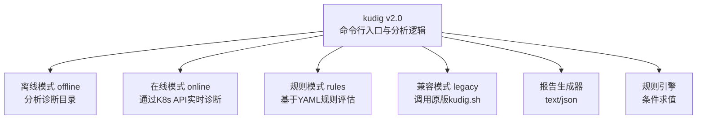
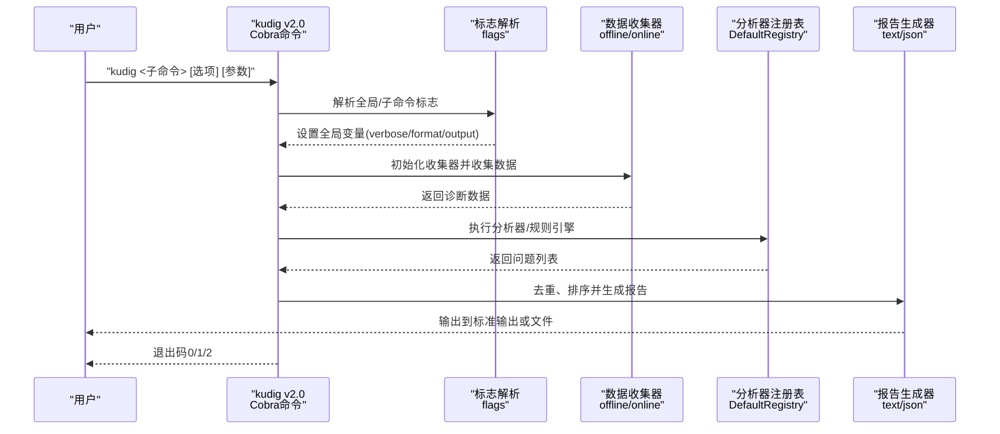
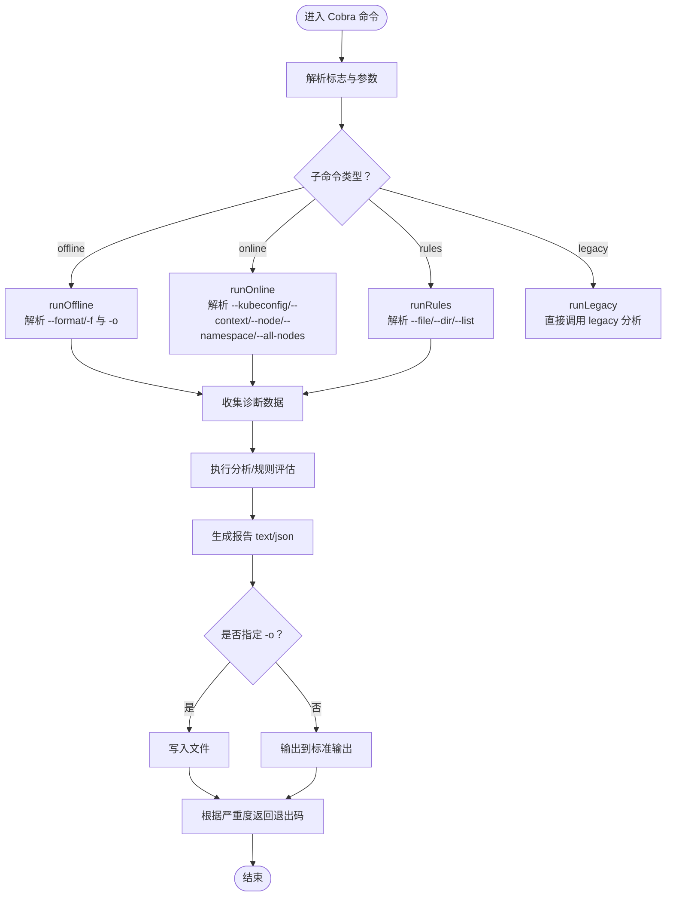

# 使用方法

<cite>
**本文引用的文件**
- [main.go](file://v2-go/cmd/kudig/main.go)
- [README.md（v2-go）](file://v2-go/README.md)
- [Makefile（v2-go）](file://v2-go/Makefile)
- [text.go](file://v2-go/pkg/reporter/text.go)
- [json.go](file://v2-go/pkg/reporter/json.go)
- [severity.go](file://v2-go/pkg/types/severity.go)
- [engine.go](file://v2-go/pkg/rules/engine.go)
- [custom.yaml](file://v2-go/rules/custom.yaml)
- [diagnose_k8s.sh](file://reference/diagnose_k8s/diagnose_k8s.sh)
- [README.md（v1-bash）](file://v1-bash/README.md)
- [TESTING.md（v1-bash）](file://v1-bash/TESTING.md)
</cite>

## 目录
1. [简介](#简介)
2. [项目结构](#项目结构)
3. [核心组件](#核心组件)
4. [架构总览](#架构总览)
5. [详细组件分析](#详细组件分析)
6. [依赖关系分析](#依赖关系分析)
7. [性能考虑](#性能考虑)
8. [故障排除指南](#故障排除指南)
9. [结论](#结论)
10. [附录](#附录)

## 简介
本章节面向首次使用者与自动化运维工程师，系统性讲解 kudig v2.0（Go 版本）的命令行接口与使用方法。重点覆盖：
- 基本用法 kudig offline <诊断目录> 的参数来源与路径格式
- 所有命令行选项的语义与实现逻辑（--help、--version、--verbose、--format/-f、-o/--output）
- 参数解析机制（Cobra 命令框架与 flags 注册）
- 退出码含义及在自动化脚本中的应用
- 多个实用示例：离线分析、详细模式、JSON 输出、保存文件
- 新增模式：在线模式、规则模式、兼容模式（legacy）
- 故障排除：当用户忘记指定诊断目录时的错误检查与反馈

## 项目结构
kudig v2.0 采用 Go 语言实现，提供多种诊断模式与报告格式，支持离线分析、在线诊断、规则引擎与兼容旧版 Bash 脚本。README.md（v2-go）提供了完整的使用说明与示例。

图表来源
- [main.go](file://v2-go/cmd/kudig/main.go#L59-L178)
- [README.md（v2-go）](file://v2-go/README.md#L84-L142)

章节来源
- [main.go](file://v2-go/cmd/kudig/main.go#L59-L178)
- [README.md（v2-go）](file://v2-go/README.md#L84-L142)

## 核心组件
- 命令与子命令：rootCmd、offlineCmd、onlineCmd、rulesCmd、legacyCmd、list-analyzers
- 全局标志：--verbose、--output/-o、--format/-f
- 在线模式标志：--kubeconfig、--context、--node/-n、--namespace、--all-nodes
- 规则模式标志：--file、--dir、--list
- 报告生成：text 与 json 两种格式
- 退出码策略：0 表示无异常；1 表示存在警告/提示；2 表示存在严重异常

章节来源
- [main.go](file://v2-go/cmd/kudig/main.go#L59-L178)
- [text.go](file://v2-go/pkg/reporter/text.go#L37-L105)
- [json.go](file://v2-go/pkg/reporter/json.go#L26-L34)
- [severity.go](file://v2-go/pkg/types/severity.go#L78-L89)

## 架构总览
下图展示了从命令行到最终报告输出的整体流程，以及与诊断目录的关系。

图表来源
- [main.go](file://v2-go/cmd/kudig/main.go#L180-L277)
- [main.go](file://v2-go/cmd/kudig/main.go#L368-L483)
- [main.go](file://v2-go/cmd/kudig/main.go#L485-L609)
- [text.go](file://v2-go/pkg/reporter/text.go#L37-L105)
- [json.go](file://v2-go/pkg/reporter/json.go#L26-L34)

## 详细组件分析

### 命令行接口与参数解析
- **全局选项**
  - -h, --help：打印帮助信息并退出
  - -v, --version：打印版本信息并退出
  - --verbose：启用详细调试输出（向标准错误输出）
  - --format/-f：输出格式（text、json，默认 text）
  - -o, --output：将报告保存到指定文件
- **离线模式（offline）**
  - 语法：kudig offline <诊断目录>
  - 作用：分析由 diagnose_k8s.sh 生成的诊断目录
- **在线模式（online）**
  - 语法：kudig online [选项]
  - 选项：--kubeconfig、--context、--node/-n、--namespace、--all-nodes
  - 作用：通过 K8s API 实时诊断集群
- **规则模式（rules）**
  - 语法：kudig rules [选项] <诊断目录>
  - 选项：--file、--dir、--list
  - 作用：加载内置或自定义规则，对离线数据进行评估
- **兼容模式（legacy）**
  - 语法：kudig legacy <诊断目录>
  - 作用：调用原版 Bash 脚本进行分析，保持向后兼容
- **列出分析器（list-analyzers）**
  - 语法：kudig list-analyzers
  - 作用：列出所有可用分析器及其支持模式

章节来源
- [main.go](file://v2-go/cmd/kudig/main.go#L59-L178)
- [main.go](file://v2-go/cmd/kudig/main.go#L180-L277)
- [main.go](file://v2-go/cmd/kudig/main.go#L368-L483)
- [main.go](file://v2-go/cmd/kudig/main.go#L485-L609)

### 诊断目录的来源与路径格式
- **来源**：由 diagnose_k8s.sh 在 /tmp 下创建以 diagnose_<timestamp> 命名的目录，并填充各类诊断文件。
- **路径格式**：/tmp/diagnose_<timestamp>，其中 timestamp 为当前时间戳。
- **关键文件（示例）**：system_info、service_status、system_status、network_info、memory_info、logs/dmesg.log、logs/kubelet.log 等。

章节来源
- [diagnose_k8s.sh](file://reference/diagnose_k8s/diagnose_k8s.sh#L1-L40)
- [README.md（v1-bash）](file://v1-bash/README.md#L27-L49)

### 选项实现逻辑（Cobra 标志注册与处理）
- 全局标志通过 PersistentFlags 注册，子命令共享这些标志
- 离线模式：解析 --format 与 -o；若传入 --json（已废弃标志）则覆盖为 json
- 在线模式：解析 --kubeconfig、--context、--node/-n、--namespace、--all-nodes
- 规则模式：解析 --file、--dir、--list；当 --list 为真时仅列出规则
- 兼容模式：直接调用 legacy 分析流程

章节来源
- [main.go](file://v2-go/cmd/kudig/main.go#L150-L178)
- [main.go](file://v2-go/cmd/kudig/main.go#L240-L249)
- [main.go](file://v2-go/cmd/kudig/main.go#L368-L483)
- [main.go](file://v2-go/cmd/kudig/main.go#L485-L609)

### 退出码含义与自动化应用
- 0：未检测到异常
- 1：检测到警告或提示级别异常
- 2：检测到严重级别异常
- 自动化脚本可据此判断是否需要告警或进一步处理。

章节来源
- [severity.go](file://v2-go/pkg/types/severity.go#L78-L89)
- [main.go](file://v2-go/cmd/kudig/main.go#L268-L277)
- [main.go](file://v2-go/cmd/kudig/main.go#L474-L482)
- [main.go](file://v2-go/cmd/kudig/main.go#L600-L608)

### 实用使用示例
- 离线分析基础：kudig offline /tmp/diagnose_1702468800
- 详细模式：kudig offline -v /tmp/diagnose_1702468800
- JSON 格式输出（用于 API 集成）：kudig offline --format json /tmp/diagnose_1702468800
- 保存报告到文件：kudig offline -o report.txt /tmp/diagnose_1702468800
- 组合使用多个选项：kudig offline -v --format json -o report.json /tmp/diagnose_1702468800
- 在线模式示例：kudig online --kubeconfig ~/.kube/config --node worker-1
- 规则模式示例：kudig rules --file rules/custom.yaml /tmp/diagnose_1702468800
- 兼容模式示例：kudig legacy /tmp/diagnose_1702468800
- 列出分析器：kudig list-analyzers

章节来源
- [README.md（v2-go）](file://v2-go/README.md#L84-L142)
- [main.go](file://v2-go/cmd/kudig/main.go#L180-L277)
- [main.go](file://v2-go/cmd/kudig/main.go#L368-L483)
- [main.go](file://v2-go/cmd/kudig/main.go#L485-L609)

### 参数解析流程（Cobra 层面说明）

图表来源
- [main.go](file://v2-go/cmd/kudig/main.go#L180-L277)
- [main.go](file://v2-go/cmd/kudig/main.go#L368-L483)
- [main.go](file://v2-go/cmd/kudig/main.go#L485-L609)

### 规则引擎与自定义规则
- 规则加载顺序：内置规则优先，随后加载自定义文件或目录
- 支持条件类型：file_contains、regex_match、metric_threshold、and、or
- 支持计数与否定（count、negate）
- 支持按分类评估（EvaluateByCategory）

章节来源
- [engine.go](file://v2-go/pkg/rules/engine.go#L24-L49)
- [engine.go](file://v2-go/pkg/rules/engine.go#L77-L98)
- [engine.go](file://v2-go/pkg/rules/engine.go#L100-L136)
- [engine.go](file://v2-go/pkg/rules/engine.go#L138-L158)
- [engine.go](file://v2-go/pkg/rules/engine.go#L160-L249)
- [engine.go](file://v2-go/pkg/rules/engine.go#L251-L288)
- [custom.yaml](file://v2-go/rules/custom.yaml#L1-L135)

## 依赖关系分析
- **外部命令依赖**：v1-bash 版本依赖 grep、awk、sed、wc、sort、uniq、tail、head、find 等命令；v2-go 为独立二进制，不依赖系统 shell 命令
- **输入依赖**：离线模式依赖诊断目录；在线模式依赖 kubeconfig 与集群访问权限；规则模式依赖诊断目录与规则文件
- **输出依赖**：--format/-f 控制输出格式；-o 控制文件写入

章节来源
- [README.md（v1-bash）](file://v1-bash/README.md#L27-L49)
- [main.go](file://v2-go/cmd/kudig/main.go#L368-L483)
- [main.go](file://v2-go/cmd/kudig/main.go#L485-L609)

## 性能考虑
- 离线模式：诊断目录越大，文件扫描与正则匹配耗时越长。建议仅分析最近一次的诊断目录，避免不必要的全量扫描
- 在线模式：受集群规模与 API 延迟影响，建议合理设置超时与并发
- 规则模式：规则越多、正则越复杂，评估耗时越长
- --verbose 会增加标准错误输出，对性能影响较小，但会增大输出体积

## 故障排除指南
- **忘记指定诊断目录**
  - 现象：离线/规则模式报错并退出
  - 处理：确保提供正确的 /tmp/diagnose_<timestamp> 路径
- **诊断目录不存在**
  - 现象：离线/规则模式报错并退出
  - 处理：确认 diagnose_k8s.sh 是否成功执行并生成目录
- **缺少必要命令（v1-bash）**
  - 现象：v1-bash 版本检查缺失命令并退出
  - 处理：安装缺失命令（如 grep、awk、sed、findutils 等）
- **诊断目录结构不完整**
  - 现象：v1-bash 版本发出警告但仍继续分析
  - 处理：使用完整 diagnose_k8s.sh 收集数据，确保关键文件存在
- **无法读取某些日志文件**
  - 现象：对应检测项无结果
  - 处理：确认日志文件存在于诊断目录中，或检查权限
- **在线模式连接失败**
  - 现象：连接 K8s API 失败
  - 处理：检查 --kubeconfig、--context、网络连通性与认证配置
- **规则文件加载失败**
  - 现象：规则文件或目录不可读
  - 处理：检查路径与权限，确认规则格式正确

章节来源
- [main.go](file://v2-go/cmd/kudig/main.go#L368-L483)
- [main.go](file://v2-go/cmd/kudig/main.go#L485-L609)
- [README.md（v1-bash）](file://v1-bash/README.md#L27-L49)
- [TESTING.md（v1-bash）](file://v1-bash/TESTING.md#L38-L45)

## 结论
kudig v2.0 提供更丰富的诊断能力与更好的可维护性，支持离线、在线、规则与兼容四种模式，满足不同场景下的 Kubernetes 节点诊断需求。通过 --verbose、--format/-f、-o 等选项，既能满足人工审阅，也能无缝对接自动化与 API 集成。遵循本文提供的使用方法与故障排除建议，可在生产环境中稳定高效地部署与使用。

## 附录
- 诊断目录命名规范：/tmp/diagnose_<timestamp>
- 退出码速查：0（无异常）、1（警告/提示）、2（严重异常）
- 常用组合示例：kudig offline -v --format json -o report.json /tmp/diagnose_1702468800
- 构建与运行：参考 v2-go/Makefile 的构建与测试命令

章节来源
- [Makefile（v2-go）](file://v2-go/Makefile#L24-L131)
- [README.md（v2-go）](file://v2-go/README.md#L84-L142)