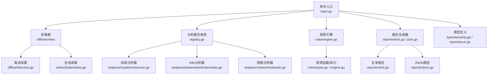
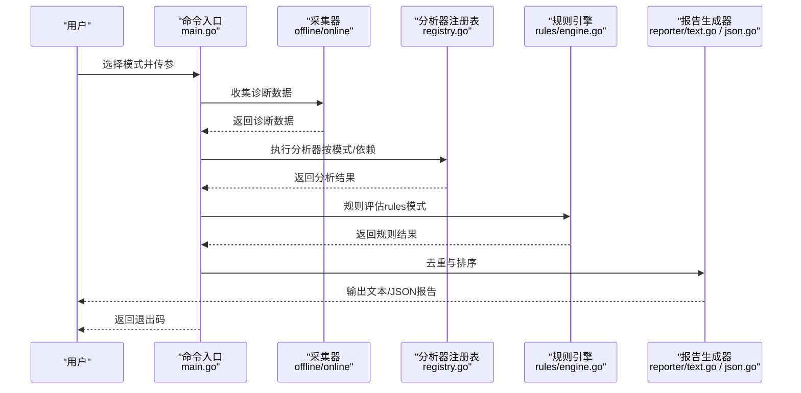
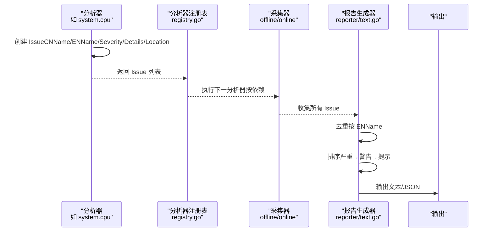

# 功能特性

<cite>
**本文引用的文件**
- [main.go](file://v2-go/cmd/kudig/main.go)
- [registry.go](file://v2-go/pkg/analyzer/registry.go)
- [interface.go](file://v2-go/pkg/analyzer/interface.go)
- [text.go](file://v2-go/pkg/reporter/text.go)
- [json.go](file://v2-go/pkg/reporter/json.go)
- [severity.go](file://v2-go/pkg/types/severity.go)
- [issue.go](file://v2-go/pkg/types/issue.go)
- [engine.go](file://v2-go/pkg/rules/engine.go)
- [types.go](file://v2-go/pkg/rules/types.go)
- [directory.go](file://v2-go/pkg/collector/offline/directory.go)
- [kubernetes.go](file://v2-go/pkg/collector/online/kubernetes.go)
- [resource.go](file://v2-go/pkg/analyzer/system/resource.go)
- [kubernetes.go](file://v2-go/pkg/analyzer/kubernetes/kubernetes.go)
- [network.go](file://v2-go/pkg/analyzer/network/network.go)
</cite>

## 目录
1. [简介](#简介)
2. [项目结构](#项目结构)
3. [核心组件](#核心组件)
4. [架构总览](#架构总览)
5. [详细组件分析](#详细组件分析)
6. [依赖关系分析](#依赖关系分析)
7. [性能考量](#性能考量)
8. [故障排查指南](#故障排查指南)
9. [结论](#结论)
10. [附录](#附录)

## 简介
本文档围绕 kudig v2.0 Go 版本的功能特性展开，重点阐述以下能力：
- 全面的异常检测：覆盖系统资源、进程服务、网络、内核、容器运行时、Kubernetes 组件、时间同步与配置等八大类检测。
- 双语输出：在 Issue 结构中同时存储中文名称与英文标识符，在报告生成时统一输出。
- 严重级别分类：通过 Severity 类型与 Issue 结构体定义与应用，实现分级输出。
- 多种输出格式：文本格式与 JSON 格式，分别强调可读性与机器可读性。
- 本地化分析：完全在本地运行，不依赖外部服务或网络连接。
- 智能去重：在报告生成前对 Issue 列表进行排序与去重处理。
- YAML 规则引擎：支持自定义规则，提供条件判断与阈值比较。
- 在线/离线/规则三种诊断模式：支持离线分析、在线实时诊断与规则引擎分析。
- Kubernetes 原生部署：提供 Helm Chart 与 RBAC 配置，便于在集群内直接部署与运行。

## 项目结构
kudig v2.0 采用模块化设计，主要分为命令入口、采集层、分析器注册表、规则引擎、报告生成器与类型定义等部分。命令入口提供 offline、online、rules、legacy 等子命令；采集层负责从离线目录或在线集群收集诊断数据；分析器注册表统一管理内置分析器；规则引擎支持 YAML 规则；报告生成器提供文本与 JSON 两种输出格式。

图表来源
- [main.go](file://v2-go/cmd/kudig/main.go#L52-L178)
- [directory.go](file://v2-go/pkg/collector/offline/directory.go#L57-L138)
- [kubernetes.go](file://v2-go/pkg/collector/online/kubernetes.go#L101-L139)
- [registry.go](file://v2-go/pkg/analyzer/registry.go#L95-L112)
- [engine.go](file://v2-go/pkg/rules/engine.go#L24-L49)
- [text.go](file://v2-go/pkg/reporter/text.go#L37-L105)
- [json.go](file://v2-go/pkg/reporter/json.go#L26-L34)
- [resource.go](file://v2-go/pkg/analyzer/system/resource.go#L32-L74)
- [kubernetes.go](file://v2-go/pkg/analyzer/kubernetes/kubernetes.go#L33-L62)
- [network.go](file://v2-go/pkg/analyzer/network/network.go#L32-L71)

章节来源
- [main.go](file://v2-go/cmd/kudig/main.go#L52-L178)
- [directory.go](file://v2-go/pkg/collector/offline/directory.go#L57-L138)
- [kubernetes.go](file://v2-go/pkg/collector/online/kubernetes.go#L101-L139)
- [registry.go](file://v2-go/pkg/analyzer/registry.go#L95-L112)
- [engine.go](file://v2-go/pkg/rules/engine.go#L24-L49)
- [text.go](file://v2-go/pkg/reporter/text.go#L37-L105)
- [json.go](file://v2-go/pkg/reporter/json.go#L26-L34)
- [resource.go](file://v2-go/pkg/analyzer/system/resource.go#L32-L74)
- [kubernetes.go](file://v2-go/pkg/analyzer/kubernetes/kubernetes.go#L33-L62)
- [network.go](file://v2-go/pkg/analyzer/network/network.go#L32-L71)

## 核心组件
- 命令入口与模式
  - offline：离线分析诊断目录，支持文本/JSON 输出与文件保存。
  - online：在线诊断集群，支持 kubeconfig/context/node/namespace/all-nodes 等参数。
  - rules：基于 YAML 规则进行诊断，支持内置规则与自定义规则文件/目录。
  - legacy：兼容旧版 Bash 脚本，输出统一为 Issue 结构并生成报告。
- 采集层
  - 离线采集：从 diagnose_k8s.sh 生成的目录读取 system_info、system_status、service_status、memory_info、network_info、ps_command_status、daemon_status、logs 等文件。
  - 在线采集：通过 K8s API 获取节点信息、事件、Pod 状态、系统组件状态等。
- 分析器注册表
  - 默认注册表维护所有已注册分析器，支持按模式过滤、按类别筛选、按依赖拓扑排序执行。
- 规则引擎
  - 支持 file_contains、regex_match、metric_threshold、and/or 等条件类型，支持阈值比较与否定操作。
- 报告生成器
  - 文本报告：按严重级别分组输出，包含中文名称、英文标识、详情与位置。
  - JSON 报告：输出标准化字段，便于下游系统消费。
- 类型定义
  - Issue 结构体包含严重级别、中文名、英文标识、详情、位置、修复建议、元数据等。
  - Severity 类型提供中文/英文字符串表示与退出码映射。

章节来源
- [main.go](file://v2-go/cmd/kudig/main.go#L180-L277)
- [main.go](file://v2-go/cmd/kudig/main.go#L341-L483)
- [main.go](file://v2-go/cmd/kudig/main.go#L485-L609)
- [directory.go](file://v2-go/pkg/collector/offline/directory.go#L57-L138)
- [kubernetes.go](file://v2-go/pkg/collector/online/kubernetes.go#L101-L139)
- [registry.go](file://v2-go/pkg/analyzer/registry.go#L95-L112)
- [engine.go](file://v2-go/pkg/rules/engine.go#L24-L49)
- [text.go](file://v2-go/pkg/reporter/text.go#L37-L105)
- [json.go](file://v2-go/pkg/reporter/json.go#L26-L34)
- [issue.go](file://v2-go/pkg/types/issue.go#L8-L36)
- [severity.go](file://v2-go/pkg/types/severity.go#L9-L20)

## 架构总览
kudig v2.0 的整体工作流如下：命令入口解析参数并选择模式；采集器收集诊断数据；分析器注册表按模式与依赖执行分析；规则引擎按规则集评估；报告生成器统一去重、排序并输出文本或 JSON 报告；最后根据最高严重级别返回退出码。

图表来源
- [main.go](file://v2-go/cmd/kudig/main.go#L180-L277)
- [main.go](file://v2-go/cmd/kudig/main.go#L341-L483)
- [main.go](file://v2-go/cmd/kudig/main.go#L485-L609)
- [registry.go](file://v2-go/pkg/analyzer/registry.go#L95-L112)
- [engine.go](file://v2-go/pkg/rules/engine.go#L24-L49)
- [text.go](file://v2-go/pkg/reporter/text.go#L134-L161)
- [json.go](file://v2-go/pkg/reporter/json.go#L26-L34)

章节来源
- [main.go](file://v2-go/cmd/kudig/main.go#L180-L277)
- [main.go](file://v2-go/cmd/kudig/main.go#L341-L483)
- [main.go](file://v2-go/cmd/kudig/main.go#L485-L609)
- [registry.go](file://v2-go/pkg/analyzer/registry.go#L95-L112)
- [engine.go](file://v2-go/pkg/rules/engine.go#L24-L49)
- [text.go](file://v2-go/pkg/reporter/text.go#L134-L161)
- [json.go](file://v2-go/pkg/reporter/json.go#L26-L34)

## 详细组件分析

### 全面的异常检测（八大类）
- 系统资源
  - CPU 负载、内存使用、磁盘空间、连接跟踪表、文件句柄、进程状态等。
  - 关键实现：system/cpu、system/memory、system/disk、system/conntrack、system/filehandle、system/process_state。
- 进程与服务
  - kubelet 状态、容器运行时、ps 命令挂起、D 状态进程等。
  - 关键实现：system/process_state。
- 网络
  - 网卡接口状态、默认路由、kubelet 端口监听、iptables 规则数量、inode 使用等。
  - 关键实现：network/interface、network/route、network/port、network/iptables、network/inode。
- 内核
  - 通过日志模式匹配检测内核相关问题（示例：内核 panic、OOM Killer 等检测思路见规则引擎）。
  - 关键实现：规则引擎支持 file_contains/regex_match 条件。
- 容器运行时
  - 通过日志与事件检查容器运行时状态（示例：CRI 日志与事件分析思路见规则引擎）。
  - 关键实现：规则引擎支持 file_contains/regex_match 条件。
- Kubernetes 组件
  - PLEG 健康、CNI 插件错误、证书状态、API Server 连接、节点状态、镜像拉取、Pod 状态、事件等。
  - 关键实现：kubernetes/pleg、kubernetes/cni、kubernetes/certificate、kubernetes/apiserver、kubernetes/node_status、kubernetes/image_pull、kubernetes/pod_status、kubernetes/events。
- 时间同步
  - 通过日志模式匹配检测 ntpd/chronyd 未运行等问题（示例：规则引擎支持 file_contains/regex_match 条件）。
  - 关键实现：规则引擎。
- 配置
  - 通过日志与系统信息检查配置问题（示例：Swap 未禁用、IP 转发、SELinux 等检测思路见规则引擎）。
  - 关键实现：规则引擎。

章节来源
- [resource.go](file://v2-go/pkg/analyzer/system/resource.go#L32-L74)
- [resource.go](file://v2-go/pkg/analyzer/system/resource.go#L94-L133)
- [resource.go](file://v2-go/pkg/analyzer/system/resource.go#L153-L184)
- [resource.go](file://v2-go/pkg/analyzer/system/resource.go#L205-L225)
- [resource.go](file://v2-go/pkg/analyzer/system/resource.go#L245-L284)
- [resource.go](file://v2-go/pkg/analyzer/system/resource.go#L304-L334)
- [resource.go](file://v2-go/pkg/analyzer/system/resource.go#L354-L392)
- [network.go](file://v2-go/pkg/analyzer/network/network.go#L32-L71)
- [network.go](file://v2-go/pkg/analyzer/network/network.go#L90-L114)
- [network.go](file://v2-go/pkg/analyzer/network/network.go#L133-L162)
- [network.go](file://v2-go/pkg/analyzer/network/network.go#L181-L208)
- [network.go](file://v2-go/pkg/analyzer/network/network.go#L228-L269)
- [kubernetes.go](file://v2-go/pkg/analyzer/kubernetes/kubernetes.go#L33-L62)
- [kubernetes.go](file://v2-go/pkg/analyzer/kubernetes/kubernetes.go#L81-L110)
- [kubernetes.go](file://v2-go/pkg/analyzer/kubernetes/kubernetes.go#L129-L166)
- [kubernetes.go](file://v2-go/pkg/analyzer/kubernetes/kubernetes.go#L186-L230)
- [kubernetes.go](file://v2-go/pkg/analyzer/kubernetes/kubernetes.go#L250-L381)
- [kubernetes.go](file://v2-go/pkg/analyzer/kubernetes/kubernetes.go#L461-L496)
- [kubernetes.go](file://v2-go/pkg/analyzer/kubernetes/kubernetes.go#L553-L644)
- [kubernetes.go](file://v2-go/pkg/analyzer/kubernetes/kubernetes.go#L664-L715)

### 双语输出机制
- 数据结构
  - Issue 结构体包含 CNName（中文名称）与 ENName（英文标识），用于人类可读与统一去重。
- 输出策略
  - 文本报告：按严重级别分组输出，同时展示中文名称与英文标识。
  - JSON 报告：输出字段包含 severity、cn_name、en_name、details、location 等，便于下游系统消费。
- 关键实现
  - Issue.NewIssue：统一创建 Issue 并设置时间戳与元数据。
  - reporter.DeduplicateIssues：以 ENName 为键进行去重。
  - reporter.SortIssuesBySeverity：按严重级别排序（严重→警告→提示）。
  - main.go 中根据模式调用对应 Reporter.Generate。

章节来源
- [issue.go](file://v2-go/pkg/types/issue.go#L8-L36)
- [issue.go](file://v2-go/pkg/types/issue.go#L53-L82)
- [text.go](file://v2-go/pkg/reporter/text.go#L107-L121)
- [text.go](file://v2-go/pkg/reporter/text.go#L134-L161)
- [json.go](file://v2-go/pkg/reporter/json.go#L26-L34)
- [main.go](file://v2-go/cmd/kudig/main.go#L235-L255)

### 严重级别分类机制
- 类型定义
  - Severity：SeverityCritical、SeverityWarning、SeverityInfo。
  - String/EnglishString：提供中英文字符串表示。
  - ExitCode：根据严重级别返回退出码（0/1/2）。
- 应用方式
  - Issue.NewIssue：创建 Issue 时指定严重级别。
  - reporter.SortIssuesBySeverity：按严重级别排序。
  - main.go：根据最高严重级别决定退出码。
- 退出码
  - 0：无问题；1：存在警告/提示；2：存在严重问题。

章节来源
- [severity.go](file://v2-go/pkg/types/severity.go#L9-L20)
- [severity.go](file://v2-go/pkg/types/severity.go#L21-L47)
- [severity.go](file://v2-go/pkg/types/severity.go#L78-L90)
- [issue.go](file://v2-go/pkg/types/issue.go#L8-L36)
- [text.go](file://v2-go/pkg/reporter/text.go#L149-L160)
- [main.go](file://v2-go/cmd/kudig/main.go#L268-L277)
- [main.go](file://v2-go/cmd/kudig/main.go#L474-L482)
- [main.go](file://v2-go/cmd/kudig/main.go#L600-L608)

### 多种输出格式
- 文本格式
  - 可读性强，适合人工审阅；按严重级别分段输出，包含中文名称、英文标识、详情与位置。
  - 关键实现：reporter.TextReporter.Generate。
- JSON 格式
  - 字段标准化，便于机器解析与集成；包含 anomalies 数组与 summary 统计。
  - 关键实现：reporter.JSONReporter.Generate。
- 生成流程
  - main.go：统一调度去重、排序与输出；支持保存到文件。

章节来源
- [text.go](file://v2-go/pkg/reporter/text.go#L37-L105)
- [json.go](file://v2-go/pkg/reporter/json.go#L26-L34)
- [main.go](file://v2-go/cmd/kudig/main.go#L235-L255)

### 本地化分析优势
- 完全在本地执行，不依赖外部服务或网络连接。
- 离线采集：从 diagnose_k8s.sh 生成的目录读取文件，避免网络依赖。
- 在线采集：通过 K8s API 访问集群，支持 in-cluster 与 kubeconfig 两种方式。
- 环境检查与参数解析确保脚本在可用条件下运行。

章节来源
- [directory.go](file://v2-go/pkg/collector/offline/directory.go#L57-L138)
- [kubernetes.go](file://v2-go/pkg/collector/online/kubernetes.go#L101-L139)
- [main.go](file://v2-go/cmd/kudig/main.go#L180-L277)
- [main.go](file://v2-go/cmd/kudig/main.go#L341-L483)

### 智能去重与排序
- 去重策略
  - reporter.DeduplicateIssues：以 ENName 为键进行去重，避免同一异常重复报告。
- 排序策略
  - reporter.SortIssuesBySeverity：按严重级别（严重→警告→提示）顺序排列，提升可读性与优先级表达。
- 执行时机
  - main.go：在输出前统一执行去重与排序。

章节来源
- [text.go](file://v2-go/pkg/reporter/text.go#L134-L161)
- [main.go](file://v2-go/cmd/kudig/main.go#L231-L233)
- [main.go](file://v2-go/cmd/kudig/main.go#L440-L442)
- [main.go](file://v2-go/cmd/kudig/main.go#L567-L569)

### YAML 规则引擎
- 规则定义
  - Rule：包含 id/name/description/category/severity/enabled/condition/remediation/tags。
  - Condition：支持 file_contains、regex_match、metric_threshold、and/or、否定与阈值比较。
- 规则执行
  - Engine.Evaluate：遍历规则并评估条件，命中则转换为 Issue。
  - Loader：支持内置规则与自定义文件/目录加载。
- 适用场景
  - 自定义检测逻辑、阈值比较、日志模式匹配等。

章节来源
- [types.go](file://v2-go/pkg/rules/types.go#L8-L36)
- [types.go](file://v2-go/pkg/rules/types.go#L38-L69)
- [types.go](file://v2-go/pkg/rules/types.go#L86-L112)
- [engine.go](file://v2-go/pkg/rules/engine.go#L24-L49)
- [engine.go](file://v2-go/pkg/rules/engine.go#L77-L98)
- [engine.go](file://v2-go/pkg/rules/engine.go#L100-L136)
- [engine.go](file://v2-go/pkg/rules/engine.go#L138-L158)
- [engine.go](file://v2-go/pkg/rules/engine.go#L160-L249)
- [engine.go](file://v2-go/pkg/rules/engine.go#L251-L288)

### 三种诊断模式与 Kubernetes 原生部署
- 离线模式（offline）
  - 输入：diagnose_k8s.sh 生成的诊断目录。
  - 输出：文本/JSON 报告，支持保存到文件。
- 在线模式（online）
  - 输入：K8s 集群（支持 kubeconfig/context/node/namespace/all-nodes）。
  - 输出：文本/JSON 报告，支持保存到文件。
- 规则模式（rules）
  - 输入：诊断目录 + YAML 规则（内置/文件/目录）。
  - 输出：文本/JSON 报告，支持保存到文件。
- legacy 模式
  - 兼容旧版 Bash 脚本，输出统一为 Issue 结构并生成报告。
- Kubernetes 原生部署
  - 提供 Helm Chart 与 RBAC 配置，便于在集群内直接部署与运行。

章节来源
- [main.go](file://v2-go/cmd/kudig/main.go#L180-L277)
- [main.go](file://v2-go/cmd/kudig/main.go#L341-L483)
- [main.go](file://v2-go/cmd/kudig/main.go#L485-L609)
- [main.go](file://v2-go/cmd/kudig/main.go#L279-L339)

### 代码级协作示例
以下序列图展示了分析器如何创建 Issue，以及后续的去重与排序流程。

图表来源
- [resource.go](file://v2-go/pkg/analyzer/system/resource.go#L52-L71)
- [registry.go](file://v2-go/pkg/analyzer/registry.go#L95-L112)
- [text.go](file://v2-go/pkg/reporter/text.go#L134-L161)

章节来源
- [resource.go](file://v2-go/pkg/analyzer/system/resource.go#L52-L71)
- [registry.go](file://v2-go/pkg/analyzer/registry.go#L95-L112)
- [text.go](file://v2-go/pkg/reporter/text.go#L134-L161)

## 依赖关系分析
- 命令入口依赖采集器、分析器注册表、规则引擎与报告生成器。
- 分析器注册表依赖 Analyzer 接口与 BaseAnalyzer 基类。
- 报告生成器依赖 Issue 与 Severity 类型。
- 规则引擎依赖 Rule/Condition 类型与诊断数据结构。

章节来源
- [main.go](file://v2-go/cmd/kudig/main.go#L180-L277)
- [registry.go](file://v2-go/pkg/analyzer/registry.go#L13-L21)
- [interface.go](file://v2-go/pkg/analyzer/interface.go#L10-L29)
- [text.go](file://v2-go/pkg/reporter/text.go#L37-L105)
- [json.go](file://v2-go/pkg/reporter/json.go#L26-L34)
- [engine.go](file://v2-go/pkg/rules/engine.go#L24-L49)

## 性能考量
- 依赖拓扑排序：分析器按依赖顺序执行，避免不必要的重复计算。
- 上下文取消：支持 SIGINT/SIGTERM 信号，及时终止长时间运行的任务。
- 限流与超时：在线模式设置合理超时，避免阻塞。
- 去重与排序：在输出前统一处理，减少冗余信息。

章节来源
- [registry.go](file://v2-go/pkg/analyzer/registry.go#L165-L212)
- [main.go](file://v2-go/cmd/kudig/main.go#L180-L203)
- [main.go](file://v2-go/cmd/kudig/main.go#L368-L393)
- [main.go](file://v2-go/cmd/kudig/main.go#L486-L505)

## 故障排查指南
- 离线模式
  - 确认诊断目录完整，包含 system_info、system_status、service_status、memory_info、network_info、ps_command_status、daemon_status、logs 等文件。
- 在线模式
  - 确认 kubeconfig/context 正确，具备访问节点与事件的权限；若使用 in-cluster 方式，确认 NODE_NAME 环境变量。
- 规则模式
  - 确认规则文件/目录有效，规则 id 唯一；必要时使用 --list 查看可用规则。
- 输出与退出码
  - 文本报告按严重级别分组；JSON 报告包含 anomalies 与 summary；根据最高严重级别返回 0/1/2。

章节来源
- [directory.go](file://v2-go/pkg/collector/offline/directory.go#L57-L138)
- [kubernetes.go](file://v2-go/pkg/collector/online/kubernetes.go#L101-L139)
- [main.go](file://v2-go/cmd/kudig/main.go#L485-L520)
- [text.go](file://v2-go/pkg/reporter/text.go#L37-L105)
- [json.go](file://v2-go/pkg/reporter/json.go#L26-L34)
- [main.go](file://v2-go/cmd/kudig/main.go#L268-L277)
- [main.go](file://v2-go/cmd/kudig/main.go#L474-L482)
- [main.go](file://v2-go/cmd/kudig/main.go#L600-L608)

## 结论
kudig v2.0 在保持原有诊断能力的基础上，新增了 YAML 规则引擎、在线/离线/规则三种诊断模式与 Kubernetes 原生部署能力，进一步提升了灵活性与可扩展性。通过统一的 Issue 结构、去重与排序机制，以及文本/JSON 双格式输出，为用户提供高效、准确且易于集成的诊断工具。

## 附录
- 术语
  - Issue：检测到的问题条目，包含严重级别、中文名、英文标识、详情、位置、修复建议与元数据。
  - Analyzer：分析器接口，负责从诊断数据中检测异常。
  - Registry：分析器注册表，负责注册、查询、按模式与依赖执行分析器。
  - Reporter：报告生成器，负责生成文本或 JSON 报告。
  - Rule/Condition：规则与条件，用于定义自定义检测逻辑。