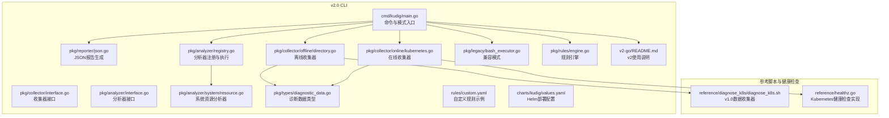
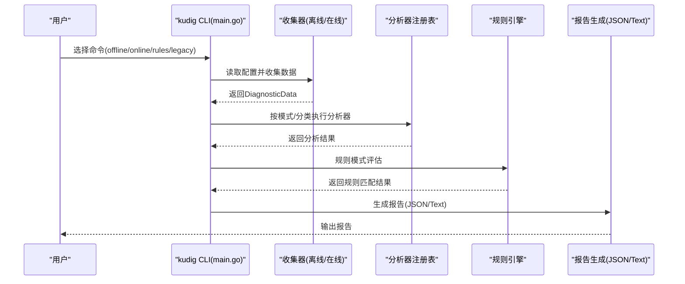
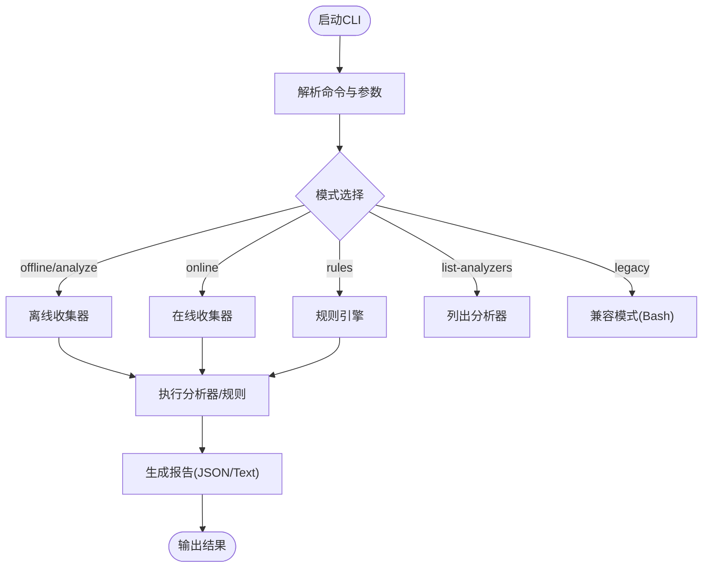
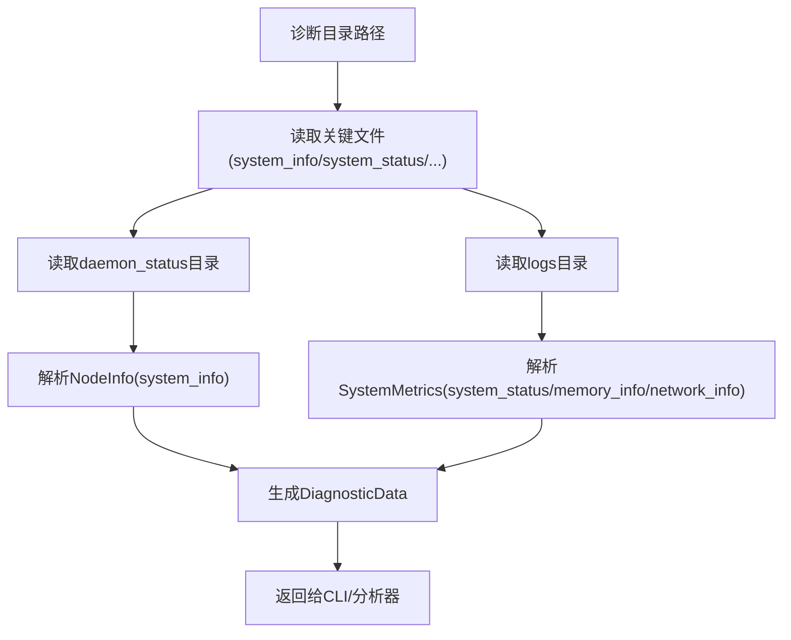
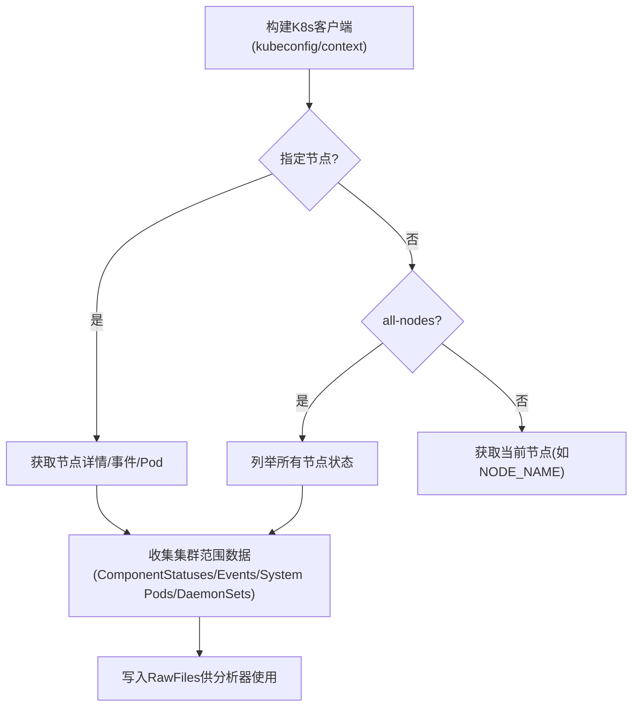
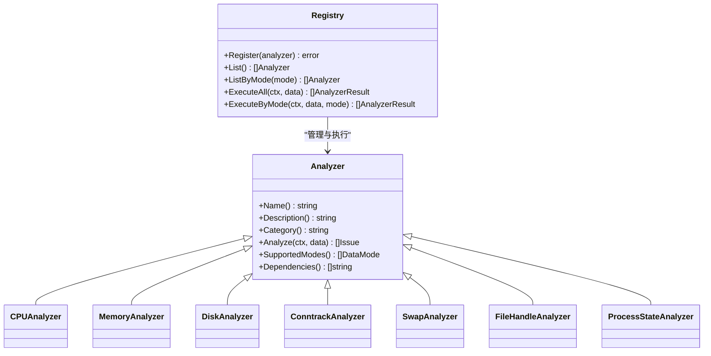
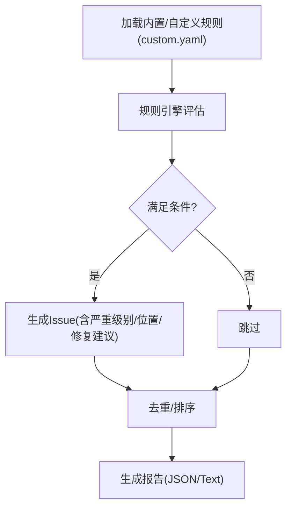
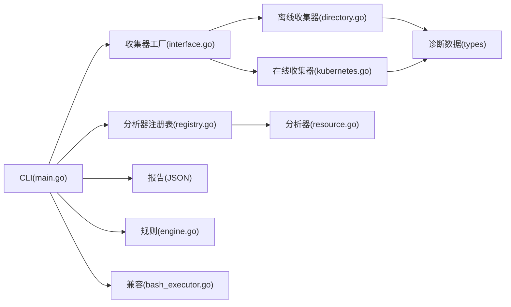

# 参考资料

<cite>
**本文引用的文件**
- [main.go](file://v2-go/cmd/kudig/main.go)
- [README.md](file://v2-go/README.md)
- [interface.go](file://v2-go/pkg/collector/interface.go)
- [directory.go](file://v2-go/pkg/collector/offline/directory.go)
- [kubernetes.go](file://v2-go/pkg/collector/online/kubernetes.go)
- [interface.go](file://v2-go/pkg/analyzer/interface.go)
- [registry.go](file://v2-go/pkg/analyzer/registry.go)
- [resource.go](file://v2-go/pkg/analyzer/system/resource.go)
- [diagnostic_data.go](file://v2-go/pkg/types/diagnostic_data.go)
- [json.go](file://v2-go/pkg/reporter/json.go)
- [engine.go](file://v2-go/pkg/rules/engine.go)
- [custom.yaml](file://v2-go/rules/custom.yaml)
- [values.yaml](file://v2-go/charts/kudig/values.yaml)
- [bash_executor.go](file://v2-go/pkg/legacy/bash_executor.go)
- [diagnose_k8s.sh](file://reference/diagnose_k8s/diagnose_k8s.sh)
- [healthz.go](file://reference/healthz.go)
</cite>

## 目录
1. [简介](#简介)
2. [项目结构](#项目结构)
3. [核心组件](#核心组件)
4. [架构总览](#架构总览)
5. [详细组件分析](#详细组件分析)
6. [依赖分析](#依赖分析)
7. [性能考虑](#性能考虑)
8. [故障排查指南](#故障排查指南)
9. [结论](#结论)
10. [附录](#附录)

## 简介
本文档围绕 kudig.sh v2.0 Go 版本参考资料进行系统化整理，重点阐述其与相关组件的关联。核心内容包括：
- v2.0 引入的 CLI 命令与模式：离线分析、在线诊断、规则引擎、列出分析器、兼容模式等。
- 数据收集层：离线收集器兼容 diagnose_k8s.sh 输出目录结构，解析 system_info/system_status/network_info/memory_info/daemon_status/logs 等关键文件；在线收集器通过 K8s API 实时拉取节点与集群信息。
- 分析引擎：内置 35+ 分析器，涵盖系统、进程、网络、内核、Kubernetes、运行时等维度，支持按模式与分类执行。
- 报告与规则：支持文本/JSON 报告输出；提供 YAML 规则引擎，支持自定义规则与复合条件。
- 与 v1.0 Bash 版本的兼容：保留 legacy 模式，无缝复用旧诊断目录。
- 与 Kubernetes 原生健康检查（healthz.go）的对比：v2.0 关注离线/在线诊断与规则扩展，healthz.go 代表组件内部实时健康探针。

## 项目结构
v2-go 目录包含 CLI、收集层、分析层、报告层、规则引擎、类型定义、Helm Chart 与示例规则等模块；reference 目录包含 v1.0 Bash 脚本与 healthz.go。

**图表来源**
- [main.go](file://v2-go/cmd/kudig/main.go#L52-L178)
- [directory.go](file://v2-go/pkg/collector/offline/directory.go#L1-L138)
- [kubernetes.go](file://v2-go/pkg/collector/online/kubernetes.go#L101-L139)
- [registry.go](file://v2-go/pkg/analyzer/registry.go#L95-L112)
- [resource.go](file://v2-go/pkg/analyzer/system/resource.go#L1-L74)
- [diagnostic_data.go](file://v2-go/pkg/types/diagnostic_data.go#L1-L71)
- [json.go](file://v2-go/pkg/reporter/json.go#L1-L40)
- [engine.go](file://v2-go/pkg/rules/engine.go#L24-L49)
- [custom.yaml](file://v2-go/rules/custom.yaml#L1-L60)
- [values.yaml](file://v2-go/charts/kudig/values.yaml#L1-L60)
- [bash_executor.go](file://v2-go/pkg/legacy/bash_executor.go#L59-L97)
- [diagnose_k8s.sh](file://reference/diagnose_k8s/diagnose_k8s.sh#L1-L120)
- [healthz.go](file://reference/healthz.go#L1-L168)

**章节来源**
- [README.md](file://v2-go/README.md#L1-L63)

## 核心组件
- CLI 与模式
  - offline/analyze：离线分析诊断目录，兼容 v1.0 输出结构。
  - online：通过 K8s API 实时诊断集群与节点。
  - rules：基于 YAML 规则引擎评估诊断数据。
  - list-analyzers：列出所有可用分析器及其支持模式。
  - legacy：调用原版 kudig.sh 脚本，生成兼容报告。
- 数据收集层
  - 离线收集器：读取 diagnose_k8s.sh 生成的诊断目录，解析关键文件与目录，构建 types.DiagnosticData。
  - 在线收集器：构建 K8s 客户端，拉取节点、事件、系统 Pod、DaemonSet 等信息。
- 分析引擎
  - 分析器接口与注册表，支持按模式与分类执行，具备依赖拓扑排序。
  - 系统资源分析器：CPU/内存/磁盘/连接跟踪/文件句柄/进程状态等。
- 报告与规则
  - JSON 文本报告生成器。
  - YAML 规则引擎：支持 file_contains、regex_match、metric_threshold、and/or 复合条件。
- 兼容层
  - legacy 模式通过 BashExecutor 执行 kudig.sh 并转换为统一 Issue 结构。

**章节来源**
- [main.go](file://v2-go/cmd/kudig/main.go#L52-L178)
- [interface.go](file://v2-go/pkg/collector/interface.go#L1-L114)
- [directory.go](file://v2-go/pkg/collector/offline/directory.go#L57-L138)
- [kubernetes.go](file://v2-go/pkg/collector/online/kubernetes.go#L101-L139)
- [interface.go](file://v2-go/pkg/analyzer/interface.go#L1-L112)
- [registry.go](file://v2-go/pkg/analyzer/registry.go#L95-L112)
- [resource.go](file://v2-go/pkg/analyzer/system/resource.go#L1-L74)
- [json.go](file://v2-go/pkg/reporter/json.go#L1-L40)
- [engine.go](file://v2-go/pkg/rules/engine.go#L24-L49)
- [bash_executor.go](file://v2-go/pkg/legacy/bash_executor.go#L59-L97)

## 架构总览
下图展示 v2.0 的核心关系：CLI 解析命令与参数，选择收集器模式，读取诊断数据，执行分析器或规则引擎，生成报告；离线模式兼容 v1.0 diagnose_k8s.sh 输出；在线模式对接 K8s API；healthz.go 代表组件内部实时健康检查。

**图表来源**
- [main.go](file://v2-go/cmd/kudig/main.go#L180-L277)
- [directory.go](file://v2-go/pkg/collector/offline/directory.go#L57-L138)
- [kubernetes.go](file://v2-go/pkg/collector/online/kubernetes.go#L101-L139)
- [registry.go](file://v2-go/pkg/analyzer/registry.go#L95-L112)
- [engine.go](file://v2-go/pkg/rules/engine.go#L24-L49)
- [json.go](file://v2-go/pkg/reporter/json.go#L21-L40)

**章节来源**
- [main.go](file://v2-go/cmd/kudig/main.go#L180-L277)

## 详细组件分析

### CLI 与命令模式
- offline/analyze：解析诊断目录，执行分析器，生成报告，支持 --format/--output/--verbose。
- online：支持 kubeconfig/context/node/namespace/all-nodes 等参数，连接集群并收集实时数据。
- rules：加载内置与自定义规则，评估诊断数据，支持 --file/--dir/--list。
- list-analyzers：列出分析器名称、类别、描述与支持模式。
- legacy：查找并执行 kudig.sh，解析 JSON 输出并转换为 Issue。

**图表来源**
- [main.go](file://v2-go/cmd/kudig/main.go#L52-L178)
- [main.go](file://v2-go/cmd/kudig/main.go#L180-L277)
- [main.go](file://v2-go/cmd/kudig/main.go#L368-L483)
- [main.go](file://v2-go/cmd/kudig/main.go#L485-L609)
- [main.go](file://v2-go/cmd/kudig/main.go#L341-L366)
- [main.go](file://v2-go/cmd/kudig/main.go#L279-L339)
- [json.go](file://v2-go/pkg/reporter/json.go#L21-L40)

**章节来源**
- [main.go](file://v2-go/cmd/kudig/main.go#L52-L178)
- [main.go](file://v2-go/cmd/kudig/main.go#L180-L277)
- [main.go](file://v2-go/cmd/kudig/main.go#L341-L366)
- [main.go](file://v2-go/cmd/kudig/main.go#L368-L483)
- [main.go](file://v2-go/cmd/kudig/main.go#L485-L609)

### 离线收集器：兼容 diagnose_k8s.sh
- 输入：诊断目录（system_info/system_status/service_status/memory_info/network_info/ps_command_status/daemon_status/logs 等）。
- 输出：types.DiagnosticData，包含 NodeInfo 与 SystemMetrics。
- 关键解析：
  - system_info：提取主机名、内核版本、OS 图像、CPU 核心数、conntrack 最大值等。
  - system_status：解析负载、磁盘使用率、文件句柄等。
  - memory_info：解析 MemTotal/MemAvailable/SwapTotal/SwapFree。
  - network_info：统计 conntrack 当前值。
- 与 v1.0 的输入匹配：完全兼容 diagnose_k8s.sh 的输出目录结构。

**图表来源**
- [directory.go](file://v2-go/pkg/collector/offline/directory.go#L57-L138)
- [directory.go](file://v2-go/pkg/collector/offline/directory.go#L140-L274)
- [diagnostic_data.go](file://v2-go/pkg/types/diagnostic_data.go#L37-L112)

**章节来源**
- [directory.go](file://v2-go/pkg/collector/offline/directory.go#L57-L138)
- [directory.go](file://v2-go/pkg/collector/offline/directory.go#L140-L274)
- [diagnostic_data.go](file://v2-go/pkg/types/diagnostic_data.go#L37-L112)

### 在线收集器：K8s API 实时诊断
- 客户端构建：优先使用 in-cluster 配置，其次 kubeconfig/context。
- 节点数据：节点标签、污点、容量/可分配资源、条件、事件、Pod 列表。
- 集群数据：ComponentStatuses、kube-system 事件、目标命名空间事件、系统 Pod 状态、DaemonSet 状态。
- 输出：以原始文本形式存储在 DiagnosticData.RawFiles 中，供分析器使用。

**图表来源**
- [kubernetes.go](file://v2-go/pkg/collector/online/kubernetes.go#L52-L99)
- [kubernetes.go](file://v2-go/pkg/collector/online/kubernetes.go#L141-L214)
- [kubernetes.go](file://v2-go/pkg/collector/online/kubernetes.go#L216-L262)

**章节来源**
- [kubernetes.go](file://v2-go/pkg/collector/online/kubernetes.go#L52-L99)
- [kubernetes.go](file://v2-go/pkg/collector/online/kubernetes.go#L141-L214)
- [kubernetes.go](file://v2-go/pkg/collector/online/kubernetes.go#L216-L262)

### 分析器框架与系统资源分析
- 分析器接口：Name/Description/Category/Analyze/SupportedModes/Dependencies。
- 注册表：支持按模式/分类/名称执行，拓扑排序依赖。
- 系统资源分析器：
  - CPUAnalyzer：基于 15 分钟负载与 CPU 核心数阈值判定。
  - MemoryAnalyzer：基于内存使用率阈值判定。
  - DiskAnalyzer：遍历磁盘使用率阈值判定。
  - ConntrackAnalyzer：基于 conntrack 当前/最大值比例判定。
  - SwapAnalyzer：检测是否启用 swap。
  - FileHandleAnalyzer：从 system_status 中解析文件句柄数。
  - ProcessStateAnalyzer：检测 ps 命令挂起与 D 状态进程。

**图表来源**
- [interface.go](file://v2-go/pkg/analyzer/interface.go#L1-L112)
- [registry.go](file://v2-go/pkg/analyzer/registry.go#L95-L112)
- [resource.go](file://v2-go/pkg/analyzer/system/resource.go#L1-L74)

**章节来源**
- [interface.go](file://v2-go/pkg/analyzer/interface.go#L1-L112)
- [registry.go](file://v2-go/pkg/analyzer/registry.go#L95-L112)
- [resource.go](file://v2-go/pkg/analyzer/system/resource.go#L1-L74)

### 报告生成与规则引擎
- JSONReporter：支持缩进输出，生成统一报告结构。
- 规则引擎：
  - 条件类型：file_contains、regex_match、metric_threshold、and/or。
  - 支持对系统指标进行阈值比较，支持否定与计数过滤。
  - 自定义规则示例：包含系统/CPU/内存/Kubernetes/网络等规则，支持复合条件。

**图表来源**
- [json.go](file://v2-go/pkg/reporter/json.go#L21-L40)
- [engine.go](file://v2-go/pkg/rules/engine.go#L24-L49)
- [engine.go](file://v2-go/pkg/rules/engine.go#L160-L249)
- [custom.yaml](file://v2-go/rules/custom.yaml#L1-L60)

**章节来源**
- [json.go](file://v2-go/pkg/reporter/json.go#L21-L40)
- [engine.go](file://v2-go/pkg/rules/engine.go#L24-L49)
- [engine.go](file://v2-go/pkg/rules/engine.go#L160-L249)
- [custom.yaml](file://v2-go/rules/custom.yaml#L1-L60)

### 兼容模式：legacy
- 查找 kudig.sh 脚本路径，执行并解析 JSON 输出。
- 将 Bash 报告转换为统一 Issue 结构，支持 --verbose 与 --json 输出。

**章节来源**
- [bash_executor.go](file://v2-go/pkg/legacy/bash_executor.go#L30-L58)
- [bash_executor.go](file://v2-go/pkg/legacy/bash_executor.go#L59-L97)
- [bash_executor.go](file://v2-go/pkg/legacy/bash_executor.go#L149-L180)

### 与 v1.0 Bash 脚本与 healthz.go 的关系
- 与 diagnose_k8s.sh：v2.0 离线收集器完全兼容其输出目录结构，确保数据源无缝迁移。
- 与 healthz.go：v2.0 专注于离线/在线诊断与规则扩展，healthz.go 代表 Kubernetes 组件内部的实时健康检查（livez/readyz），二者互补：前者用于事后分析，后者用于实时监控。

**章节来源**
- [diagnose_k8s.sh](file://reference/diagnose_k8s/diagnose_k8s.sh#L1-L120)
- [healthz.go](file://reference/healthz.go#L1-L168)

## 依赖分析
- 组件耦合
  - CLI 通过收集器工厂获取离线/在线收集器，按模式执行分析器或规则引擎。
  - 离线收集器依赖 diagnose_k8s.sh 的目录结构；在线收集器依赖 K8s API。
  - 分析器注册表维护依赖关系，执行前进行拓扑排序。
- 外部依赖
  - 在线模式依赖 kubernetes/client-go。
  - 规则引擎依赖正则表达式与阈值比较。
  - 兼容模式依赖 bash 与 kudig.sh 脚本。

**图表来源**
- [main.go](file://v2-go/cmd/kudig/main.go#L180-L277)
- [interface.go](file://v2-go/pkg/collector/interface.go#L79-L114)
- [directory.go](file://v2-go/pkg/collector/offline/directory.go#L57-L138)
- [kubernetes.go](file://v2-go/pkg/collector/online/kubernetes.go#L101-L139)
- [registry.go](file://v2-go/pkg/analyzer/registry.go#L95-L112)
- [resource.go](file://v2-go/pkg/analyzer/system/resource.go#L1-L74)
- [json.go](file://v2-go/pkg/reporter/json.go#L21-L40)
- [engine.go](file://v2-go/pkg/rules/engine.go#L24-L49)
- [bash_executor.go](file://v2-go/pkg/legacy/bash_executor.go#L59-L97)

**章节来源**
- [main.go](file://v2-go/cmd/kudig/main.go#L180-L277)
- [interface.go](file://v2-go/pkg/collector/interface.go#L79-L114)
- [registry.go](file://v2-go/pkg/analyzer/registry.go#L95-L112)

## 性能考虑
- 离线模式：仅读取本地文件，解析关键指标，避免复杂计算。
- 在线模式：设置合理超时，按需拉取节点/事件/系统 Pod 等数据，避免全量扫描。
- 规则引擎：支持按类别与名称筛选，减少不必要的评估。
- 分析器执行：拓扑排序确保依赖顺序，避免重复计算。

[本节为一般性指导，不涉及具体文件分析]

## 故障排查指南
- 离线模式
  - 确认诊断目录存在且包含 system_info/system_status 等关键文件。
  - 若缺少某些文件，分析器会跳过对应检测，但可能降低覆盖度。
- 在线模式
  - 确认 kubeconfig/context 可用，或使用 in-cluster 配置。
  - 检查网络连通性与 RBAC 权限。
- 规则引擎
  - 自定义规则语法错误会跳过该规则，不影响其他规则执行。
  - file_contains/regex_match 依赖 RawFiles 中的文件内容。
- 兼容模式
  - 确保 bash 与 kudig.sh 脚本可执行，输出 JSON 可解析。

**章节来源**
- [directory.go](file://v2-go/pkg/collector/offline/directory.go#L36-L56)
- [kubernetes.go](file://v2-go/pkg/collector/online/kubernetes.go#L42-L51)
- [engine.go](file://v2-go/pkg/rules/engine.go#L77-L98)
- [bash_executor.go](file://v2-go/pkg/legacy/bash_executor.go#L59-L97)

## 结论
- v2.0 Go 版本在 v1.0 Bash 基础上实现了模块化、可扩展的诊断工具链：CLI、收集层、分析层、规则引擎与报告层协同工作。
- 离线模式兼容 diagnose_k8s.sh 输出，确保历史数据分析的连续性；在线模式通过 K8s API 实时诊断，弥补离线视角的不足。
- healthz.go 代表组件内部实时健康检查，与 v2.0 的离线/在线诊断形成互补：前者关注“当下”，后者关注“过去与综合”。

[本节为总结性内容，不涉及具体文件分析]

## 附录

### 获取方式与使用建议
- 获取方式
  - 从仓库根目录使用 kudig.sh（v1.0）与 reference 下的 diagnose_k8s.sh、healthz.go。
  - 使用 v2-go/README.md 了解 v2.0 的构建、使用与部署方式。
- 使用建议
  - 诊断数据收集：在目标节点以 root 权限执行 diagnose_k8s.sh，生成诊断目录。
  - 离线分析：在任意 Linux 环境（无需 root）运行 kudig offline，读取诊断目录并生成报告。
  - 在线诊断：在具备 kubeconfig 的环境中运行 kudig online，实时拉取集群与节点信息。
  - 规则扩展：基于 rules/custom.yaml 编写自定义规则，使用 kudig rules 进行评估。
  - 兼容模式：保留 legacy，无缝复用旧诊断目录与报告格式。
  - Helm 部署：参考 charts/kudig/values.yaml 进行 DaemonSet/Deployment 部署，开启特权与宿主机路径挂载。

**章节来源**
- [README.md](file://v2-go/README.md#L84-L143)
- [values.yaml](file://v2-go/charts/kudig/values.yaml#L1-L60)