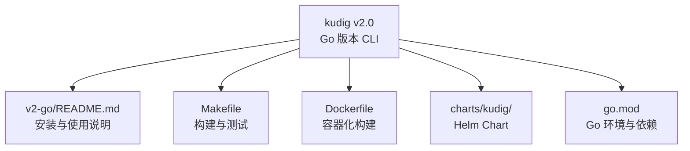
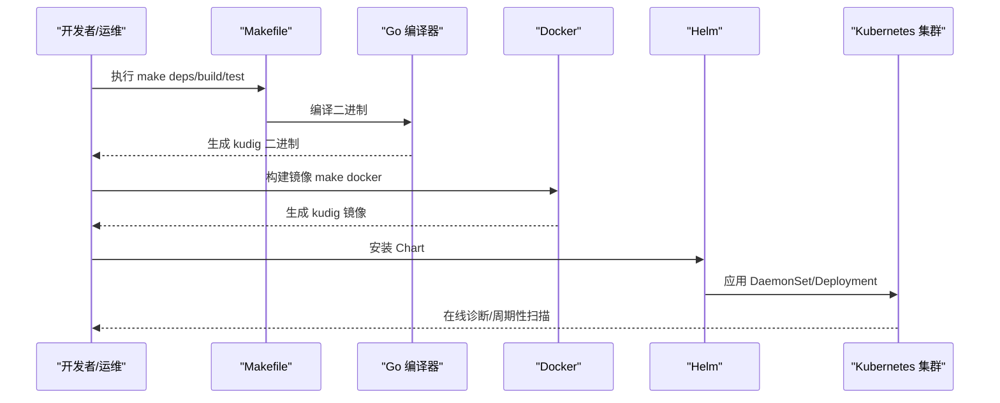
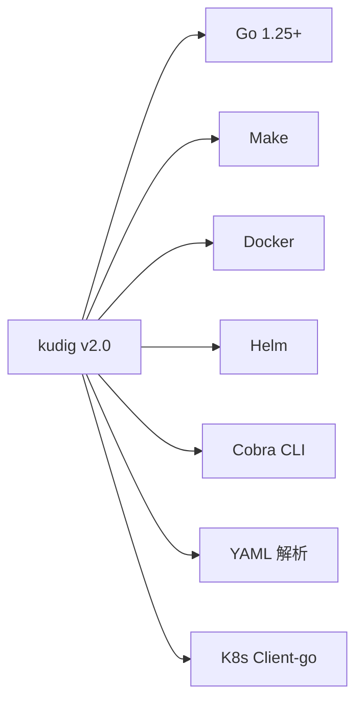

# 安装与配置

<cite>
**本文引用的文件**
- [README.md](file://README.md)
- [v2-go/README.md](file://v2-go/README.md)
- [v2-go/cmd/kudig/main.go](file://v2-go/cmd/kudig/main.go)
- [v2-go/Makefile](file://v2-go/Makefile)
- [v2-go/Dockerfile](file://v2-go/Dockerfile)
- [v2-go/go.mod](file://v2-go/go.mod)
- [v2-go/charts/kudig/Chart.yaml](file://v2-go/charts/kudig/Chart.yaml)
- [v2-go/charts/kudig/values.yaml](file://v2-go/charts/kudig/values.yaml)
- [v2-go/charts/kudig/templates/daemonset.yaml](file://v2-go/charts/kudig/templates/daemonset.yaml)
- [v2-go/charts/kudig/templates/rbac.yaml](file://v2-go/charts/kudig/templates/rbac.yaml)
- [scripts/kudig.sh](file://scripts/kudig.sh)
- [v1-bash/README.md](file://v1-bash/README.md)
- [v1-bash/TESTING.md](file://v1-bash/TESTING.md)
</cite>

## 目录
1. [简介](#简介)
2. [项目结构](#项目结构)
3. [核心组件](#核心组件)
4. [架构总览](#架构总览)
5. [详细组件分析](#详细组件分析)
6. [依赖关系分析](#依赖关系分析)
7. [性能考虑](#性能考虑)
8. [故障排查指南](#故障排查指南)
9. [结论](#结论)
10. [附录](#附录)

## 简介
本章节面向首次接触 kudig v2.0 的用户，提供从安装到配置的完整说明。重点覆盖以下方面：
- Go 版本安装方式：编译构建、Docker 镜像、Helm Chart 部署
- 系统要求：Go 1.25+、Make、Kubernetes 集群访问权限
- 权限要求：kudig v2.0 以只读方式运行，无需 root；在线模式需具备 K8s API 访问权限
- 配置选项：命令行参数（--help/-h、--version/-v、-v/--verbose、--format/-f、-o/--output、--kubeconfig、--context、--node、--namespace、--all-nodes、--file、--dir、--list）
- 常见问题与最佳实践：Go 环境搭建、Docker 镜像使用、Helm Chart 部署、PATH 设置

## 项目结构
仓库包含 v1.0 Bash 版本与 v2.0 Go 版本，以及文档说明。下图展示了与安装和配置相关的核心文件与职责：

图表来源
- [v2-go/README.md](file://v2-go/README.md#L1-L120)
- [v2-go/Makefile](file://v2-go/Makefile#L1-L60)
- [v2-go/Dockerfile](file://v2-go/Dockerfile#L1-L47)
- [v2-go/charts/kudig/Chart.yaml](file://v2-go/charts/kudig/Chart.yaml#L1-L18)

章节来源
- [README.md](file://README.md#L1-L120)
- [v2-go/README.md](file://v2-go/README.md#L1-L120)
- [v2-go/Makefile](file://v2-go/Makefile#L1-L60)
- [v2-go/Dockerfile](file://v2-go/Dockerfile#L1-L47)
- [v2-go/charts/kudig/Chart.yaml](file://v2-go/charts/kudig/Chart.yaml#L1-L18)

## 核心组件
- kudig v2.0：Go 版本 CLI，支持离线分析、在线诊断、规则引擎、列表分析器等功能
- Makefile：提供依赖下载、构建、测试、清理、安装等常用命令
- Dockerfile：定义多阶段构建流程，生成精简的 Alpine 基础镜像
- Helm Chart：提供 DaemonSet/Deployment 部署模板，支持 RBAC、HostPath 挂载、自定义规则等
- go.mod：声明 Go 版本要求与依赖库

章节来源
- [v2-go/README.md](file://v2-go/README.md#L1-L120)
- [v2-go/cmd/kudig/main.go](file://v2-go/cmd/kudig/main.go#L59-L178)
- [v2-go/Makefile](file://v2-go/Makefile#L1-L60)
- [v2-go/Dockerfile](file://v2-go/Dockerfile#L1-L47)
- [v2-go/charts/kudig/Chart.yaml](file://v2-go/charts/kudig/Chart.yaml#L1-L18)
- [v2-go/go.mod](file://v2-go/go.mod#L1-L20)

## 架构总览
kudig v2.0 的安装与使用架构如下：

图表来源
- [v2-go/Makefile](file://v2-go/Makefile#L24-L49)
- [v2-go/Dockerfile](file://v2-go/Dockerfile#L1-L47)
- [v2-go/charts/kudig/templates/daemonset.yaml](file://v2-go/charts/kudig/templates/daemonset.yaml#L1-L85)

章节来源
- [v2-go/README.md](file://v2-go/README.md#L65-L120)
- [v2-go/Makefile](file://v2-go/Makefile#L24-L49)
- [v2-go/Dockerfile](file://v2-go/Dockerfile#L1-L47)
- [v2-go/charts/kudig/templates/daemonset.yaml](file://v2-go/charts/kudig/templates/daemonset.yaml#L1-L85)

## 详细组件分析

### 安装步骤与 Go 环境要求
- Go 版本要求
  - Go 1.25+（详见 go.mod）
- 安装方式
  - 本地编译：使用 Makefile 提供的命令进行依赖下载、构建、测试与安装
  - Docker 镜像：通过 Dockerfile 构建容器镜像，内置 kudig 二进制与运行时依赖
  - Helm Chart：通过 Helm Chart 在 Kubernetes 集群中部署 DaemonSet/Deployment
- Linux 文件系统权限模型中的作用（与 v1.0 Bash 版本对比）
  - v1.0 Bash 版本需要 chmod +x 赋予执行权限
  - v2.0 Go 版本生成的二进制文件无需额外执行权限设置，直接可执行

章节来源
- [v2-go/go.mod](file://v2-go/go.mod#L1-L10)
- [v2-go/Makefile](file://v2-go/Makefile#L24-L49)
- [v2-go/Dockerfile](file://v2-go/Dockerfile#L1-L47)
- [v2-go/README.md](file://v2-go/README.md#L65-L120)

### 系统要求与依赖命令
- Go 环境
  - Go 1.25+、Make
- Kubernetes 访问
  - 在线模式需要访问 K8s API，需具备 kubeconfig/context/node/namespace/all-nodes 等参数
- 容器与 Helm
  - Docker 用于构建镜像
  - Helm 用于部署 Chart

章节来源
- [v2-go/go.mod](file://v2-go/go.mod#L1-L20)
- [v2-go/Makefile](file://v2-go/Makefile#L1-L60)
- [v2-go/cmd/kudig/main.go](file://v2-go/cmd/kudig/main.go#L150-L178)
- [v2-go/charts/kudig/values.yaml](file://v2-go/charts/kudig/values.yaml#L1-L60)

### 权限要求与数据来源
- 脚本权限
  - kudig v2.0 以只读方式运行，无需 root 权限
- 在线模式权限
  - 需具备访问 K8s API 的权限，包括节点、Pod、事件、组件状态等资源的读取权限
- 离线模式权限
  - 仅读取诊断目录，无需 root 权限

章节来源
- [v2-go/cmd/kudig/main.go](file://v2-go/cmd/kudig/main.go#L368-L483)
- [v2-go/charts/kudig/templates/rbac.yaml](file://v2-go/charts/kudig/templates/rbac.yaml#L1-L26)

### 配置选项与命令行参数
- 常用参数
  - --help/-h：显示帮助信息
  - --version/-v：显示版本信息
  - -v/--verbose：详细模式，输出调试信息
  - --format/-f：输出格式（text、json，默认 text）
  - -o/--output <文件>：将报告保存到指定文件
  - --kubeconfig：指定 kubeconfig 文件路径
  - --context：指定 K8s 上下文
  - --node/-n：指定节点名称
  - --namespace：指定命名空间
  - --all-nodes：诊断所有节点
  - --file：指定规则 YAML 文件
  - --dir：指定规则目录
  - --list：列出可用规则
- 行为说明
  - 离线模式：仅允许指定一个诊断目录
  - 在线模式：可指定 kubeconfig/context/node/namespace/all-nodes
  - 规则模式：可加载内置规则与自定义规则文件/目录

章节来源
- [v2-go/cmd/kudig/main.go](file://v2-go/cmd/kudig/main.go#L150-L178)
- [v2-go/cmd/kudig/main.go](file://v2-go/cmd/kudig/main.go#L180-L277)
- [v2-go/cmd/kudig/main.go](file://v2-go/cmd/kudig/main.go#L368-L483)
- [v2-go/cmd/kudig/main.go](file://v2-go/cmd/kudig/main.go#L484-L610)

### 不同安装方式与部署
- 本地编译安装
  - 使用 make deps 下载依赖
  - 使用 make build 构建二进制
  - 使用 make install 安装到系统 PATH
- Docker 镜像
  - 使用 make docker 构建镜像
  - 镜像内置 kudig 二进制与运行时依赖（bash、curl、jq）
- Helm Chart 部署
  - Chart 名称：kudig
  - AppVersion：2.0.0
  - 支持 DaemonSet/Deployment 部署模式
  - 默认输出格式：json
  - 支持自定义规则目录挂载
  - RBAC 规则包含节点、Pod、事件、组件状态等资源读取权限

章节来源
- [v2-go/Makefile](file://v2-go/Makefile#L24-L49)
- [v2-go/Dockerfile](file://v2-go/Dockerfile#L1-L47)
- [v2-go/charts/kudig/Chart.yaml](file://v2-go/charts/kudig/Chart.yaml#L1-L18)
- [v2-go/charts/kudig/values.yaml](file://v2-go/charts/kudig/values.yaml#L1-L60)
- [v2-go/charts/kudig/templates/daemonset.yaml](file://v2-go/charts/kudig/templates/daemonset.yaml#L1-L85)
- [v2-go/charts/kudig/templates/rbac.yaml](file://v2-go/charts/kudig/templates/rbac.yaml#L1-L26)

### 常见配置问题与解决方案
- 问题：Go 版本过低
  - 现象：构建失败或依赖不兼容
  - 解决：升级到 Go 1.25+（参考 go.mod）
- 问题：Docker 构建失败
  - 现象：镜像构建阶段失败
  - 解决：检查网络与代理设置，确保可访问 golang:1.21-alpine 镜像
- 问题：Helm 部署 RBAC 权限不足
  - 现象：无法创建 ClusterRole/ClusterRoleBinding
  - 解决：使用具备 ClusterAdmin 权限的账户进行部署
- 问题：在线模式无法访问 K8s API
  - 现象：连接失败或权限不足
  - 解决：检查 kubeconfig、context、node/namespace 参数与集群访问权限

章节来源
- [v2-go/go.mod](file://v2-go/go.mod#L1-L10)
- [v2-go/Dockerfile](file://v2-go/Dockerfile#L1-L47)
- [v2-go/charts/kudig/templates/rbac.yaml](file://v2-go/charts/kudig/templates/rbac.yaml#L1-L26)

### 最佳实践
- 将二进制安装到系统 PATH，便于全局调用
- 使用 --format json 与外部工具（jq、curl）进行自动化集成
- 在 CI/CD 或巡检脚本中，依据退出码（0/1/2）进行告警与处理
- 使用 Helm Chart 的 DaemonSet 模式进行集群范围的周期性诊断

章节来源
- [v2-go/Makefile](file://v2-go/Makefile#L94-L103)
- [v2-go/charts/kudig/values.yaml](file://v2-go/charts/kudig/values.yaml#L52-L60)
- [v2-go/charts/kudig/templates/daemonset.yaml](file://v2-go/charts/kudig/templates/daemonset.yaml#L35-L42)

## 依赖关系分析
kudig v2.0 对 Go 环境与依赖库的关系如下：

图表来源
- [v2-go/go.mod](file://v2-go/go.mod#L1-L20)
- [v2-go/cmd/kudig/main.go](file://v2-go/cmd/kudig/main.go#L1-L31)

章节来源
- [v2-go/go.mod](file://v2-go/go.mod#L1-L20)
- [v2-go/cmd/kudig/main.go](file://v2-go/cmd/kudig/main.go#L1-L31)

## 性能考虑
- 仅本地分析，避免网络依赖，整体开销较低
- 大型日志文件建议使用 tail/head 截断，减少 IO 压力
- 详细模式会输出调试信息，仅在排障时启用

## 故障排查指南
- 依赖缺失
  - 现象：构建失败或依赖下载失败
  - 处理：使用 make deps 下载依赖，确保网络可达
- Docker 构建失败
  - 现象：镜像构建阶段失败
  - 处理：检查代理与网络，确保 golang:1.21-alpine 可用
- Helm 部署失败
  - 现象：RBAC 权限不足或资源冲突
  - 处理：使用具备 ClusterAdmin 权限的账户，检查命名空间与资源名称
- 在线模式连接失败
  - 现象：无法访问 K8s API
  - 处理：检查 kubeconfig、context、node/namespace 参数与集群访问权限

章节来源
- [v2-go/Makefile](file://v2-go/Makefile#L78-L87)
- [v2-go/Dockerfile](file://v2-go/Dockerfile#L1-L47)
- [v2-go/charts/kudig/templates/rbac.yaml](file://v2-go/charts/kudig/templates/rbac.yaml#L1-L26)

## 结论
kudig v2.0 通过 Go 语言重构，提供了更丰富的功能与更灵活的部署方式。遵循本文档的安装步骤、系统要求与权限规范，即可在不同环境中稳定运行。配合 Docker 镜像与 Helm Chart，可实现从单机到集群的无缝部署与管理。

## 附录
- 术语
  - 诊断目录：由 diagnose_k8s.sh 生成的包含系统信息、服务状态、日志等文件的目录
- 参考
  - README.md：安装、使用与系统要求
  - v2-go/README.md：Go 版本安装与使用说明
  - v1-bash/README.md：Bash 版本安装与使用说明
  - v1-bash/TESTING.md：测试流程与退出码约定