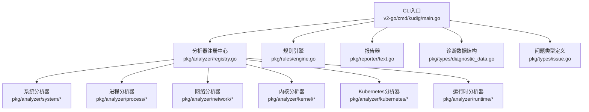
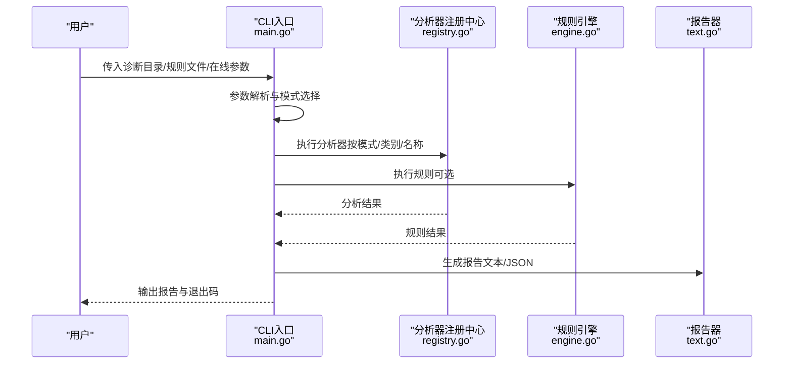
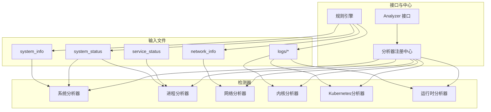

# 异常检测规则

<cite>
**本文引用的文件**
- [main.go](file://v2-go/cmd/kudig/main.go)
- [registry.go](file://v2-go/pkg/analyzer/registry.go)
- [interface.go](file://v2-go/pkg/analyzer/interface.go)
- [resource.go](file://v2-go/pkg/analyzer/system/resource.go)
- [service.go](file://v2-go/pkg/analyzer/process/service.go)
- [network.go](file://v2-go/pkg/analyzer/network/network.go)
- [kernel.go](file://v2-go/pkg/analyzer/kernel/kernel.go)
- [kubernetes.go](file://v2-go/pkg/analyzer/kubernetes/kubernetes.go)
- [runtime.go](file://v2-go/pkg/analyzer/runtime/runtime.go)
- [engine.go](file://v2-go/pkg/rules/engine.go)
- [custom.yaml](file://v2-go/rules/custom.yaml)
- [diagnostic_data.go](file://v2-go/pkg/types/diagnostic_data.go)
- [issue.go](file://v2-go/pkg/types/issue.go)
- [text.go](file://v2-go/pkg/reporter/text.go)
- [README.md](file://v2-go/README.md)
</cite>

## 目录
1. [简介](#简介)
2. [项目结构](#项目结构)
3. [核心组件](#核心组件)
4. [架构总览](#架构总览)
5. [详细组件分析](#详细组件分析)
6. [依赖关系分析](#依赖关系分析)
7. [性能考量](#性能考量)
8. [故障排查指南](#故障排查指南)
9. [结论](#结论)
10. [附录：规则参考表](#附录规则参考表)

## 简介
本文件系统性梳理 kudig v2.0 Go 版本的异常检测规则，覆盖系统资源、进程与服务、网络、内核与驱动、容器运行时、Kubernetes 组件、配置等七大类。针对每条规则，说明其检测逻辑、触发条件、严重级别以及在源码中的实现位置（如 CPUAnalyzer 的负载阈值计算、KubeletAnalyzer 的服务状态解析、NetworkAnalyzer 的端口监听检查等），并给出设计原则与扩展建议，帮助读者快速理解与使用该工具。

## 项目结构
kudig v2.0 采用模块化的 Go 架构，CLI 入口负责参数解析与模式切换，分析器注册中心统一调度，规则引擎支持自定义规则，报告器输出文本/JSON 报告。

图表来源
- [main.go](file://v2-go/cmd/kudig/main.go#L180-L277)
- [registry.go](file://v2-go/pkg/analyzer/registry.go#L95-L164)
- [engine.go](file://v2-go/pkg/rules/engine.go#L24-L49)
- [text.go](file://v2-go/pkg/reporter/text.go#L37-L105)

章节来源
- [README.md](file://v2-go/README.md#L35-L63)

## 核心组件
- 分析器接口与基类：Analyzer 接口定义了名称、描述、分类、支持模式与依赖；BaseAnalyzer 提供通用实现。
- 注册中心：DefaultRegistry 统一注册与执行分析器，支持按类别、模式与名称执行。
- 规则引擎：支持 file_contains、regex_match、metric_threshold、and/or 等条件类型，可按类别或全量执行。
- 报告器：文本报告按严重级别分组输出，支持去重与排序。
- 诊断数据：封装离线/在线模式的数据载体，包含系统指标、原始文件、日志流与 K8s 客户端。

章节来源
- [interface.go](file://v2-go/pkg/analyzer/interface.go#L10-L112)
- [registry.go](file://v2-go/pkg/analyzer/registry.go#L13-L229)
- [engine.go](file://v2-go/pkg/rules/engine.go#L24-L297)
- [text.go](file://v2-go/pkg/reporter/text.go#L37-L166)
- [diagnostic_data.go](file://v2-go/pkg/types/diagnostic_data.go#L37-L163)
- [issue.go](file://v2-go/pkg/types/issue.go#L8-L121)

## 架构总览
整体工作流：CLI 解析参数 → 选择模式（离线/在线/规则）→ 收集数据 → 执行分析器/规则 → 生成报告 → 退出码。

图表来源
- [main.go](file://v2-go/cmd/kudig/main.go#L180-L277)
- [registry.go](file://v2-go/pkg/analyzer/registry.go#L95-L164)
- [engine.go](file://v2-go/pkg/rules/engine.go#L24-L49)
- [text.go](file://v2-go/pkg/reporter/text.go#L37-L105)

## 详细组件分析

### 系统资源类
- 规则1：系统负载过高（HIGH_SYSTEM_LOAD）
  - 检测逻辑：15 分钟平均负载 > CPU 核心数 × 4。
  - 触发条件：满足上述不等式。
  - 严重级别：严重。
  - 实现位置：CPUAnalyzer.Analyze 中对 SystemMetrics.LoadAvg15Min 与 CPUCores 的比较。
  - 设计原则：基于 Kubernetes 最佳实践，避免长时间高负载导致调度与节点稳定性问题。

- 规则2：系统负载偏高（ELEVATED_SYSTEM_LOAD）
  - 检测逻辑：15 分钟平均负载 > CPU 核心数 × 2。
  - 触发条件：满足上述不等式。
  - 严重级别：警告。
  - 实现位置：同上，阈值不同。

- 规则3：内存使用率过高（HIGH_MEMORY_USAGE）
  - 检测逻辑：MemTotal 与 MemAvailable 计算使用率 ≥ 95%。
  - 触发条件：满足上述不等式。
  - 严重级别：严重。
  - 实现位置：MemoryAnalyzer.Analyze 中对 SystemMetrics 的计算。

- 规则4：内存使用率偏高（ELEVATED_MEMORY_USAGE）
  - 检测逻辑：使用率 ≥ 85%。
  - 触发条件：满足上述不等式。
  - 严重级别：警告。
  - 实现位置：同上。

- 规则5：磁盘空间严重不足（DISK_SPACE_CRITICAL）
  - 检测逻辑：任一挂载点 UsedPercent ≥ 95%。
  - 触发条件：存在满足条件的挂载点。
  - 严重级别：严重。
  - 实现位置：DiskAnalyzer.Analyze 遍历 SystemMetrics.DiskUsage。

- 规则6：磁盘空间不足（DISK_SPACE_LOW）
  - 检测逻辑：UsedPercent ≥ 90%。
  - 触发条件：满足上述不等式。
  - 严重级别：警告。
  - 实现位置：同上。

- 规则7：Swap 未禁用（SWAP_NOT_DISABLED）
  - 检测逻辑：SwapTotal > 0。
  - 触发条件：满足上述不等式。
  - 严重级别：提示。
  - 实现位置：SwapAnalyzer.Analyze 中对 SystemMetrics.SwapTotal 的检查。

- 规则8：连接跟踪表满（CONNTRACK_TABLE_FULL）
  - 检测逻辑：current/max ≥ 95%。
  - 触发条件：满足上述不等式。
  - 严重级别：严重。
  - 实现位置：ConntrackAnalyzer.Analyze 中对 SystemMetrics.ConntrackCurrent/Max 的计算。

- 规则9：连接跟踪表使用率高（CONNTRACK_TABLE_HIGH_USAGE）
  - 检测逻辑：使用率 ≥ 80%。
  - 触发条件：满足上述不等式。
  - 严重级别：警告。
  - 实现位置：同上。

- 规则10：文件句柄使用量过高（HIGH_FILE_HANDLES）
  - 检测逻辑：从 system_status 中匹配最大文件句柄数 > 50000。
  - 触发条件：满足上述不等式。
  - 严重级别：警告。
  - 实现位置：FileHandleAnalyzer.Analyze 中正则匹配与阈值比较。

- 规则11：进程/线程数异常（PID_LEAK_DETECTED）
  - 检测逻辑：从 system_status 中提取最大线程数 > 10000。
  - 触发条件：满足上述不等式。
  - 严重级别：严重。
  - 实现位置：ProcessStateAnalyzer.Analyze 中正则匹配与计数。

- 规则12：存在 D 状态进程（PROCESS_IN_D_STATE）
  - 检测逻辑：统计 ps_command_status 中“is in State D”的行数 > 0。
  - 触发条件：满足上述不等式。
  - 严重级别：严重。
  - 实现位置：同上，字符串计数。

章节来源
- [resource.go](file://v2-go/pkg/analyzer/system/resource.go#L32-L133)
- [resource.go](file://v2-go/pkg/analyzer/system/resource.go#L135-L185)
- [resource.go](file://v2-go/pkg/analyzer/system/resource.go#L187-L225)
- [resource.go](file://v2-go/pkg/analyzer/system/resource.go#L227-L284)
- [resource.go](file://v2-go/pkg/analyzer/system/resource.go#L286-L334)
- [resource.go](file://v2-go/pkg/analyzer/system/resource.go#L336-L392)
- [diagnostic_data.go](file://v2-go/pkg/types/diagnostic_data.go#L90-L123)

### 进程与服务类
- 规则13：Kubelet 服务未运行（KUBELET_SERVICE_DOWN）
  - 检测逻辑：daemon_status/kubelet_status 中状态为 failed。
  - 触发条件：满足上述条件。
  - 严重级别：严重。
  - 实现位置：KubeletAnalyzer.Analyze 中 parseServiceStatus 的状态判断。

- 规则14：Kubelet 服务停止（KUBELET_SERVICE_STOPPED）
  - 检测逻辑：状态为 stopped/inactive。
  - 触发条件：满足上述条件。
  - 严重级别：严重。
  - 实现位置：同上。

- 规则15：容器运行时服务异常（CONTAINER_RUNTIME_DOWN）
  - 检测逻辑：docker 与 containerd 均为 failed。
  - 触发条件：两者状态均为 failed。
  - 严重级别：严重。
  - 实现位置：ContainerRuntimeAnalyzer.Analyze 中对两个服务状态的联合判断。

- 规则16：容器运行时服务停止（CONTAINER_RUNTIME_STOPPED）
  - 检测逻辑：两者均未启动（stopped/inactive）。
  - 触发条件：满足上述条件。
  - 严重级别：严重。
  - 实现位置：同上。

- 规则17：runc 进程可能挂起（RUNC_PROCESS_HANG）
  - 检测逻辑：system_status 中包含“runc process ... maybe hang”并统计次数 > 0。
  - 触发条件：满足上述条件。
  - 严重级别：警告。
  - 实现位置：RuncAnalyzer.Analyze 中字符串匹配与计数。

- 规则18：Firewalld 服务运行中（FIREWALLD_RUNNING）
  - 检测逻辑：service_status 中包含“firewalld.*running”。
  - 触发条件：满足上述条件。
  - 严重级别：警告。
  - 实现位置：FirewalldAnalyzer.Analyze 中字符串匹配。

- 规则19：进程/线程数偏高（HIGH_THREAD_COUNT）
  - 检测逻辑：最大线程数 > 5000 且 ≤ 10000。
  - 触发条件：满足上述不等式。
  - 严重级别：警告。
  - 实现位置：同上，阈值不同。

章节来源
- [service.go](file://v2-go/pkg/analyzer/process/service.go#L31-L68)
- [service.go](file://v2-go/pkg/analyzer/process/service.go#L69-L127)
- [service.go](file://v2-go/pkg/analyzer/process/service.go#L129-L171)
- [service.go](file://v2-go/pkg/analyzer/process/service.go#L173-L214)
- [service.go](file://v2-go/pkg/analyzer/process/service.go#L216-L282)
- [service.go](file://v2-go/pkg/analyzer/process/service.go#L284-L311)

### 网络类
- 规则20：网卡接口 down（NETWORK_INTERFACE_DOWN）
  - 检测逻辑：network_info 中匹配 state DOWN，且接口名非 lo/veth*。
  - 触发条件：存在满足条件的接口。
  - 严重级别：警告。
  - 实现位置：InterfaceAnalyzer.Analyze 中正则匹配与过滤。

- 规则21：缺少默认路由（NO_DEFAULT_ROUTE）
  - 检测逻辑：network_info 中未包含“default via”。
  - 触发条件：满足上述条件。
  - 严重级别：警告。
  - 实现位置：RouteAnalyzer.Analyze 中字符串包含判断。

- 规则22：Kubelet 端口未监听（KUBELET_PORT_NOT_LISTENING）
  - 检测逻辑：system_status 中未包含“:10250.*LISTEN”。
  - 触发条件：满足上述条件。
  - 严重级别：严重。
  - 实现位置：PortAnalyzer.Analyze 中正则匹配。

- 规则23：iptables 规则过多（TOO_MANY_IPTABLES_RULES）
  - 检测逻辑：network_info 中以“-A”开头的行数 > 50000。
  - 触发条件：满足上述不等式。
  - 严重级别：警告。
  - 实现位置：IptablesAnalyzer.Analyze 中字符串计数。

- 规则24：Inode 使用率过高（HIGH_INODE_USAGE）
  - 检测逻辑：system_status 中 df -i 输出的 inode 使用率 ≥ 90%。
  - 触发条件：满足上述不等式。
  - 严重级别：警告。
  - 实现位置：InodeAnalyzer.Analyze 中正则解析与阈值比较。

章节来源
- [network.go](file://v2-go/pkg/analyzer/network/network.go#L15-L71)
- [network.go](file://v2-go/pkg/analyzer/network/network.go#L73-L114)
- [network.go](file://v2-go/pkg/analyzer/network/network.go#L116-L162)
- [network.go](file://v2-go/pkg/analyzer/network/network.go#L164-L208)
- [network.go](file://v2-go/pkg/analyzer/network/network.go#L210-L271)

### 内核与驱动类
- 规则25：内核 Panic（KERNEL_PANIC）
  - 检测逻辑：logs/dmesg.log 或 varlogmessage.log 中包含“Kernel panic”。
  - 触发条件：满足上述条件。
  - 严重级别：严重。
  - 实现位置：PanicAnalyzer.Analyze 中字符串匹配。

- 规则26：内核触发 OOM 杀进程（KERNEL_OOM_KILLER）
  - 检测逻辑：dmesg.log/messages/varlogmessage.log 中包含 OOM 相关关键字并计数 > 0。
  - 触发条件：满足上述条件。
  - 严重级别：严重。
  - 实现位置：OOMAnalyzer.Analyze 中多文件扫描与计数。

- 规则27：文件系统只读（FILESYSTEM_READONLY）
  - 检测逻辑：dmesg.log/varlogmessage.log 中包含“Read-only file system”或相关关键字。
  - 触发条件：满足上述条件。
  - 严重级别：严重。
  - 实现位置：FilesystemAnalyzer.Analyze 中字符串匹配。

- 规则28：磁盘 IO 错误（DISK_IO_ERROR）
  - 检测逻辑：dmesg.log/varlogmessage.log 中“I/O error”次数 > 10。
  - 触发条件：满足上述不等式。
  - 严重级别：严重。
  - 实现位置：同上，计数阈值不同。

- 规则29：内核模块加载失败（KERNEL_MODULE_LOAD_FAILED）
  - 检测逻辑：dmesg.log/varlogmessage.log 中包含“module.*failed”。
  - 触发条件：满足上述条件。
  - 严重级别：警告。
  - 实现位置：ModuleAnalyzer.Analyze 中字符串匹配。

- 规则30：NMI Watchdog 触发（NMI_WATCHDOG_TRIGGERED）
  - 检测逻辑：dmesg.log 中包含“NMI watchdog.*hard LOCKUP”。
  - 触发条件：满足上述条件。
  - 严重级别：警告。
  - 实现位置：NMIWatchdogAnalyzer.Analyze 中字符串匹配。

章节来源
- [kernel.go](file://v2-go/pkg/analyzer/kernel/kernel.go#L13-L59)
- [kernel.go](file://v2-go/pkg/analyzer/kernel/kernel.go#L61-L110)
- [kernel.go](file://v2-go/pkg/analyzer/kernel/kernel.go#L112-L177)
- [kernel.go](file://v2-go/pkg/analyzer/kernel/kernel.go#L179-L223)
- [kernel.go](file://v2-go/pkg/analyzer/kernel/kernel.go#L225-L266)

### 容器运行时类
- 规则31：Docker 启动失败（DOCKER_START_FAILED）
  - 检测逻辑：logs/docker.log 中包含“Failed to start”。
  - 触发条件：满足上述条件。
  - 严重级别：严重。
  - 实现位置：DockerAnalyzer.Analyze 中字符串匹配。

- 规则32：Docker 存储驱动错误（DOCKER_STORAGE_DRIVER_ERROR）
  - 检测逻辑：包含“storage driver.*error”（不区分大小写）。
  - 触发条件：满足上述条件。
  - 严重级别：严重。
  - 实现位置：同上。

- 规则33：容器创建失败率高（CONTAINER_CREATE_FAILED）
  - 检测逻辑：logs/containerd.log 中“failed to create/Failed to create”次数 > 10。
  - 触发条件：满足上述不等式。
  - 严重级别：警告。
  - 实现位置：ContainerdAnalyzer.Analyze 中字符串计数。

- 规则34：镜像拉取失败（IMAGE_PULL_FAILED）
  - 检测逻辑：离线模式：kubelet.log 中“Failed to pull image/ImagePullBackOff”次数 > 5；在线模式：查询 Pod 事件。
  - 触发条件：满足上述不等式。
  - 严重级别：警告。
  - 实现位置：ImagePullAnalyzer.Analyze 中离线计数与在线查询。

- 规则35：时间同步服务未运行（TIME_SYNC_SERVICE_DOWN）
  - 检测逻辑：service_status 中未同时包含 ntpd/chronyd 且处于 running。
  - 触发条件：满足上述条件。
  - 严重级别：提示。
  - 实现位置：TimeSyncAnalyzer.Analyze 中字符串匹配与布尔判断。

- 规则36：IP 转发未启用（IP_FORWARD_DISABLED）
  - 检测逻辑：system_info 中包含“net.ipv4.ip_forward = 0”。
  - 触发条件：满足上述条件。
  - 严重级别：警告。
  - 实现位置：ConfigAnalyzer.Analyze 中字符串匹配。

- 规则37：bridge-nf-call-iptables 未启用（BRIDGE_NF_CALL_IPTABLES_DISABLED）
  - 检测逻辑：system_info 中包含“net.bridge.bridge-nf-call-iptables = 0”。
  - 触发条件：满足上述条件。
  - 严重级别：警告。
  - 实现位置：同上。

- 规则38：文件句柄限制过低（LOW_ULIMIT_NOFILE）
  - 检测逻辑：system_info 中包含“open files.*1024”。
  - 触发条件：满足上述条件。
  - 严重级别：提示。
  - 实现位置：同上。

- 规则39：SELinux 处于 Enforcing 模式（SELINUX_ENFORCING）
  - 检测逻辑：system_info 中包含“selinux.*enforcing”（不区分大小写）。
  - 触发条件：满足上述条件。
  - 严重级别：提示。
  - 实现位置：同上。

章节来源
- [runtime.go](file://v2-go/pkg/analyzer/runtime/runtime.go#L13-L69)
- [runtime.go](file://v2-go/pkg/analyzer/runtime/runtime.go#L71-L116)
- [runtime.go](file://v2-go/pkg/analyzer/runtime/runtime.go#L118-L163)
- [runtime.go](file://v2-go/pkg/analyzer/runtime/runtime.go#L164-L247)

### Kubernetes 组件类
- 规则40：Kubelet PLEG 不健康（KUBELET_PLEG_UNHEALTHY）
  - 检测逻辑：logs/kubelet.log 中“PLEG is not healthy”次数 > 0。
  - 触发条件：满足上述条件。
  - 严重级别：严重。
  - 实现位置：PLEGAnalyzer.Analyze 中字符串计数。

- 规则41：CNI 网络插件错误（CNI_PLUGIN_ERROR）
  - 检测逻辑：包含“Failed to create pod sandbox.*CNI”或“CNI.*failed”。
  - 触发条件：满足上述条件。
  - 严重级别：严重。
  - 实现位置：CNIAnalyzer.Analyze 中字符串匹配。

- 规则42：证书已过期（CERTIFICATE_EXPIRED）
  - 检测逻辑：kubelet.log 中包含“certificate has expired”。
  - 触发条件：满足上述条件。
  - 严重级别：严重。
  - 实现位置：CertificateAnalyzer.Analyze 中字符串匹配。

- 规则43：证书即将过期（CERTIFICATE_EXPIRING）
  - 检测逻辑：包含“certificate will expire”。
  - 触发条件：满足上述条件。
  - 严重级别：警告。
  - 实现位置：同上。

- 规则44：API Server 连接失败（APISERVER_CONNECTION_FAILED）
  - 检测逻辑：包含“Unable to connect to the server”或“connection refused”且次数 > 10。
  - 触发条件：满足上述不等式。
  - 严重级别：严重。
  - 实现位置：APIServerAnalyzer.Analyze 中字符串计数。

- 规则45：Kubelet 认证失败（KUBELET_AUTH_FAILED）
  - 检测逻辑：包含“Unauthorized”且次数 > 0。
  - 触发条件：满足上述条件。
  - 严重级别：严重。
  - 实现位置：同上。

- 规则46：节点 NotReady 状态（NODE_NOT_READY）
  - 检测逻辑：在线模式：K8s API 中 NodeReady 非 True；离线模式：kubelet.log 中包含“Node.*NotReady”。
  - 触发条件：满足上述条件。
  - 严重级别：严重。
  - 实现位置：NodeStatusAnalyzer.analyzeOnline 与 analyzeFromLogs。

- 规则47：磁盘压力（DISK_PRESSURE）
  - 检测逻辑：在线模式：NodeDiskPressure 为 True；离线模式：kubelet.log 中包含“DiskPressure”。
  - 触发条件：满足上述条件。
  - 严重级别：警告。
  - 实现位置：同上。

- 规则48：内存压力（MEMORY_PRESSURE）
  - 检测逻辑：在线模式：NodeMemoryPressure 为 True；离线模式：kubelet.log 中包含“MemoryPressure”。
  - 触发条件：满足上述条件。
  - 严重级别：警告。
  - 实现位置：同上。

- 规则49：Pod 被驱逐（POD_EVICTED）
  - 检测逻辑：离线模式：kubelet.log 中包含“evicted pod/Evicted”且次数 > 0。
  - 触发条件：满足上述条件。
  - 严重级别：警告。
  - 实现位置：NodeStatusAnalyzer.analyzeFromLogs 中字符串匹配与计数。

- 规则50：节点 PID 压力（PID_PRESSURE）
  - 检测逻辑：在线模式：NodePIDPressure 为 True。
  - 触发条件：满足上述条件。
  - 严重级别：警告。
  - 实现位置：同上。

- 规则51：网络不可用（NETWORK_UNAVAILABLE）
  - 检测逻辑：在线模式：NodeNetworkUnavailable 为 True。
  - 触发条件：满足上述条件。
  - 严重级别：严重。
  - 实现位置：同上。

- 规则52：节点不可调度（NODE_UNSCHEDULABLE）
  - 检测逻辑：在线模式：节点被 taint 标记为不可调度。
  - 触发条件：满足上述条件。
  - 严重级别：提示。
  - 实现位置：同上。

- 规则53：Pod CrashLoopBackOff（POD_CRASHLOOP）
  - 检测逻辑：在线模式：Pod Phase 为 Pending/Failed 或容器状态为 CrashLoopBackOff。
  - 触发条件：满足上述条件。
  - 严重级别：警告。
  - 实现位置：PodStatusAnalyzer.Analyze 中 Pod 列表遍历与状态判断。

- 规则54：Pod Pending（POD_PENDING）
  - 检测逻辑：在线模式：Pod Phase 为 Pending 且数量 > 5。
  - 触发条件：满足上述条件。
  - 严重级别：警告。
  - 实现位置：同上。

- 规则55：Pod Failed（POD_FAILED）
  - 检测逻辑：在线模式：Pod Phase 为 Failed。
  - 触发条件：满足上述条件。
  - 严重级别：警告。
  - 实现位置：同上。

- 规则56：Pod 重启次数过多（POD_HIGH_RESTARTS）
  - 检测逻辑：在线模式：容器 RestartCount > 10。
  - 触发条件：满足上述条件。
  - 严重级别：提示。
  - 实现位置：同上。

- 规则57：集群事件（EVENT_*）
  - 检测逻辑：在线模式：K8s Events 中 Warning 类型事件数量超过阈值，如 FailedScheduling/FailedMount 等。
  - 触发条件：满足上述条件。
  - 严重级别：警告（部分事件为严重）。
  - 实现位置：EventAnalyzer.Analyze 中事件统计与阈值判断。

章节来源
- [kubernetes.go](file://v2-go/pkg/analyzer/kubernetes/kubernetes.go#L16-L62)
- [kubernetes.go](file://v2-go/pkg/analyzer/kubernetes/kubernetes.go#L64-L110)
- [kubernetes.go](file://v2-go/pkg/analyzer/kubernetes/kubernetes.go#L112-L166)
- [kubernetes.go](file://v2-go/pkg/analyzer/kubernetes/kubernetes.go#L168-L230)
- [kubernetes.go](file://v2-go/pkg/analyzer/kubernetes/kubernetes.go#L232-L277)
- [kubernetes.go](file://v2-go/pkg/analyzer/kubernetes/kubernetes.go#L279-L381)
- [kubernetes.go](file://v2-go/pkg/analyzer/kubernetes/kubernetes.go#L383-L441)
- [kubernetes.go](file://v2-go/pkg/analyzer/kubernetes/kubernetes.go#L443-L496)
- [kubernetes.go](file://v2-go/pkg/analyzer/kubernetes/kubernetes.go#L498-L533)
- [kubernetes.go](file://v2-go/pkg/analyzer/kubernetes/kubernetes.go#L535-L644)
- [kubernetes.go](file://v2-go/pkg/analyzer/kubernetes/kubernetes.go#L646-L717)

### 配置类（运行时）
- 规则58：时间同步服务未运行（TIME_SYNC_SERVICE_DOWN）
  - 检测逻辑：service_status 中未同时包含 ntpd/chronyd 且处于 running。
  - 触发条件：满足上述条件。
  - 严重级别：提示。
  - 实现位置：TimeSyncAnalyzer.Analyze。

- 规则59：IP 转发未启用（IP_FORWARD_DISABLED）
  - 检测逻辑：system_info 中包含“net.ipv4.ip_forward = 0”。
  - 触发条件：满足上述条件。
  - 严重级别：警告。
  - 实现位置：ConfigAnalyzer.Analyze。

- 规则60：bridge-nf-call-iptables 未启用（BRIDGE_NF_CALL_IPTABLES_DISABLED）
  - 检测逻辑：system_info 中包含“net.bridge.bridge-nf-call-iptables = 0”。
  - 触发条件：满足上述条件。
  - 严重级别：警告。
  - 实现位置：同上。

- 规则61：文件句柄限制过低（LOW_ULIMIT_NOFILE）
  - 检测逻辑：system_info 中包含“open files.*1024”。
  - 触发条件：满足上述条件。
  - 严重级别：提示。
  - 实现位置：同上。

- 规则62：SELinux 处于 Enforcing 模式（SELINUX_ENFORCING）
  - 检测逻辑：system_info 中包含“selinux.*enforcing”（不区分大小写）。
  - 触发条件：满足上述条件。
  - 严重级别：提示。
  - 实现位置：同上。

章节来源
- [runtime.go](file://v2-go/pkg/analyzer/runtime/runtime.go#L118-L247)

## 依赖关系分析
- 输入依赖：离线模式依赖诊断目录中的 system_info、service_status、system_status、network_info、logs/* 等文件；在线模式依赖 K8s API。
- 关键接口依赖：
  - Analyzer 接口：Name/Description/Category/Analyze/SupportedModes/Dependencies。
  - Registry：Register/List/ExecuteAll/ExecuteByMode/ExecuteByCategory。
  - 规则引擎：file_contains/regex_match/metric_threshold/and/or。
- 控制流：CLI 依据模式选择执行路径，先执行内置分析器，再执行规则引擎，最后生成报告。

图表来源
- [interface.go](file://v2-go/pkg/analyzer/interface.go#L10-L112)
- [registry.go](file://v2-go/pkg/analyzer/registry.go#L95-L164)
- [engine.go](file://v2-go/pkg/rules/engine.go#L77-L160)

章节来源
- [main.go](file://v2-go/cmd/kudig/main.go#L180-L277)

## 性能考量
- I/O 与正则匹配：多处使用字符串匹配与正则，建议确保诊断数据规模可控；对大文件使用精确的范围限定。
- 计算复杂度：大部分检测器为 O(n) 遍历，规则引擎的 metric_threshold 为 O(1) 指标访问，总体可接受。
- 退出码策略：严重异常直接返回 2，有助于快速告警；建议在自动化巡检中结合阈值与频率控制，避免噪声。

## 故障排查指南
- 症状：诊断目录结构不完整
  - 现象：未找到关键文件，分析器返回空结果。
  - 处理：确保使用 diagnose_k8s.sh 完整采集数据，必要时以 root 权限执行。
  - 章节来源
    - [diagnostic_data.go](file://v2-go/pkg/types/diagnostic_data.go#L142-L163)

- 症状：某些检测项无结果
  - 现象：对应日志文件缺失或为空。
  - 处理：确认 diagnose_k8s.sh 是否成功采集到目标文件；检查权限与路径。
  - 章节来源
    - [diagnostic_data.go](file://v2-go/pkg/types/diagnostic_data.go#L142-L163)

- 症状：命令不存在
  - 现象：缺少 grep/awk/sed 等基础命令。
  - 处理：安装缺失命令后重试。
  - 章节来源
    - [main.go](file://v2-go/cmd/kudig/main.go#L180-L277)

- 症状：退出码不符合预期
  - 现象：0/1/2 与期望不符。
  - 处理：检查报告中严重级别异常数量；确认阈值与触发条件。
  - 章节来源
    - [text.go](file://v2-go/pkg/reporter/text.go#L37-L105)

## 结论
kudig v2.0 通过模块化分析器与规则引擎，实现了对 Kubernetes 节点的全面诊断。其规则设计遵循 Kubernetes 最佳实践与常见故障模式，具备良好的可读性与可扩展性。建议在生产环境中结合自动化巡检与告警策略，持续优化阈值与规则集。

## 附录：规则参考表
下表汇总所有异常标识符、中文名称、严重级别与简要说明，便于快速查阅。

- 系统资源类
  - HIGH_SYSTEM_LOAD：系统负载过高（严重）
  - ELEVATED_SYSTEM_LOAD：系统负载偏高（警告）
  - HIGH_MEMORY_USAGE：内存使用率过高（严重）
  - ELEVATED_MEMORY_USAGE：内存使用率偏高（警告）
  - DISK_SPACE_CRITICAL：磁盘空间严重不足（严重）
  - DISK_SPACE_LOW：磁盘空间不足（警告）
  - SWAP_NOT_DISABLED：Swap 未禁用（提示）
  - CONNTRACK_TABLE_FULL：连接跟踪表满（严重）
  - CONNTRACK_TABLE_HIGH_USAGE：连接跟踪表使用率高（警告）
  - HIGH_FILE_HANDLES：文件句柄使用量过高（警告）
  - PID_LEAK_DETECTED：进程/线程数异常（严重）
  - HIGH_INODE_USAGE：Inode 使用率过高（警告）

- 进程与服务类
  - KUBELET_SERVICE_DOWN：Kubelet 服务未运行（严重）
  - KUBELET_SERVICE_STOPPED：Kubelet 服务停止（严重）
  - CONTAINER_RUNTIME_DOWN：容器运行时服务异常（严重）
  - CONTAINER_RUNTIME_STOPPED：容器运行时服务停止（严重）
  - RUNC_PROCESS_HANG：runc 进程可能挂起（警告）
  - FIREWALLD_RUNNING：Firewalld 服务运行中（警告）
  - HIGH_THREAD_COUNT：进程/线程数偏高（警告）

- 网络类
  - NETWORK_INTERFACE_DOWN：网卡接口 down（警告）
  - NO_DEFAULT_ROUTE：缺少默认路由（警告）
  - KUBELET_PORT_NOT_LISTENING：Kubelet 端口未监听（严重）
  - TOO_MANY_IPTABLES_RULES：iptables 规则过多（警告）
  - HIGH_INODE_USAGE：Inode 使用率过高（警告）

- 内核与驱动类
  - KERNEL_PANIC：内核 Panic（严重）
  - KERNEL_OOM_KILLER：内核触发 OOM 杀进程（严重）
  - FILESYSTEM_READONLY：文件系统只读（严重）
  - DISK_IO_ERROR：磁盘 IO 错误（严重）
  - KERNEL_MODULE_LOAD_FAILED：内核模块加载失败（警告）
  - NMI_WATCHDOG_TRIGGERED：NMI Watchdog 触发（警告）

- 容器运行时类
  - DOCKER_START_FAILED：Docker 启动失败（严重）
  - DOCKER_STORAGE_DRIVER_ERROR：Docker 存储驱动错误（严重）
  - CONTAINER_CREATE_FAILED：容器创建失败率高（警告）
  - IMAGE_PULL_FAILED：镜像拉取失败（警告）
  - TIME_SYNC_SERVICE_DOWN：时间同步服务未运行（提示）

- Kubernetes 组件类
  - KUBELET_PLEG_UNHEALTHY：Kubelet PLEG 不健康（严重）
  - CNI_PLUGIN_ERROR：CNI 网络插件错误（严重）
  - CERTIFICATE_EXPIRED：证书已过期（严重）
  - CERTIFICATE_EXPIRING：证书即将过期（警告）
  - APISERVER_CONNECTION_FAILED：API Server 连接失败（严重）
  - KUBELET_AUTH_FAILED：Kubelet 认证失败（严重）
  - NODE_NOT_READY：节点 NotReady 状态（严重）
  - DISK_PRESSURE：磁盘压力（警告）
  - MEMORY_PRESSURE：内存压力（警告）
  - POD_EVICTED：Pod 被驱逐（警告）
  - PID_PRESSURE：节点 PID 压力（警告）
  - NETWORK_UNAVAILABLE：节点网络不可用（严重）
  - NODE_UNSCHEDULABLE：节点不可调度（提示）
  - POD_CRASHLOOP：Pod CrashLoopBackOff（警告）
  - POD_PENDING：Pod Pending（警告）
  - POD_FAILED：Pod Failed（警告）
  - POD_HIGH_RESTARTS：Pod 重启次数过多（提示）
  - EVENT_*：集群事件（警告/严重）

章节来源
- [README.md](file://v2-go/README.md#L10-L19)