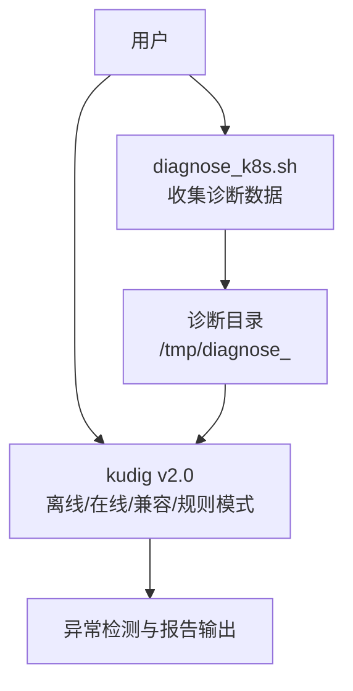
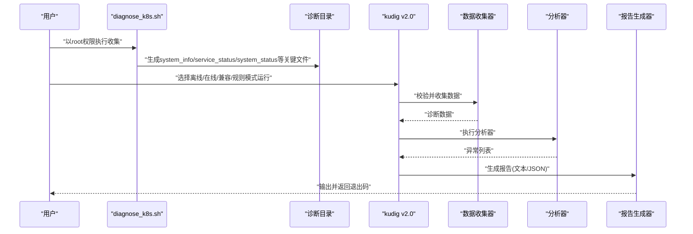
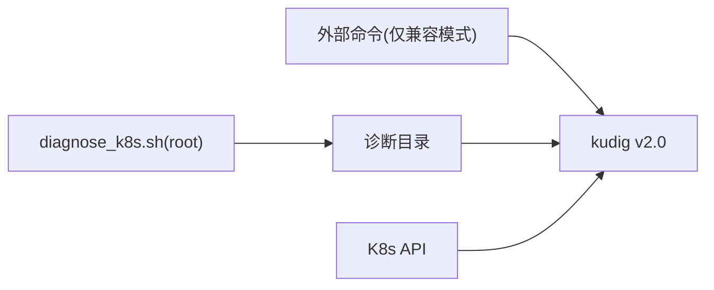

# 故障排除

<cite>
**本文引用的文件**
- [main.go](file://v2-go/cmd/kudig/main.go)
- [bash_executor.go](file://v2-go/pkg/legacy/bash_executor.go)
- [text.go](file://v2-go/pkg/reporter/text.go)
- [json.go](file://v2-go/pkg/reporter/json.go)
- [severity.go](file://v2-go/pkg/types/severity.go)
- [directory.go](file://v2-go/pkg/collector/offline/directory.go)
- [resource.go](file://v2-go/pkg/analyzer/system/resource.go)
- [kernel.go](file://v2-go/pkg/analyzer/kernel/kernel.go)
- [README.md](file://v2-go/README.md)
- [Makefile](file://v2-go/Makefile)
- [diagnose_k8s.sh](file://reference/diagnose_k8s/diagnose_k8s.sh)
- [README.md](file://README.md)
- [TESTING.md](file://TESTING.md)
</cite>

## 目录
1. [简介](#简介)
2. [项目结构](#项目结构)
3. [核心组件](#核心组件)
4. [架构总览](#架构总览)
5. [详细组件分析](#详细组件分析)
6. [依赖关系分析](#依赖关系分析)
7. [性能考虑](#性能考虑)
8. [故障排除指南](#故障排除指南)
9. [结论](#结论)
10. [附录](#附录)

## 简介
本指南面向使用 kudig v2.0（Go 版本）的用户，系统性地梳理在实际使用中可能遇到的常见问题及解决方案。内容基于 v2-go 源码与参考脚本的行为，结合 TESTING.md 的注意事项，帮助您快速定位并解决问题，提升诊断效率。

## 项目结构
- kudig v2.0 提供多种运行模式：
  - 离线模式：分析由 diagnose_k8s.sh 生成的诊断目录
  - 在线模式：通过 K8s API 实时诊断集群
  - 兼容模式：调用原版 kudig.sh 脚本进行分析
  - 规则模式：基于 YAML 规则对诊断数据进行定制化检测
- 参考脚本 diagnose_k8s.sh：用于收集节点诊断数据，包含对 root 权限的要求与关键文件的生成逻辑。
- README.md：官方使用说明、输出示例、常见问题与修复建议。
- TESTING.md：测试与注意事项，强调脚本不需要 root 权限，但依赖由 root 收集的数据。

图表来源
- [diagnose_k8s.sh](file://reference/diagnose_k8s/diagnose_k8s.sh#L1-L60)
- [main.go](file://v2-go/cmd/kudig/main.go#L180-L277)

章节来源
- [README.md](file://README.md#L231-L243)
- [TESTING.md](file://TESTING.md#L177-L183)

## 核心组件
- 命令行入口与模式分发：通过 Cobra 子命令实现离线、在线、兼容、规则、列出分析器等功能，支持 --verbose、--format、--output 等通用参数。
- 离线数据收集器：校验诊断目录存在性与合法性，读取关键文件与日志，解析节点信息与系统指标。
- 在线数据收集器：通过 K8s API 连接集群，采集节点信息与运行时状态。
- 分析器注册与执行：按模式选择执行系统、进程、网络、内核、Kubernetes、运行时等分析器。
- 报告生成器：支持文本与 JSON 两种输出格式，自动去重与按严重度排序。
- 退出码策略：根据最高严重度与异常数量返回 0/1/2。

章节来源
- [main.go](file://v2-go/cmd/kudig/main.go#L180-L277)
- [main.go](file://v2-go/cmd/kudig/main.go#L368-L483)
- [main.go](file://v2-go/cmd/kudig/main.go#L484-L609)
- [directory.go](file://v2-go/pkg/collector/offline/directory.go#L36-L55)
- [directory.go](file://v2-go/pkg/collector/offline/directory.go#L57-L138)
- [text.go](file://v2-go/pkg/reporter/text.go#L37-L105)
- [json.go](file://v2-go/pkg/reporter/json.go#L21-L34)
- [severity.go](file://v2-go/pkg/types/severity.go#L78-L90)

## 架构总览
下图展示了从数据收集到分析报告的整体流程，以及关键错误处理点。

图表来源
- [diagnose_k8s.sh](file://reference/diagnose_k8s/diagnose_k8s.sh#L1-L20)
- [main.go](file://v2-go/cmd/kudig/main.go#L180-L277)
- [main.go](file://v2-go/cmd/kudig/main.go#L368-L483)
- [main.go](file://v2-go/cmd/kudig/main.go#L484-L609)

## 详细组件分析

### 命令行入口与模式分发（Cobra 命令）
- 离线模式：校验诊断目录存在性与合法性，收集数据，执行分析器，生成报告，按严重度设置退出码。
- 在线模式：连接 K8s API，采集节点信息与运行时状态，执行支持在线模式的分析器，生成报告。
- 兼容模式：查找并执行原版 kudig.sh，解析其 JSON 输出，转换为统一 Issue 类型。
- 规则模式：加载内置与自定义规则，对离线数据进行规则评估，生成报告。

章节来源
- [main.go](file://v2-go/cmd/kudig/main.go#L180-L277)
- [main.go](file://v2-go/cmd/kudig/main.go#L368-L483)
- [main.go](file://v2-go/cmd/kudig/main.go#L484-L609)
- [bash_executor.go](file://v2-go/pkg/legacy/bash_executor.go#L59-L97)

### 离线数据收集器（offline/directory）
- 校验诊断目录存在性与类型，读取关键文件（如 system_info、system_status、service_status、memory_info、network_info、ps_command_status），以及 daemon_status 与 logs 子目录下的文件。
- 解析节点信息（主机名、内核版本、OS 图像、Kubelet 版本）与系统指标（CPU 核心数、负载、内存、磁盘使用、连接跟踪、文件句柄等）。
- 对缺失文件采取安全跳过策略，不影响其他可用文件的分析。

章节来源
- [directory.go](file://v2-go/pkg/collector/offline/directory.go#L36-L55)
- [directory.go](file://v2-go/pkg/collector/offline/directory.go#L57-L138)
- [directory.go](file://v2-go/pkg/collector/offline/directory.go#L140-L274)

### 系统资源分析器（system.resource）
- CPU 负载：基于 15 分钟平均负载与 CPU 核心数阈值判定严重/警告。
- 内存使用：基于 MemTotal 与 MemAvailable 计算使用率，判定严重/警告。
- 磁盘空间：遍历磁盘使用百分比，判定严重/警告。
- 连接跟踪表：基于当前连接数与最大值计算使用率，判定严重/警告。
- 文件句柄与 D 状态进程：检查 ps 命令状态与 D 状态进程数量，判定严重/警告。

章节来源
- [resource.go](file://v2-go/pkg/analyzer/system/resource.go#L32-L74)
- [resource.go](file://v2-go/pkg/analyzer/system/resource.go#L93-L133)
- [resource.go](file://v2-go/pkg/analyzer/system/resource.go#L152-L185)
- [resource.go](file://v2-go/pkg/analyzer/system/resource.go#L244-L284)
- [resource.go](file://v2-go/pkg/analyzer/system/resource.go#L303-L334)
- [resource.go](file://v2-go/pkg/analyzer/system/resource.go#L354-L392)

### 内核分析器（kernel）
- 文件系统只读：检测 dmesg 等日志中的只读相关关键字，判定严重。
- IO 错误：统计 I/O 错误次数，超过阈值判定严重。

章节来源
- [kernel.go](file://v2-go/pkg/analyzer/kernel/kernel.go#L144-L177)

### 报告生成与退出码
- 文本报告：按严重度分组输出，包含摘要统计。
- JSON 报告：结构化输出，支持缩进。
- 退出码：根据最高严重度与异常数量返回 0/1/2。

章节来源
- [text.go](file://v2-go/pkg/reporter/text.go#L37-L105)
- [json.go](file://v2-go/pkg/reporter/json.go#L21-L34)
- [severity.go](file://v2-go/pkg/types/severity.go#L78-L90)
- [main.go](file://v2-go/cmd/kudig/main.go#L268-L277)
- [main.go](file://v2-go/cmd/kudig/main.go#L474-L482)
- [main.go](file://v2-go/cmd/kudig/main.go#L600-L608)

## 依赖关系分析
- 外部命令依赖：v2.0 为 Go 实现，不依赖 bash/grep/awk 等外部命令；但兼容模式会调用 bash 执行原版 kudig.sh。
- 数据来源依赖：离线模式依赖 diagnose_k8s.sh 生成的诊断目录；在线模式依赖 K8s API。
- 权限依赖：diagnose_k8s.sh 需要 root 权限以收集完整数据；kudig v2.0 作为分析工具可在普通用户下运行。

图表来源
- [bash_executor.go](file://v2-go/pkg/legacy/bash_executor.go#L59-L97)
- [directory.go](file://v2-go/pkg/collector/offline/directory.go#L36-L55)
- [main.go](file://v2-go/cmd/kudig/main.go#L368-L483)

章节来源
- [README.md](file://README.md#L231-L236)
- [TESTING.md](file://TESTING.md#L177-L183)

## 性能考虑
- 离线模式：读取与解析大量文本文件，建议确保系统资源充足，避免在极大规模日志下产生长时间阻塞。
- 在线模式：通过 K8s API 采集数据，注意网络延迟与 API 限流；可通过 --kubeconfig、--context、--node、--namespace 控制范围。
- 输出格式：JSON 输出便于后续系统集成，但会增加 CPU 与内存开销；在资源受限环境中可优先使用文本输出。

章节来源
- [main.go](file://v2-go/cmd/kudig/main.go#L368-L483)
- [main.go](file://v2-go/cmd/kudig/main.go#L180-L277)

## 故障排除指南

### 问题1：离线模式提示诊断目录不存在或非目录
- 现象：运行离线模式时报错“诊断目录不存在”或“路径不是目录”。
- 原因：传入的 diagnose_path 不存在或不是目录。
- 解决方案：
  - 确认路径正确且指向完整诊断目录。
  - 使用 root 权限重新执行 diagnose_k8s.sh，确保生成完整数据。
- 参考：离线收集器 Validate 逻辑会检查路径存在性与类型。

章节来源
- [directory.go](file://v2-go/pkg/collector/offline/directory.go#L36-L55)

### 问题2：诊断目录结构不完整
- 现象：输出警告“诊断目录结构可能不完整”，但脚本仍继续分析。
- 原因：diagnose_k8s.sh 未以 root 权限执行，或执行过程被中断，导致关键文件缺失。
- 解决方案：
  - 重新以 root 权限执行 diagnose_k8s.sh，确保完整收集数据。
  - 确认诊断目录包含 system_info、service_status、system_status 等关键文件。
- 参考：README.md 提示该问题的解决方案；离线收集器对缺失文件采取安全跳过策略。

章节来源
- [README.md](file://README.md#L313-L338)
- [directory.go](file://v2-go/pkg/collector/offline/directory.go#L57-L138)
- [diagnose_k8s.sh](file://reference/diagnose_k8s/diagnose_k8s.sh#L1-L20)

### 问题3：无法读取某些日志文件
- 现象：部分检测项无结果或输出为空。
- 原因：诊断目录中对应文件缺失，或文件权限不足导致无法读取。
- 解决方案：
  - 检查诊断目录中是否存在目标文件（如 logs/dmesg.log、logs/kubelet.log 等）。
  - 确认文件权限允许当前用户读取；必要时以 root 权限重新收集数据。
- 参考：离线收集器对缺失文件采用跳过策略，但若文件不存在则无法产出结果。

章节来源
- [directory.go](file://v2-go/pkg/collector/offline/directory.go#L113-L129)

### 问题4：兼容模式找不到原版 kudig.sh
- 现象：运行兼容模式时报错“未在常见位置找到 kudig.sh”。
- 原因：未在默认搜索路径中找到原版脚本。
- 解决方案：
  - 显式指定原版脚本路径，或将脚本放置于常见位置（如 /usr/local/bin/kudig.sh）。
  - 确保脚本具备可执行权限。
- 参考：兼容模式会尝试在多个常见位置查找脚本。

章节来源
- [bash_executor.go](file://v2-go/pkg/legacy/bash_executor.go#L30-L57)

### 问题5：兼容模式执行失败或无输出
- 现象：兼容模式执行失败或无输出。
- 原因：原版脚本执行失败、未生成 JSON 输出或输出为空。
- 解决方案：
  - 使用 --verbose 查看详细日志。
  - 确认原版脚本依赖的 bash 环境与命令可用。
  - 检查诊断目录权限与完整性。
- 参考：兼容模式会捕获 stderr 并解析 JSON 输出。

章节来源
- [bash_executor.go](file://v2-go/pkg/legacy/bash_executor.go#L59-L97)

### 问题6：在线模式连接失败或权限不足
- 现象：在线模式连接 K8s API 失败或返回权限错误。
- 原因：kubeconfig 路径错误、上下文不正确、缺少访问权限或节点/命名空间不存在。
- 解决方案：
  - 指定正确的 --kubeconfig 与 --context。
  - 使用 --node 或 --namespace 精确限定目标范围。
  - 确认 RBAC 权限与集群可达性。
- 参考：在线模式构建配置并连接集群。

章节来源
- [main.go](file://v2-go/cmd/kudig/main.go#L368-L483)

### 问题7：规则模式未提供诊断目录或规则加载失败
- 现象：规则模式报错“需要诊断目录”或“加载规则失败”。
- 原因：未提供 diagnose_path 或规则文件/目录不存在。
- 解决方案：
  - 为规则模式提供有效的诊断目录。
  - 检查规则文件路径与格式，确保可读。
- 参考：规则模式要求提供诊断目录并加载内置/自定义规则。

章节来源
- [main.go](file://v2-go/cmd/kudig/main.go#L522-L566)

### 问题8：脚本无输出或报错
- 现象：运行后无输出或出现错误。
- 原因：缺少必要命令、诊断目录不存在或不完整、文件权限问题、或需要更详细的调试信息。
- 解决方案：
  - 使用 --verbose 选项开启详细模式，查看调试日志。
  - 确认已安装所有必需命令（v2.0 为 Go 实现，不依赖 bash/grep/awk）。
  - 确保诊断目录存在且包含关键文件。
  - 检查文件权限与存在性。
- 参考：README.md 提供 --verbose 选项说明；v2.0 通过 Cobra 参数控制详细输出。

章节来源
- [README.md](file://README.md#L38-L67)
- [main.go](file://v2-go/cmd/kudig/main.go#L150-L178)

### 问题9：退出码不符合预期
- 现象：脚本返回 0/1/2，但与预期不符。
- 原因：严重异常数量决定退出码；若有严重异常则返回 2，否则根据警告/提示返回 1 或 0。
- 解决方案：
  - 依据报告中的异常级别与数量调整排查重点。
  - 若希望快速定位，先查看严重级别异常，再逐步处理警告与提示。
- 参考：退出码策略由严重度与异常数量共同决定。

章节来源
- [severity.go](file://v2-go/pkg/types/severity.go#L78-L90)
- [main.go](file://v2-go/cmd/kudig/main.go#L268-L277)
- [main.go](file://v2-go/cmd/kudig/main.go#L474-L482)
- [main.go](file://v2-go/cmd/kudig/main.go#L600-L608)

## 结论
通过以上系统化的故障排除流程，您可以快速定位并解决 kudig v2.0 使用中的常见问题。建议遵循“先检查依赖，再验证诊断目录完整性”的原则，并在需要时使用 --verbose 获取更多调试信息。对于仍未解决的问题，欢迎提交 GitHub Issue 并附带脚本版本、系统环境与错误日志以便进一步协助。

## 附录

### 诊断步骤建议
- 步骤1：确认诊断目录存在且包含关键文件（system_info、service_status、system_status 等）。
- 步骤2：以 root 权限重新执行 diagnose_k8s.sh，确保生成完整诊断目录。
- 步骤3：使用 --verbose 选项运行 kudig v2.0，查看详细日志。
- 步骤4：根据报告异常级别与位置，逐项排查并修复。
- 步骤5：如需兼容旧版，确保原版 kudig.sh 可用且具备可执行权限。

章节来源
- [README.md](file://README.md#L313-L338)
- [TESTING.md](file://TESTING.md#L177-L183)
- [directory.go](file://v2-go/pkg/collector/offline/directory.go#L36-L55)
- [bash_executor.go](file://v2-go/pkg/legacy/bash_executor.go#L30-L57)
- [Makefile](file://v2-go/Makefile#L104-L111)