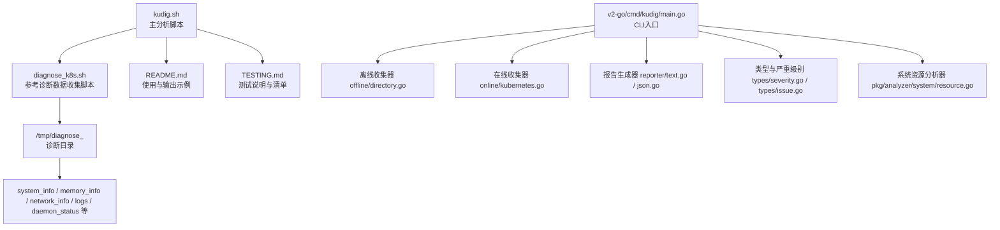
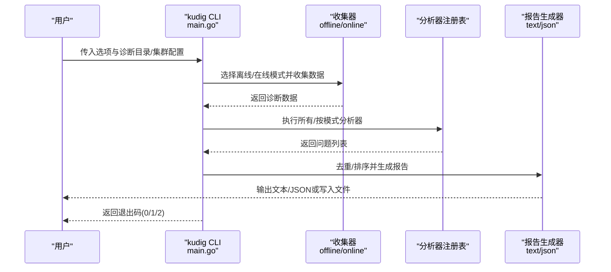
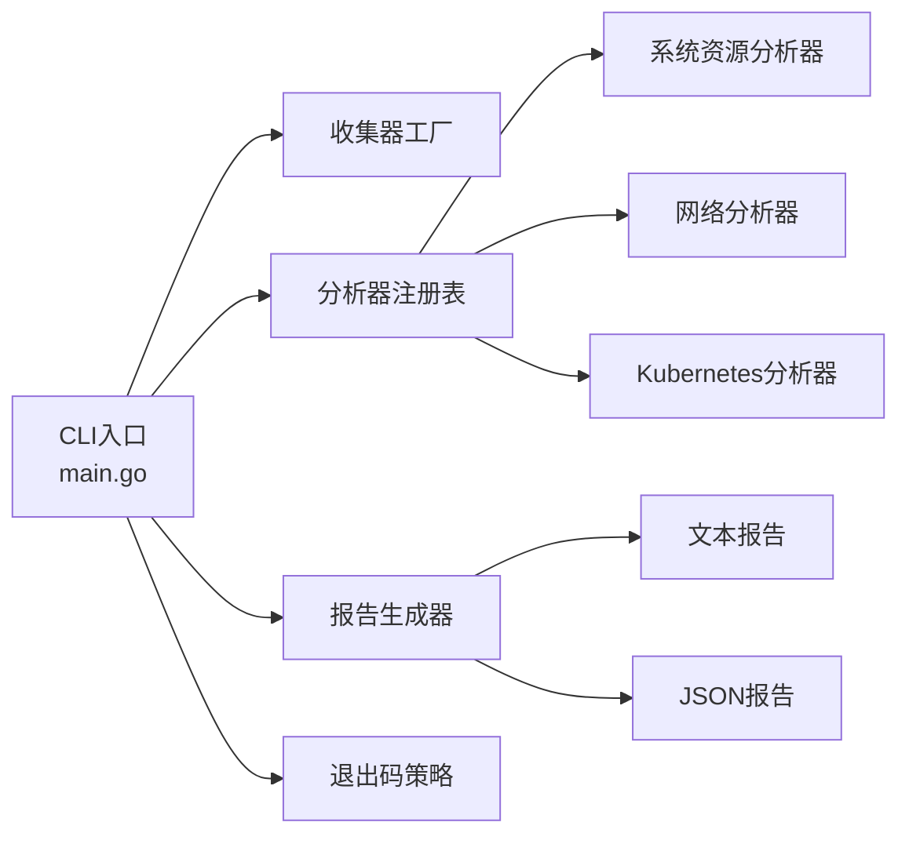
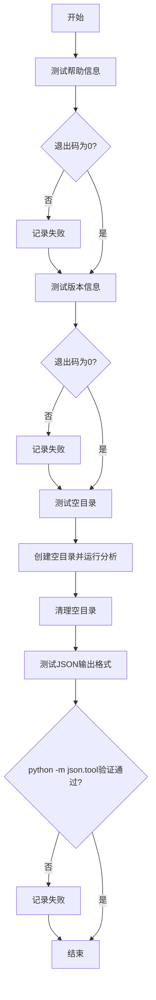

# 测试说明

<cite>
**本文引用的文件**
- [README.md](file://README.md)
- [TESTING.md](file://TESTING.md)
- [kudig.sh](file://kudig.sh)
- [reference/diagnose_k8s/diagnose_k8s.sh](file://reference/diagnose_k8s/diagnose_k8s.sh)
- [cmd/kudig/main.go](file://v2-go/cmd/kudig/main.go)
- [Makefile](file://v2-go/Makefile)
- [tests/unit/test_basic_functions.bats](file://tests/unit/test_basic_functions.bats)
- [tests/unit/test_system_check.bats](file://tests/unit/test_system_check.bats)
- [pkg/reporter/text.go](file://v2-go/pkg/reporter/text.go)
- [pkg/reporter/json.go](file://v2-go/pkg/reporter/json.go)
- [pkg/types/severity.go](file://v2-go/pkg/types/severity.go)
- [pkg/types/issue.go](file://v2-go/pkg/types/issue.go)
- [pkg/collector/offline/directory.go](file://v2-go/pkg/collector/offline/directory.go)
- [pkg/collector/online/kubernetes.go](file://v2-go/pkg/collector/online/kubernetes.go)
- [pkg/analyzer/system/resource.go](file://v2-go/pkg/analyzer/system/resource.go)
- [scripts/quality_check.sh](file://scripts/quality_check.sh)
</cite>

## 目录
1. [简介](#简介)
2. [项目结构](#项目结构)
3. [核心组件](#核心组件)
4. [架构总览](#架构总览)
5. [详细组件分析](#详细组件分析)
6. [依赖关系分析](#依赖关系分析)
7. [性能考虑](#性能考虑)
8. [故障排查指南](#故障排查指南)
9. [结论](#结论)
10. [附录](#附录)

## 简介
本测试说明面向kudig.sh工具的功能验证与正确性评估，覆盖Linux/Unix、Windows WSL以及Git Bash三种环境下的测试方法。文档提供从诊断数据准备、基础/详细/JSON/文件输出测试，到自动化测试脚本示例与常见问题解答的全流程指导，确保在不同平台下均可稳定复现预期行为与退出码。同时新增v2.0 Go版本的测试说明，包括单元测试、集成测试、质量检查等内容，帮助在多平台、多模式（离线/在线/规则引擎/兼容模式）下验证工具功能。

## 项目结构
仓库包含工具脚本、参考诊断脚本、Go版本实现、测试套件与质量检查脚本，整体结构清晰，便于在不同环境中进行测试与验证。

图表来源
- [kudig.sh](file://kudig.sh#L1-L120)
- [reference/diagnose_k8s/diagnose_k8s.sh](file://reference/diagnose_k8s/diagnose_k8s.sh#L1-L120)
- [README.md](file://README.md#L230-L270)
- [cmd/kudig/main.go](file://v2-go/cmd/kudig/main.go#L52-L178)
- [pkg/collector/offline/directory.go](file://v2-go/pkg/collector/offline/directory.go#L1-L138)
- [pkg/collector/online/kubernetes.go](file://v2-go/pkg/collector/online/kubernetes.go#L1-L139)
- [pkg/reporter/text.go](file://v2-go/pkg/reporter/text.go#L1-L105)
- [pkg/reporter/json.go](file://v2-go/pkg/reporter/json.go#L1-L40)
- [pkg/types/severity.go](file://v2-go/pkg/types/severity.go#L1-L90)
- [pkg/types/issue.go](file://v2-go/pkg/types/issue.go#L1-L121)
- [pkg/analyzer/system/resource.go](file://v2-go/pkg/analyzer/system/resource.go#L1-L120)

章节来源
- [README.md](file://README.md#L1-L120)
- [TESTING.md](file://TESTING.md#L1-L68)

## 核心组件
- 命令行参数解析与帮助/版本输出（Go版本使用Cobra）
- 诊断目录校验与关键文件存在性检查（离线模式）
- 异常检测器集合（系统资源、进程服务、网络、内核、容器运行时、Kubernetes组件、时间同步、配置）
- 报告生成（文本/JSON）、去重与排序、输出到文件
- 退出码策略（0/1/2）
- 在线模式（实时K8s集群分析）
- 规则引擎（自定义YAML规则）
- 兼容模式（调用旧版kudig.sh）

章节来源
- [cmd/kudig/main.go](file://v2-go/cmd/kudig/main.go#L150-L178)
- [pkg/collector/offline/directory.go](file://v2-go/pkg/collector/offline/directory.go#L36-L55)
- [pkg/analyzer/system/resource.go](file://v2-go/pkg/analyzer/system/resource.go#L1-L120)
- [pkg/reporter/text.go](file://v2-go/pkg/reporter/text.go#L123-L166)
- [pkg/reporter/json.go](file://v2-go/pkg/reporter/json.go#L21-L40)
- [pkg/types/severity.go](file://v2-go/pkg/types/severity.go#L78-L90)
- [pkg/types/issue.go](file://v2-go/pkg/types/issue.go#L83-L121)

## 架构总览
kudig v2.0的工作流分为“数据收集”和“数据分析”两个阶段，前者由离线/在线收集器读取诊断数据，后者由分析器集合执行检测，最终输出文本或JSON报告，并根据异常级别返回退出码。

图表来源
- [cmd/kudig/main.go](file://v2-go/cmd/kudig/main.go#L180-L277)
- [pkg/collector/offline/directory.go](file://v2-go/pkg/collector/offline/directory.go#L57-L138)
- [pkg/collector/online/kubernetes.go](file://v2-go/pkg/collector/online/kubernetes.go#L101-L139)
- [pkg/reporter/text.go](file://v2-go/pkg/reporter/text.go#L37-L105)
- [pkg/reporter/json.go](file://v2-go/pkg/reporter/json.go#L21-L40)

## 详细组件分析

### 命令行与参数解析（Go版本）
- 支持子命令：offline、online、legacy、analyze、list-analyzers、rules
- 全局选项：--verbose、-o 输出文件、-f/--format 文本/JSON
- 在线模式选项：--kubeconfig、--context、-n 节点、--namespace、--all-nodes
- 规则引擎选项：--file、--dir、--list
- 兼容模式：--json（已弃用，建议使用 --format json）

章节来源
- [cmd/kudig/main.go](file://v2-go/cmd/kudig/main.go#L59-L178)
- [cmd/kudig/main.go](file://v2-go/cmd/kudig/main.go#L176-L178)

### 诊断目录校验（离线模式）
- 校验诊断目录存在性与类型
- 读取关键文件：system_info、system_status、service_status、memory_info、network_info、ps_command_status
- 读取 daemon_status 与 logs 子目录中的文件
- 解析节点信息与系统指标（CPU核心数、负载、内存、磁盘、连接跟踪）

章节来源
- [pkg/collector/offline/directory.go](file://v2-go/pkg/collector/offline/directory.go#L36-L55)
- [pkg/collector/offline/directory.go](file://v2-go/pkg/collector/offline/directory.go#L57-L138)
- [pkg/collector/offline/directory.go](file://v2-go/pkg/collector/offline/directory.go#L140-L208)
- [pkg/collector/offline/directory.go](file://v2-go/pkg/collector/offline/directory.go#L209-L274)

### 异常检测器集合（系统资源）
- CPU负载：严重阈值=核心数×4，警告阈值=核心数×2
- 内存使用：严重≥95%，警告≥85%
- 磁盘空间：严重≥95%，警告≥90%
- Swap未禁用：提示级别
- 连接跟踪表：严重≥95%，警告≥80%
- 文件句柄：>50000提示
- D状态进程与ps挂起：严重

章节来源
- [pkg/analyzer/system/resource.go](file://v2-go/pkg/analyzer/system/resource.go#L1-L120)
- [pkg/analyzer/system/resource.go](file://v2-go/pkg/analyzer/system/resource.go#L120-L225)
- [pkg/analyzer/system/resource.go](file://v2-go/pkg/analyzer/system/resource.go#L225-L334)
- [pkg/analyzer/system/resource.go](file://v2-go/pkg/analyzer/system/resource.go#L334-L404)

### 报告生成与输出（文本/JSON）
- 文本报告：按严重>警告>提示分组，包含统计摘要
- JSON报告：包含版本、时间戳、主机名、诊断目录/集群信息、异常数组与汇总
- 去重与排序：基于英文标识符去重，严重级别排序

章节来源
- [pkg/reporter/text.go](file://v2-go/pkg/reporter/text.go#L37-L105)
- [pkg/reporter/text.go](file://v2-go/pkg/reporter/text.go#L133-L166)
- [pkg/reporter/json.go](file://v2-go/pkg/reporter/json.go#L21-L40)

### 退出码策略
- 0：未检测到异常
- 1：检测到警告或提示级别异常
- 2：检测到严重级别异常

章节来源
- [pkg/types/severity.go](file://v2-go/pkg/types/severity.go#L78-L90)
- [pkg/types/issue.go](file://v2-go/pkg/types/issue.go#L83-L121)
- [cmd/kudig/main.go](file://v2-go/cmd/kudig/main.go#L268-L277)

## 依赖关系分析
- Go版本CLI依赖Cobra命令框架
- 分析器通过注册表统一管理，支持离线/在线模式
- 报告生成器支持文本与JSON两种格式
- 退出码取决于最高严重级别与是否存在异常

图表来源
- [cmd/kudig/main.go](file://v2-go/cmd/kudig/main.go#L180-L277)
- [pkg/analyzer/system/resource.go](file://v2-go/pkg/analyzer/system/resource.go#L394-L404)
- [pkg/reporter/text.go](file://v2-go/pkg/reporter/text.go#L123-L166)
- [pkg/reporter/json.go](file://v2-go/pkg/reporter/json.go#L21-L40)
- [pkg/types/severity.go](file://v2-go/pkg/types/severity.go#L78-L90)

章节来源
- [cmd/kudig/main.go](file://v2-go/cmd/kudig/main.go#L180-L277)
- [pkg/analyzer/system/resource.go](file://v2-go/pkg/analyzer/system/resource.go#L394-L404)
- [pkg/reporter/text.go](file://v2-go/pkg/reporter/text.go#L123-L166)
- [pkg/reporter/json.go](file://v2-go/pkg/reporter/json.go#L21-L40)
- [pkg/types/severity.go](file://v2-go/pkg/types/severity.go#L78-L90)

## 性能考虑
- 大多数检测为文本匹配与数值计算，复杂度与文件大小线性相关
- 建议在大型诊断目录上使用JSON输出并重定向到文件，避免终端渲染开销
- 在线模式需考虑K8s API延迟与超时设置

## 故障排查指南
- 必要命令缺失：安装缺失命令后重试
- 诊断目录不完整：脚本会发出警告但仍继续分析
- 权限问题：确保诊断数据收集时具备足够权限
- 某些检测项无结果：对应日志文件缺失属正常
- 在线模式：确认kubeconfig/context/节点选择正确

章节来源
- [README.md](file://README.md#L311-L337)
- [TESTING.md](file://TESTING.md#L177-L197)
- [pkg/collector/online/kubernetes.go](file://v2-go/pkg/collector/online/kubernetes.go#L52-L99)

## 结论
kudig.sh提供了全面的Kubernetes节点诊断能力，测试覆盖了帮助、版本、参数校验、诊断目录完整性、各类异常检测、输出格式与退出码等关键点。通过本文档提供的测试步骤与自动化脚本示例，可在Linux/Unix、WSL与Git Bash环境下稳定验证工具功能。v2.0 Go版本新增了单元测试、集成测试、质量检查与多模式测试流程，进一步提升了可测试性与可靠性。

## 附录

### 不同环境下的测试方法

- Linux/Unix系统
  - 准备诊断数据：使用参考脚本在Kubernetes节点上收集诊断数据，生成类似/tmp/diagnose_1702468800的目录
  - 运行测试：
    - 基本测试：./kudig.sh /tmp/diagnose_1702468800
    - 详细模式：./kudig.sh --verbose /tmp/diagnose_1702468800
    - JSON格式：./kudig.sh --json /tmp/diagnose_1702468800
    - 保存到文件：./kudig.sh -o report.txt /tmp/diagnose_1702468800
  - 验证退出码：执行后使用echo "Exit code: $?"查看返回码（0/1/2）

  章节来源
  - [TESTING.md](file://TESTING.md#L7-L42)

- Windows WSL
  - 在WSL中切换到仓库目录，赋予脚本执行权限
  - 可使用参考脚本创建测试目录（模拟诊断数据），然后运行kudig.sh进行分析

  章节来源
  - [TESTING.md](file://TESTING.md#L44-L59)

- Git Bash
  - 在Git Bash中切换到仓库目录，使用bash命令执行脚本的--help选项进行验证

  章节来源
  - [TESTING.md](file://TESTING.md#L60-L68)

### 功能验证清单
- 帮助信息显示正常（--help）
- 版本信息显示正常（--version）
- 能够正确解析诊断目录
- 系统资源检测功能正常
- 进程服务检测功能正常
- 网络检测功能正常
- 内核检测功能正常
- 容器运行时检测功能正常
- Kubernetes组件检测功能正常
- 时间同步检测功能正常
- 配置检测功能正常
- 异常去重功能正常
- 异常排序功能正常
- 文本格式输出正常
- JSON格式输出正常
- 文件保存功能正常
- 退出码正确

章节来源
- [TESTING.md](file://TESTING.md#L69-L88)

### 预期输出示例
- 无异常情况：文本报告显示“未检测到异常”，退出码为0
- 有异常情况：文本报告按严重级别分组显示异常项，统计总数，退出码为2（存在严重异常）

章节来源
- [TESTING.md](file://TESTING.md#L89-L131)
- [README.md](file://README.md#L69-L138)

### 自动化测试脚本示例
以下为自动化测试脚本的完整示例，演示如何验证帮助、版本、空目录与JSON格式等功能。该脚本使用bash编写，适合在Linux/Unix、WSL或Git Bash环境中运行。

图表来源
- [TESTING.md](file://TESTING.md#L132-L175)

章节来源
- [TESTING.md](file://TESTING.md#L132-L175)

### 测试注意事项
- 脚本需要在Linux环境或支持Bash的环境下运行
- 诊断目录必须是由参考脚本生成的完整目录
- 脚本只读取诊断数据，不会修改任何文件
- 若诊断目录不完整，脚本会发出警告但仍继续分析
- 某些检测项可能因日志文件缺失而无结果，属正常现象

章节来源
- [TESTING.md](file://TESTING.md#L177-L197)
- [README.md](file://README.md#L311-L337)

### 常见问题
- 在Windows上如何测试？
  - 推荐使用WSL或Git Bash
- 如何验证JSON输出格式正确？
  - 使用python -m json.tool或jq进行格式验证

章节来源
- [TESTING.md](file://TESTING.md#L184-L197)

### v2.0 Go版本测试说明

#### 单元测试
- 使用BATS测试框架对kudig.sh进行基础功能与系统资源检测验证
- 覆盖项：
  - kudig.sh文件存在且可执行
  - --help与--version输出
  - 缺少参数/目录不存在的错误处理
  - 空诊断目录的处理
  - JSON输出格式有效性与必需字段
  - --verbose模式输出
  - 使用参考数据的真实场景

章节来源
- [tests/unit/test_basic_functions.bats](file://tests/unit/test_basic_functions.bats#L1-L107)
- [tests/unit/test_system_check.bats](file://tests/unit/test_system_check.bats#L1-L163)

#### 集成测试
- 使用Makefile提供的命令进行集成测试：
  - make test：运行Go包测试（含竞态检测与覆盖率）
  - make test-coverage：生成覆盖率报告
  - make run-test：离线模式运行真实诊断数据
  - make run-legacy：兼容模式运行旧版脚本
- 测试目标：
  - 验证CLI子命令与选项
  - 验证离线/在线/规则引擎/兼容模式的输出与退出码
  - 验证报告生成（文本/JSON）与去重排序

章节来源
- [v2-go/Makefile](file://v2-go/Makefile#L51-L111)
- [cmd/kudig/main.go](file://v2-go/cmd/kudig/main.go#L180-L277)
- [pkg/reporter/text.go](file://v2-go/pkg/reporter/text.go#L123-L166)
- [pkg/reporter/json.go](file://v2-go/pkg/reporter/json.go#L21-L40)

#### 质量检查
- 使用自定义Shell质量检查脚本对kudig.sh进行质量评估：
  - 文件头注释完整性
  - 全局变量命名规范
  - 函数命名规范
  - 关键函数注释完整性
  - 退出码使用规范
  - 算术运算安全
  - 硬编码路径检查
  - TODO/FIXME标记检查
- 使用方法：./scripts/quality_check.sh [--verbose] kudig.sh

章节来源
- [scripts/quality_check.sh](file://scripts/quality_check.sh#L1-L330)

#### v2.0 Go版本功能验证清单
- CLI帮助与版本：--help、--version、Version字段
- 子命令：offline、online、legacy、analyze、list-analyzers、rules
- 全局选项：--verbose、-o、-f/--format
- 在线模式：--kubeconfig、--context、-n、--namespace、--all-nodes
- 规则引擎：--file、--dir、--list
- 离线模式：诊断目录存在性与关键文件读取
- 报告生成：文本/JSON格式、去重与排序
- 退出码：0/1/2
- 兼容模式：legacy输出与退出码保持一致

章节来源
- [cmd/kudig/main.go](file://v2-go/cmd/kudig/main.go#L59-L178)
- [cmd/kudig/main.go](file://v2-go/cmd/kudig/main.go#L180-L277)
- [pkg/collector/offline/directory.go](file://v2-go/pkg/collector/offline/directory.go#L36-L55)
- [pkg/reporter/text.go](file://v2-go/pkg/reporter/text.go#L123-L166)
- [pkg/reporter/json.go](file://v2-go/pkg/reporter/json.go#L21-L40)
- [pkg/types/severity.go](file://v2-go/pkg/types/severity.go#L78-L90)

#### v2.0 Go版本预期输出示例
- 无异常情况：文本报告包含“未检测到异常”，退出码为0
- 有异常情况：文本报告按严重级别分组显示异常项，统计总数，退出码为2（存在严重异常）
- JSON输出：包含版本、时间戳、主机名、诊断目录/集群信息、异常数组与汇总

章节来源
- [pkg/reporter/text.go](file://v2-go/pkg/reporter/text.go#L37-L105)
- [pkg/reporter/json.go](file://v2-go/pkg/reporter/json.go#L21-L40)
- [pkg/types/issue.go](file://v2-go/pkg/types/issue.go#L83-L121)

#### v2.0 Go版本自动化测试脚本示例
- 使用Makefile命令快速验证：
  - make build：构建二进制
  - make run-test：离线模式运行参考数据
  - make run-legacy：兼容模式运行旧版脚本
- 结合BATS测试验证参数解析、JSON格式与异常场景

章节来源
- [v2-go/Makefile](file://v2-go/Makefile#L104-L111)
- [tests/unit/test_basic_functions.bats](file://tests/unit/test_basic_functions.bats#L1-L107)
- [tests/unit/test_system_check.bats](file://tests/unit/test_system_check.bats#L1-L163)